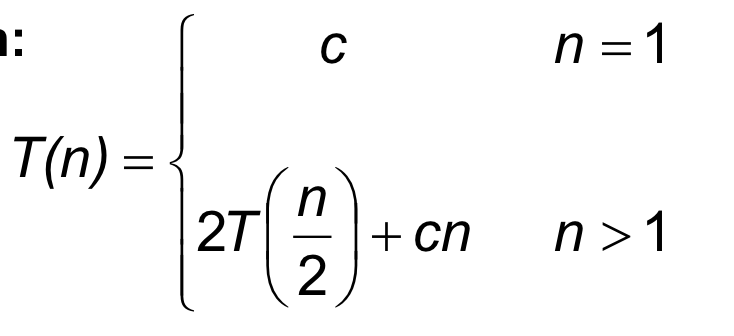
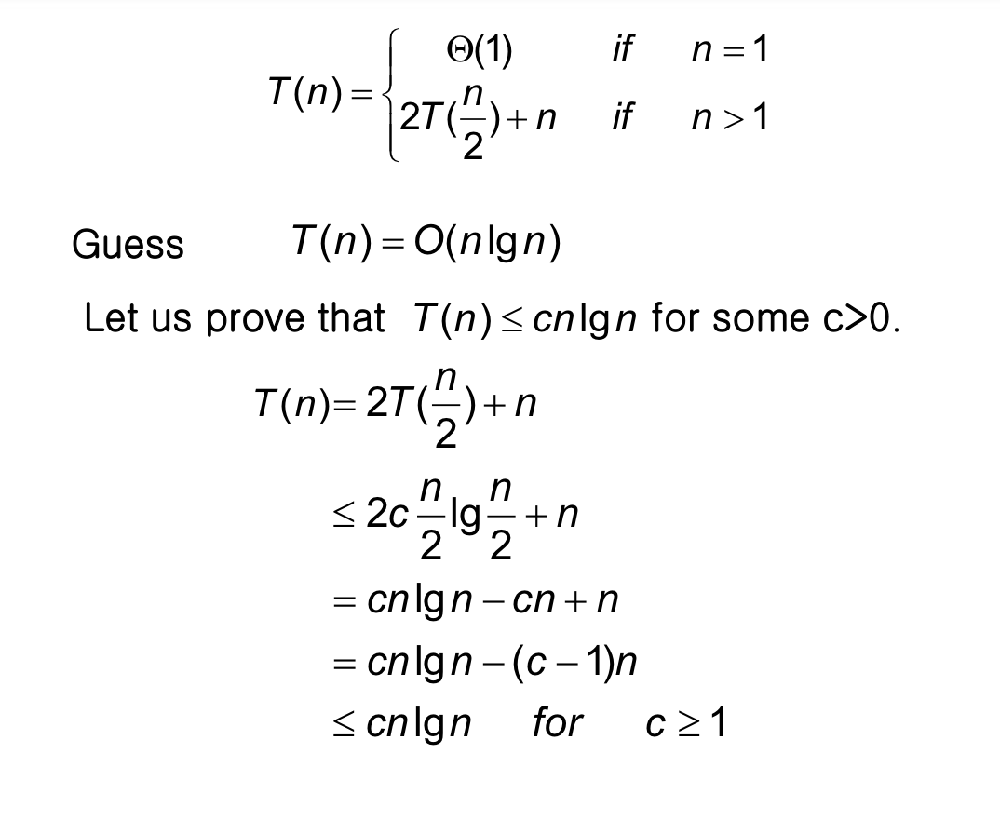
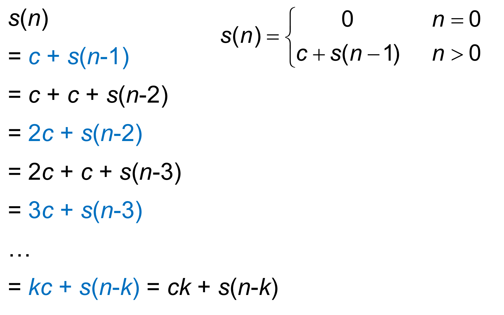
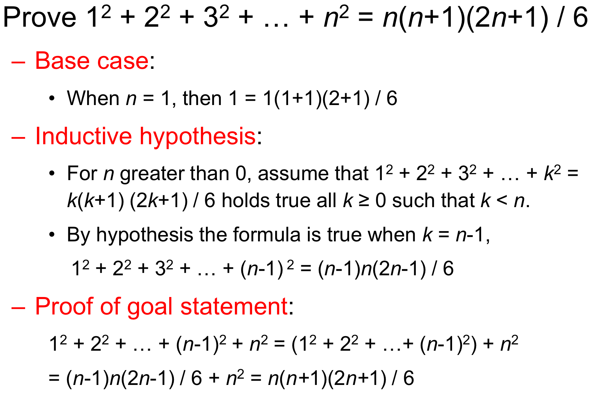

## Divide and Conquer

Divide and Conquer, 분할정복은 큰 문제를 여러 개의 작은 문제로 쪼개고 쪼개서 해결하는 방법이다. 일반적으로 Divide and Conquer는 recurrence equation으로 표현할 수 있는데, 우리는 이 수식을 통해서 알고리즘의 time complexity 를 구할 것이다.

위와 같은 식을 우리는 recurrence equation 이라고 한다. 식을 보면 T(n) 이 T(n/2) 로 작아지는 것을 볼 수 있다. 이런식으로 n 은 재귀를 거듭할때마다 작아질 것이다.

이런 recurrence equation을 통해 알고리즘을 분석하는 방법은 네 가지가 있다.

## Substitution method

첫번째 방법은 substitution method이다. 이 방법을 사용하려면 사실 어느정도 알고리즘에 숙련되어 있어야한다. 왜냐하면 분석의 첫 시작을 solution 의 form 을 추측하는 것으로 시작하기 때문이다. 주어진 수식을 보고 어떤 알고리즘일 것이다라고 가정을 세우고 그것이 맞는지 확인해가는 작업을 거친다.

위 예시를 보자. 나는 왜인지 전혀 모르겠지만, 저자는 2T(n/2)+n 을 보고 O(nlogn) 의 복잡도를 가지지 않을까라는 가정을 세운다. 그리고 그것을 증명하기 위 nlogn을 기존 수식에 대입하여 풀고 가설이 사실이라는 것을 증명했다.

## Recursion Tree Method

Recursion Tree Method는 수식을 단계별로 트리모양으로 만들어 복잡도를 계산하는 방법이다. 이 방법은 세 단계로 진행되는데,

1. Build a recursion tree.
2. Sum the costs within each level.
3. Sum the costs of all levels.

로 나눌 수 있다.

위 예를 보면, 3T(n/4) 이기 때문에 총 세 개의 c(n/4)를 만들수 있고 이런식으로 계속 노드를 아래로 늘려가다보면 T(1)이 되는 노드들이 나올 것이다. 이렇게 하면 일단 1단계인 recurstion tree를 만드는 것은 완료이다.

이제 2단계인 각 level의 cost를 구해야하는데, 그림의 오른쪽에 보다시피 우리가 구한 노드들의 n을 나열해보면 1/4^n 씩 늘어나는 것을 알 수 있다. 따라서 높이를 h로 두었을 때 마지막 노드는 1/4^h n 으로 나타낼 수 있다. 이것을 h에 대해서 정리하면, 우리는 이 트리에 높이를 log4n으로 표현할 수 있을 것이다.

각 레벨의 노드의 개수는 3의 거듭제곱씩 늘어나기 때문에 제일 아래에 위치한 노드들의 갯수는 3log4n 이 되고 이것을 로그의 성질에 따라 정리하면 nlog43 으로 나타낼 수 있다.

따라서 3단계에 따라 모든 cost들의 합을 계산하면 cn2 부터 (3/16)log4n-1cn2 + 𝛩(nlog43) 의 합을 구하면 되고 이는 등비수열에 해당하기 때문에 공식을 따라서 계산하면 된다. 그러면 그 결과로 우리는 T(n)이 𝛩(n2)의 복잡도를 가지는 것을 확인할 수 있다.

## Iteration method

iteration method 는 우리가 가진 재귀 수식으로 새로운 수식을 만들어 나가는 방식으로 문제를 해결하는 것이다.

위 예시를 보자. s(n) = c + s(n-1) 의 식이 성립하기 때문에, 우항의 s(n-1)은 c + s(n-2) 로도 나타낼 수 있다. 이런식으로 식을 반복적으로 만들어보면 우리는 ck + s(n-k) 라는 정규화된 식을 도출 할 수 있다.

초기식에서 우리는 s(0) = 0 이라는 정보를 가지고 있고, k는 항상 n보다 같거나 작아야 한다. 따라서 k가 n 과 같다고 가정했을 때, 우리는 최종적으로 s(n) = cn 이라는 식을 도출 할 수 있고, 최종적으로 이 수식의 시간복잡도는 O(n) 이라고 결론내릴 수 있게 된다.

## Master Method

Master method 는 재귀식을 특정한 형태로 만들고, 그 형태 안에서 정보를 얻어 준비되어 있는 조건에 맞는지 확인하는 방법이다. 하지만 모든 재귀식이 이 조건으로 판단 될 수는 없고 주어지는 세 가지 조건에 모두 해당하지 않는 재귀식이 있을 수 있다.

Master theorem 은 다음과 같다.

a >= 1, b > 1, 함수 f(n) > 0 이고 T(n) 이 양수로 정의된다면,

 T(n) = a T(n/b) + f(n)

 
위 수식의 T(n)은 아래의 조건에 따라 구분될 수 있다.

1. f(n) = Օ(nlogba-ε) 의 형태를 가질 때, ε이 0보다 크다면, T(n)의 복잡도는 **T(n) = 𝛩(nlogba)** 이다.
2. f(n) = 𝛩(nlogba) 의 형태를 가질 때, T(n)의 복잡도는 **T(n) = 𝛩(nlogba lg n)** 이다.
3. f(n) = Ω(nlogba+ε) 의 형태를 가질 때, ε이 0보다 크고, 1보다 작은 c에 대해 f(n) 이 f(n/b) ≤ cf(n)의 조건을 만족한다면, T(n)의 복잡도는 **T(n) = 𝛩(f(n))** 이다.

## Proof By Induction

수학적 귀납법을 통해 알고리즘을 분석하는 방법이다. 수학적 귀납법은 크게 1) Base case, 2) Inductive hypothesis, 3) Proof of goal statement 의 세 단계로 이루어져 있다.

1. Base case:
   이 단계에서 우리는 가지고 있는 방정식이 n=0 이거나 n=1 일 때 성립하는지 확인한다.
2. Inductive hypothesis:
   귀납법을 수행하기 위해서 가정을 세워야 한다. Base case 를 기준으로 가설을 세우면, 0보다 큰 모든 n에 대해서 우리가 가진 방정식이 k ≥ 0 와 k < n 을 만족한다는 가정을 세울 수 있다. 따라서, 이 가정에 따라 방정식은 k=n-1 일 때도 성립할 것이다.
3. Proof of goal statement:
   이 단계에서는 우리가 세운 가정에 따라 방정식이 실제로 성립하는지 확인하는 작업을 가져야한다.

귀납법을 이용한 방법은 항상 쉽지 않다. 왜냐하면 중간단계에서 세우는 가정이 조금만 틀리면, 그럴듯 해보이지만 반례가 존재하는 가정이 만들어지고 실제로는 false 이지만 true인 명제라고 착각하기가 쉽기 때문이다. 아래 예를 통해 더 자세히 알아보자.

