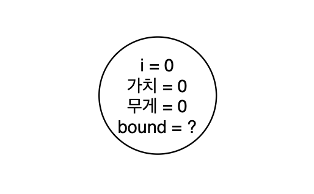
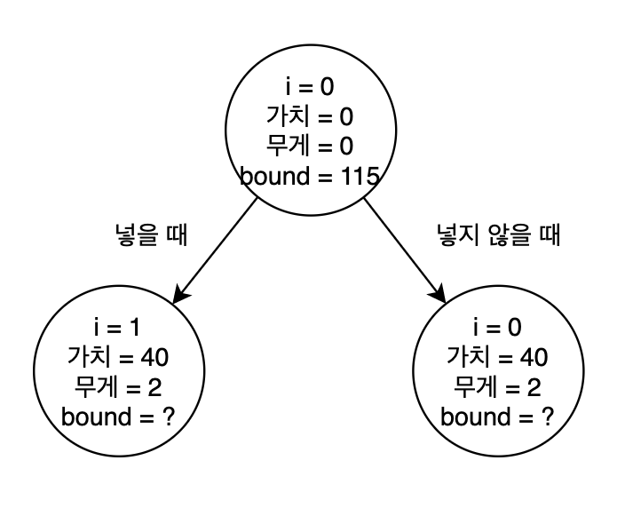
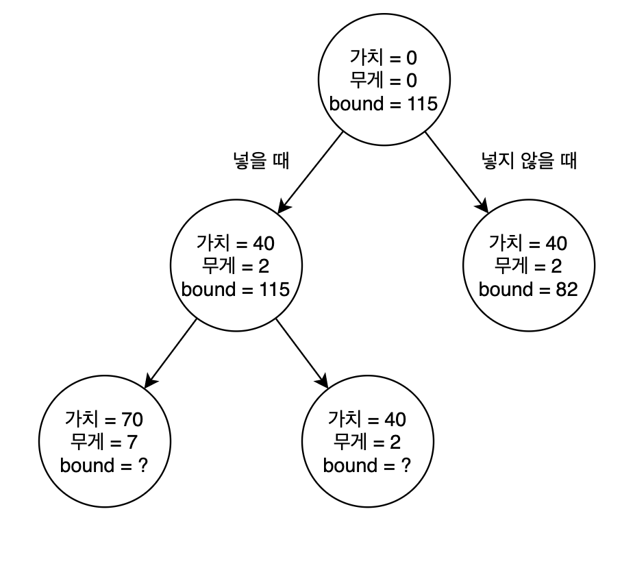
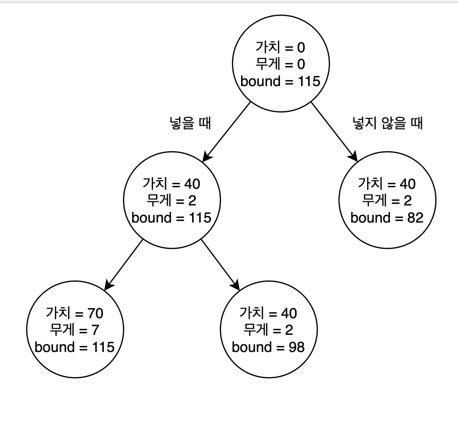
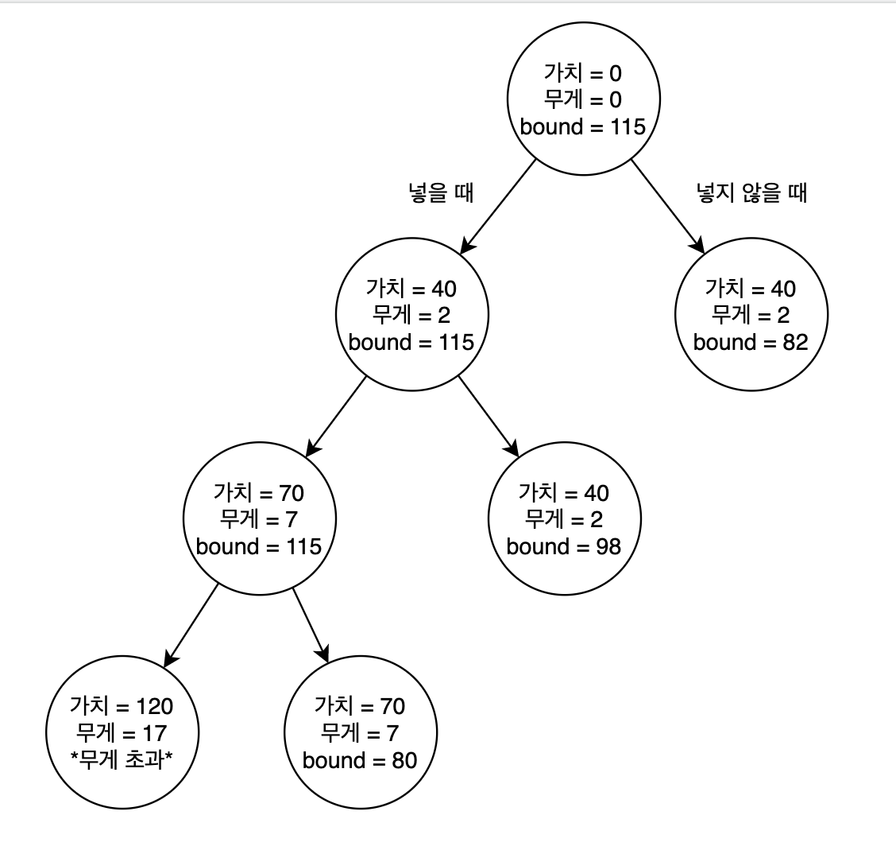
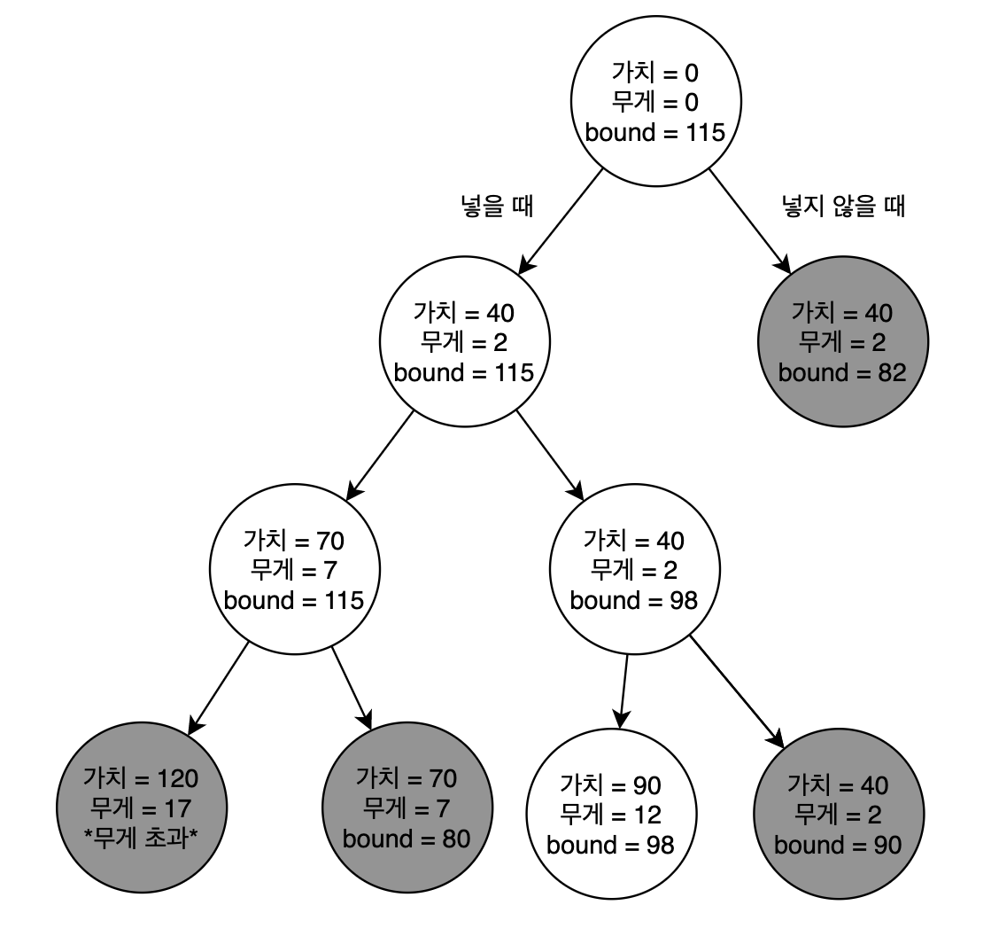

# Branch and Bound

Branch and Bound 는 트리를 타고 내려갈 때, 더 이상 갈 필요가 없는 지점을 판단해서 어떤 노드의 자식 노드를 방문할지 방문하지 않을지 결정하는 방식이다. 완전탐색으로 트리를 검사하는 것보다 방문하는 노드의 수가 줄어들기 때문에 시간을 단축시킬 수 있다. 여기서 핵심적으로 사용되는 개념이 bound 인데, bound 는 어떤 노드에 방문했을 때, 해당 노드의 child 노드를 방문하는 것으로 얻을 수 있는 이익의 한계치를 계산해 bound로 정하게 된다. 계산된 bound가 현재 시점에서 트리가 가진 최적 값을 넘어서지 못한다면, 아무리 더 트리를 타고 내려가도 현재 시점보다 더 좋은 값을 찾지 못한다는 의미가 되기 때문에 더 이상 트리를 진행하는 것이 의미가 없어진다.

이 개념을 사용해서 Kanpsack 문제를 해결해보자.

## 0/1 Knapsack Problem

이전 강의에서도 0/1 knapsack을 DP로 해결했기 때문에, 이번에도 0/1 knapsack을 예시로 사용하자.

일단 모든 물건은 무게대비 값어치가 가장 큰 물건의 순서대로 정렬이 되어 있어야 한다. 이번에 풀어볼 예시에서는 총 4개의 아이템이 있고, 각 아이템은 다음과 같은 정보들을 가지고 있다고 하자. 그리고 가져갈 수 있는 최대 무게는 16으로 정해보자.

|  i  | 가치 | 무게 | 가치/무게 |
| :-: | :--: | :--: | :-------: |
|  1  |  40  |  2   |    20     |
|  2  |  30  |  5   |     6     |
|  3  |  50  |  10  |     5     |
|  4  |  10  |  5   |     2     |

우리는 무게대비 가치가 제일 큰 물건부터 가방안에 넣게 될 것이다. 시작 노드는 가방안에 아무것도 넣지 않은 초기상태일 것이다.

이제부터 노드에 bound and branch 를 위한 다른 정보들을 함께 표기해야한다. 이 정보들은 누적 가치, 누적 무게, 그리고 bound 가 된다. 먼저 물건을 넣었을 때 우리가 얻을 수 있는 최대의 가치인 bound를 학인해보자.

bound 를 계산하기 위해서는 가방이 꽉 찰 떄까지 최대한 많은 물건을 넣어보면 된다. 우리는 이미 물건들을 무게 대비 가치 순서로 정렬해두었기 때문에 가능한 많이 넣으면 최대 가치를 얻을 수 있게된다. 따라서 bound 를 얻을 수 있는 식은 다음과 같이 세울 수 있다.

$$
bound = 가치 + \sum_{j = i + 1}^{ k -1} + (최대 무게 - 최대로 넣었을 때 무게)\times \frac {가치_k}{무게_k}
$$

현재까지 넣었을 때 가치, 그리고 물건들을 순서대로 하나씩 가방에 넣으면서 최대로 넣어봤을 때 가치를 합치면 현재 노드를 기준으로 최대한 많이 갔을 때의 최대 가치를 구할 수 있게 된다. 여기서 좀 더 정확한 bound 를 구하기 위해서 가방의 최대 무게에서 최대로 많이 넣었을 때의 무게를 빼면, 물건을 더 이상 넣을 수 없는 상태이지만 가방의 공간이 조금 남을 때, 남은 무게를 구할 수 있다. 비록 우리는 물건을 쪼갤 수 없는 0/1 knapsack을 논하고 있지만, 조금이라도 더 정확한 bound 를 구하기 위해서 아직 가방에 들어가지 않은 남은 물건을 남은 무게만큼 쪼개어서 넣으면 최종적으로 bound가 구해지게 된다.

그렇다면 아무것도 넣지 않은 현재 상태에서 bound는 물건들을 계속해서 넣었을 때의 bound 를 구해보면 될 것이다. 위 수식대로 계산을 진행해보면,

$$
bound = 0 + (40 + 30) + (16-2-5) \times50/10 = 115
$$

이런 수식으로 bound를 구할 수 있다. 0은 현재 아무것도 넣지 않았기 때문에 현재가치, 40은 1번째 물건의 가치, 30은 2번째 물건의 가치이고 최대 무게에세 1번째 물건과 2번째 물건의 무게를 빼고 그 다음 물건을 쪼개어서 넣어보면, 최대가치의 bound가 115 라는 것을 알 수 있다.

이 bound를 적용하기 위해서는 현재 트리에서 만들어진 가장 큰 가치가 무엇인지 알아야한다. 따라서 우리는 전역변수 max_benefit을 두어서 새로운 최대가치가 나타날 때마다 갱신해주게 된다. 그리고 우리는 현재 검사할 노드가 가방의 최대무게를 초과하지 않고, max_benefit 보다 큰 bound 를 가지고 있을 때, promising 하다고 말한다, 즉 다음 노드로 더 내려가는 것이 의미가 있다는 것이다. 반대로 다음 노드롱이동하는 것이 의미없을 때, nonpromising 하다고 한다.

아무것도 넣지 않은 상태에서는 최대 가치가 0이기 때문에 계속해서 트리를 뻗어나갈 수 있는 조건이 된다.

- 왼쪽 노드의 bound를 계산해보자. 가방안에 물건을 하나 더 넣은 후에 이후에 더 넣어볼지를 확인해보는 작업이다. 무게는 2가 되었기 때문에 가방의 최대무게를 초과하지 않고, 가치 40짜리 첫번째 물건이 들어갔기 때문에, max_benefit은 40으로 변경되었다.

|  i  | 가치 | 무게 | 가치/무게 |
| :-: | :--: | :--: | :-------: |
|  1  |  40  |  2   |    20     |
|  2  |  30  |  5   |     6     |
|  3  |  50  |  10  |     5     |
|  4  |  10  |  5   |     2     |

현재 가치 40, 무게 2인 물건이 가방에 들어가 있는 상황에서 물건을 최대한 많이 넣어보자. 2번째 물건을 넣으면 무게가 7이 되기 때문에 가능하고, 3번째 물건은 무게가17이 되기 때문에 최대 무게인 16을 초과하게 된다. 따라서 2번물건까지 넣는다고 하고 bound 를 계산해보면,

$$
bound = 40 + 30 + (16-7) \times50/10 = 115
$$

이 된다. 40은 현재 가방안에 있는 물건들의 가치, 30은 최대한 넣을 수 있는 물건들의 가치이다. 그리고 2번째 물건까지 가방에 넣는다고 했을 때, 가방의 무게는 7이 되므로, 최대무게 16에서 7을 뺀 나머지 9만큼의 공간을 가방에 넣지 않은 다음 물건을 쪼개어서 넣는다. 이렇게 계산해보면 bound 는 115 가 된다.

- 오른쪽 노드의 bound를 계산해보자.

오른쪽 노드에 간다는 것은 1번째 물건을 가방에 넣지 않는다는 선택을 하게된 것이기 때문에 2번째 물건부터 가방에 차례대로 넣어본다. 1번째 물건을 건너뛰고 2번째 물건을 넣었을 때, 가방의 무게는 5가 되므로 넣을 수 있다. 그리고 3번째 물건을 넣어도 15로 초과되지 않기 때문에 넣어준다. 따라서 bound는,

$$
bound = 0 + 30+50 + (16-5-10) \times10/5 = 82
$$

가 된다. 1번째 물건을 건너뛰고 2, 3번째 물건을 넣었기 때문에 bound가 달라졌다.

두 선택은 모두 promising 하다고 말할 수 있다. 왼쪽 노드의 max_benefit 은 40, 오른쪽은 0이다. 따라서 bound 가 max_benefit 을 초과하기에 더 물건을 넣어보는 것이 의미가 있고 현재 무게 또한 가방의 최대 무게를 초과하지 않았다. 하지만 왼쪽 노드는 bound 가 115, 오른쪽 노드는 bound 가 82 이기 때문에 오른쪽 보다는 왼쪽 노드로 진행하는 것이 더 합리적일 것이다. 따라서 오른쪽 노드는 일단 두고 왼쪽 노드를 먼저 진행해본다.

새로운 노드를 만들 수 없을 때까지 위 작업을 반복해보자.

|  i  | 가치 | 무게 | 가치/무게 |
| :-: | :--: | :--: | :-------: |
|  1  |  40  |  2   |    20     |
|  2  |  30  |  5   |     6     |
|  3  |  50  |  10  |     5     |
|  4  |  10  |  5   |     2     |

2번 물건에 대한 bound를 보자.

- 넣었을 때 (왼쪽 노드):

  일단 2번 물건이 들어가 가치가 70이 되었고 무게는 7이 되었다. max_benefit은 40이었는데, 70이 새로 등장했기 때문에 70으로 바뀌게된다.

$$
bound = 70 + 0 + (16-7) \times50/10 = 115
$$

가방의 무게 때문에 새로운 물건을 넣을 수 없다. 따라서 bound 를 계산하면 115가 나온다. 여전히 최대 무게보다는 작고 bound가 max_benefit 을 초과하기 때문에 promising 하다.

- 넣지 않을 때 (오른쪽 노드):
  2번 물건을 넣지 않기 때문에 건너뛰고 bound를 계산해보자.

$$
bound = 40 + 50 + (16-12) \times10/5 = 98
$$

이번 역시도 bound가 max_benefit 을 초과하기에 promising 하다고 할 수 있다. 하지만 왼쪽 노드의 bound가 더 크기 때문에 진행은 왼쪽 노드를 먼저 진행한다.

왼쪽 노드로 계속 진행해보자.

- 넣을 때 (왼쪽 노드):
  3번째 물건을 현 시점에서 넣게 되면 무게가 17이 되므로 가방의 최대무게를 초과하게 된다. 따라서 bound 를 계산하지 않고 곧바로 non-promising 하다는 판정을 내릴 수 있다. 이게 이쪽으로는 더이상 진행하는 것이 의미가 없다.

- 넣지 않을 때 (오른쪽 노드):
  3번째 물건을 넣지 않으면 무게가 초과되지 않기 때문에 bound를 계산하는 것이 의미가 있다. max_benefit은 여전히 70일 것이다.

$$
bound = 70 + 10 + (16-12) \times0 = 80
$$

이번에는 더 이상 다음 물건이 없기 때문에, 공간이 남아도 쪼개어서 채워넣을 물건이 없다. 따라서 bound는 80이 된다. max_benefit이 70 이기 때문에 이쪽으로 가는 것이 promising 하다.

branch and bound 는 기본적으로 노드들을 BFS 로 탐색하게 된다. 따라서 우리는 더 밑으로 내려가지 않고 아까 미루어 두었던 같은 레벨에 있는 노드를 먼저 확인할 것이다.

BFS 이기 때문에 bound = 98 을 가진 (2, 2) 노드의 탐색을 진행한다.

- 넣을 때 (왼쪽 노드):
  3번째 물건을 넣게 되면, 무게가 12가 되므로 무게는 초과하지 않고 가치는 90이 된다. 이때 새로운 최대 가치가 등장했기 때문에 max_benefit을 90으로 바꾸어준다.

$$
bound = 90 + 0 + (16-12) \times10/5 = 98
$$

4번째 물건은 무게 때문에 더 이상 넣지 못하므로 남은 자리만 4번째 물건을 쪼개어서 넣어준다. 결과로 얻은 bound = 98 은 max_benefit 을 초과하기 때문에 promising 하다.

- 넣지 않을 때(오른쪽 노드):
  3번째 물건을 넣지 않고 바로 4번재 물건을 넣어보려고 시도해보자.

$$
bound = 40 + 50 + (16-7) \times0 = 90
$$

max_benefit 과 같은 값이 나왔다. 따라서 더 이상 진행하는 것은 의미가 없다. 그리고 이 시점에서 max_benefit 이 90이 되었기 때문에 bound가 max_benefit 이하인 노드들은 더 이상 검사하는 것이 이유가 없어졌다. 이제 우리가 검사할 노드는 단 하나 뿐이다.

마지막 노드를 검사해보자.

- 4번 물건을 넣을 때 (왼쪽 노드)
  현재 가방에 4번 물건을 넣게되면, 무게가 17이 되기 때문에 bound 를 구하는 것 조차도 의미가 없다.

- 4번 물건을 넣지 않을 때 (오른쪽 노드)
  현재 가방을 그대로 유지하게 되면 얻을 수 있는 bound 는

$$
bound = 40 + 50 + (16-7) \times0 = 90
$$

이다. 최대 무게는 초과하지 않지만 max_benefit과 같은 값이기 때문에 promising 하지않다. 따라서 이 예제에서 가장 큰 가치는 유효한 노드들 중에 가장 큰 가치를 가진 가치 90, 무게 12, bound 98 을 가지고 있는 노드가 된다. 그리고 물건의 조합은 1번 물건과 3번 물건을 선택한 조합이 된다.

# 느낀점

옛날에 ㅇㅈ이랑 육목대회를 준비하면서 어정쩡하게 만들어봤던 Minimax Tree + alpha-beta pruning 도 branch and bound 의 일종이 아닌가 싶다. 그리고 수업을 들을 때는 이해했다고 생각했는데, 하나씩 따라가 보니 뭔가 착각하고 있던 부분도 있는 것 같고 차근차근히 다시 짚어가는게 새삼 중요한 것 같다..
