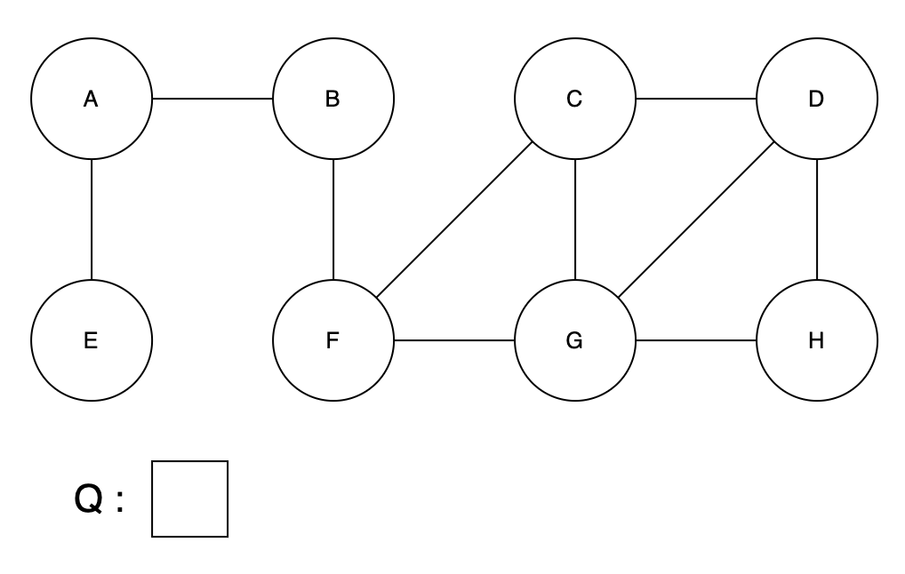
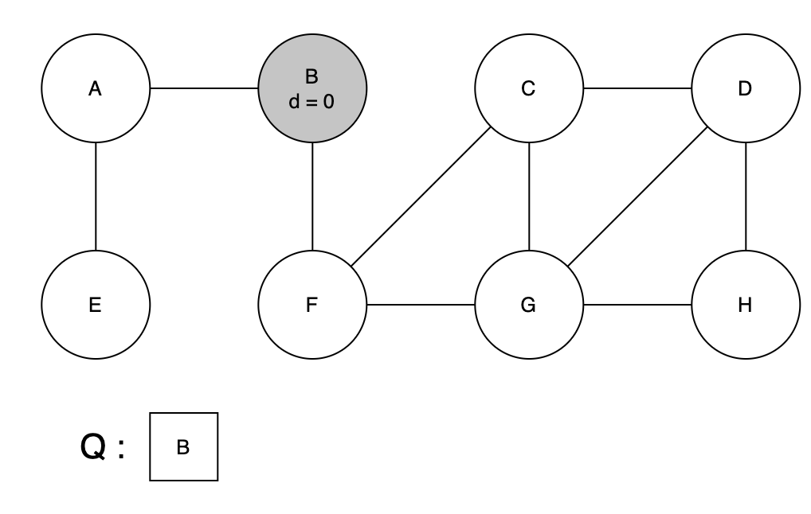
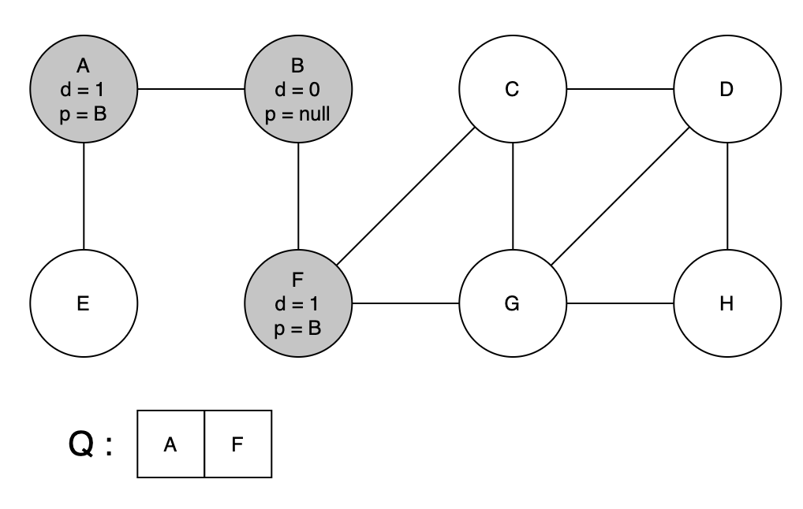
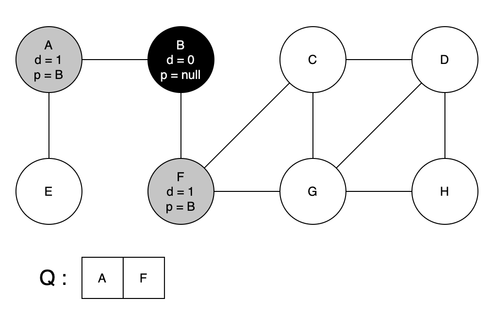
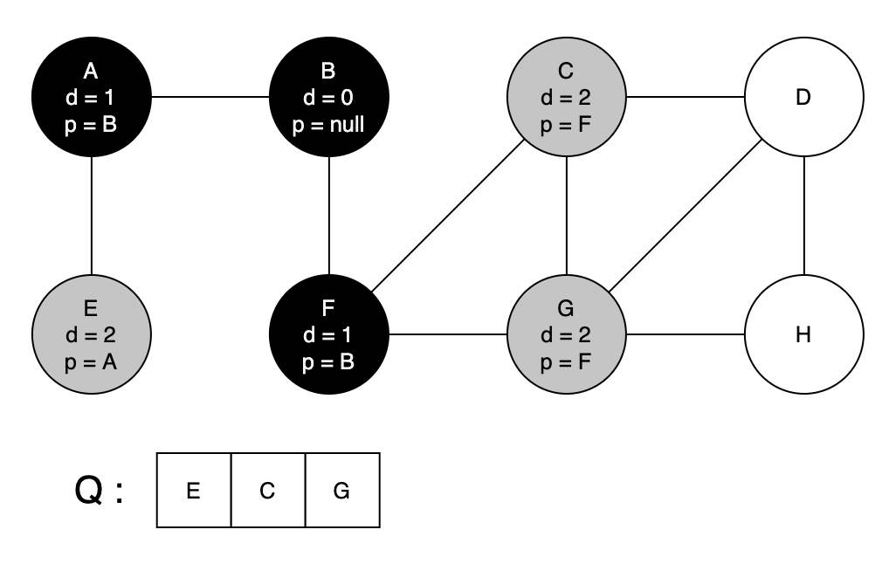
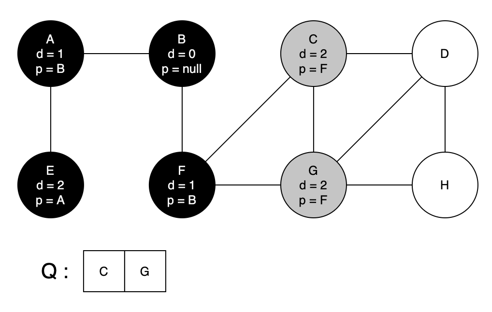
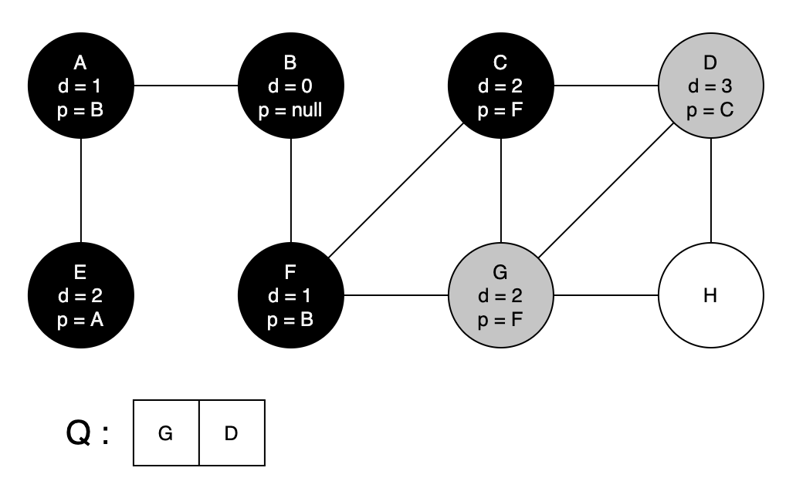
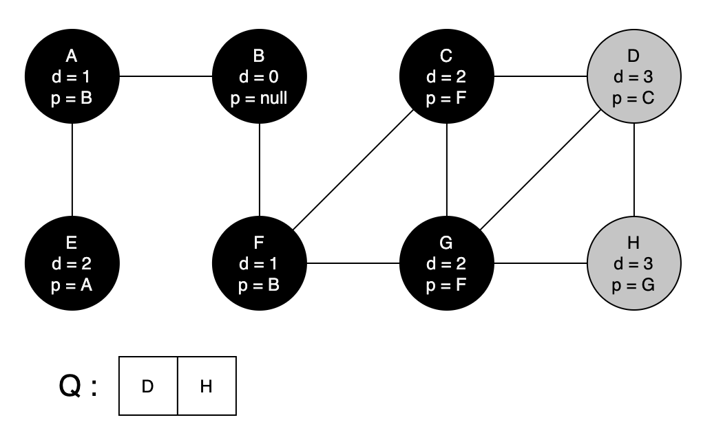
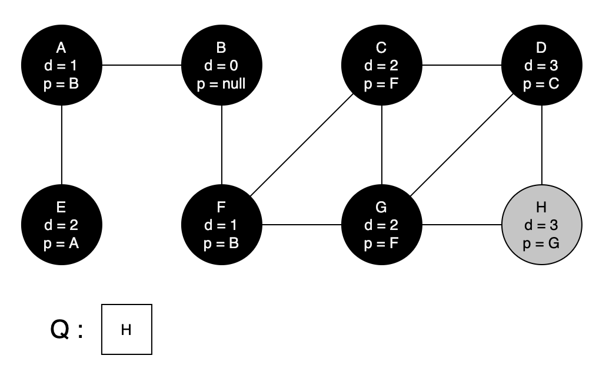
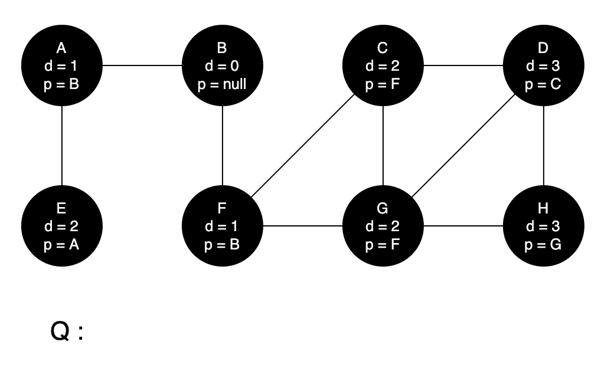

# Breadth-First Search

너비 우선 탐색으로도 불리는 BFS 역시 그래프를 탐색하기 위한 알고리즘이다. DFS는 한 노드에 대해서 제일 깊숙한 위치에 있는 레벨까지 내려가 탐색하지만 BFS는 한 레벨에 있는 모든 노드를 다 탐색하고 다음 레벨로 이동하는 방법으로 탐색을 진행한다. BFS는 최단 경로를 찾는데 유용하게 사용하는 알고리즘이고 queue 를 사용하여 구현한다.

## Algorithm Steps

### Node State

이번 강의에서 설명한 BFS는 색깔을 통해서 각 노드의 상태를 표현하게 된다.

1. White : 처음 발견된 노드
2. Gray : 발견은 되었지만 아직 해당 노드의 이웃노드들이 모두 탐색되지는 않은 노드
3. Black : 해당 노드의 이웃노드들이 모두 방문된 노드

### Distance

각 레벨, 혹은 depth 를 나타내기 위해서 distance 를 사용한다. 같은 레벨에 있는 노드들은 같은 distance 를 같게되고, distance 는 루트 노드로 부터 얼만큼의 edge가 떨어져있는지를 표현하게 된다.

### Pseudo Code

```
BFS(G, s)
    for each vertex u in V - {s}
        do d[u] = INFINITE
        predecessor(u) = null
    color[u] = gray
    d[s] = 0
    parent[u] = null
    Q = null;

    ENQUEUE (Q, s)
    while Q is not empty
        do u = dequeue (Q)
            for each v in adj[u]
                do if color[v] = white
                    then color[v] = gray
                        d[v] = d[u] + 1
                        predecessor(v) = u
                        ENQUEUE(Q, v)
        color[u] = black

```

코드가 복잡해보일 수도 있지만 생각보다 단순한 코드이다. BFS 함수에서는 모든 노드를 다 최기화 해주고 전달된 시작 노드를 세팅해준다. 그리고 ENQUEUE 함수를 통해 모든 노드를 마킹하며 순회하게 된다. 그림으로 한번 이해해보자.

### Example



위와 같이 큐와 그래프가 있다고 하자. 그리고 사용자가 bfs 의 시작노드로 B를 지정해 주었다고 하자.



첫 노드를 방문한 상태인 gray로 만들고 큐에 enqueue 해준다 . 여기까지가 pseudo code 에서 while 문 바로 앞까지의 과정이다.



이제 큐에 들어간 B를 빼내어서 해당 노드의 인접 노드들을 방문한다. 이때 한약색 상태를 가지고 있는 노드만 방문하고, 방문할 때 다음과 같은 작업을 해준다.

1. 회색으로 칠하기
2. 현재 distance + 1 을 distance 로 정하기
3. 부모 노드를 기록하기
4. 큐에 집어넣기

위 그림에서는 A 노드와 F노드를 한번에 방문한 것처럼 그려두었지만 사실 A노드를 먼저 방문했기 때문에 큐에 A가 먼저 들어가게 되었다.



이제 B에 해당하는 흰색 인접노드가 더 이상 없기 때문에 B 노드는 검은색으로 상태가 변경된다. 그리고 큐가 비어있지 않기 때문에 while 문은 다시 반복된다.


큐에 들어있던 A를 dequeue 해서 똑같은 방법을 진행한다. 이때, A는 B와 연결되어 있지만 B는 이미 검은색으로 상태가 변경되었기 때문에 A가 탐색할 노드는 E 뿐이다. E의 값을 지정해주고 큐에 넣어준다.



이번엔 F를 dequeue 하고 인접노드들을 처리해준다. 그림에서 확인할 수 있는 것 처럼 distance가 1인 노드들의 탐색이 모두 끝났다. 즉 레벨 1에 있던 노드에 대한 처리가 끝난 것이다.

위 작업을 계속 반복해보면,


</br>


</br>


</br>


</br>



더 이상 탐색할 노드가 없을 때까지 while 문에 의해 진행된다. 이제 큐에 들어있는 노드가 하나도 없기 때문에 while 문은 종룓되고 BFS가 완료된다.

## Algorithm Analysis

BFS를 진행하는데 필요한 시간복잡도는 다음과 같다.

1. 각 노드를 enqueue 하는 시간, 즉 white 상태인 노드를 gray로 바꾸는 시간 : 𝛩(V)
2. 각 노드를 dequeue 하는 시간, 즉 gray 상태인 노드를 black으로 바꾸는 시간 : 𝛩(V)
3. Ajacency List 를 통해서 인접노드를 모두 탐색하는 시간 : 𝛩(E)

따라서 전체 시간은 𝛩(V + E) 가 된다.
