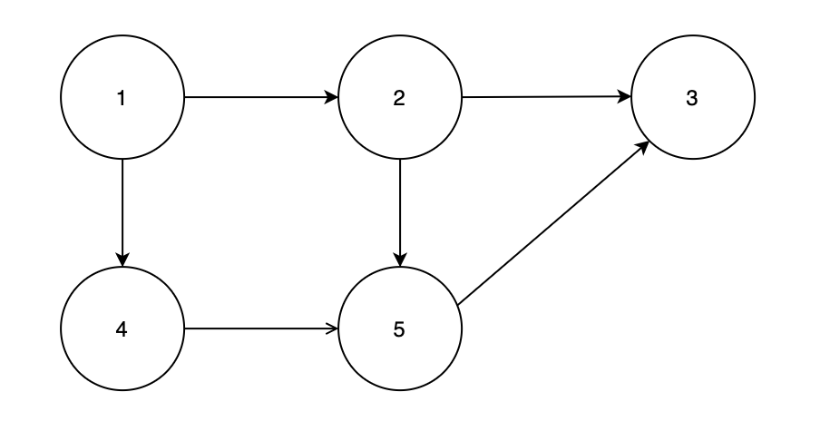
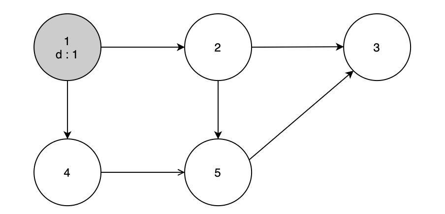
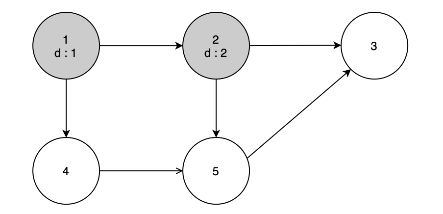
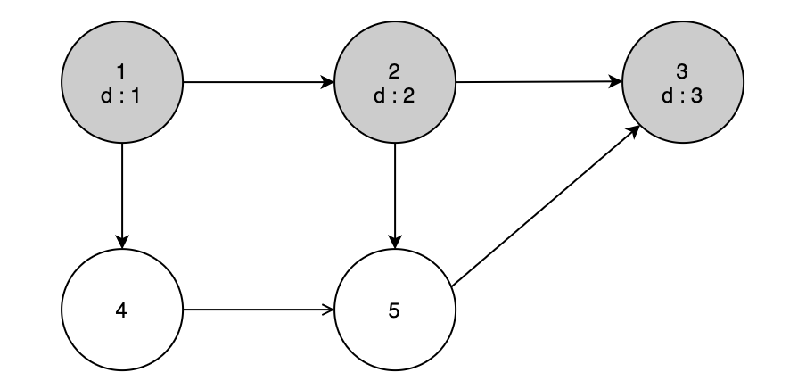
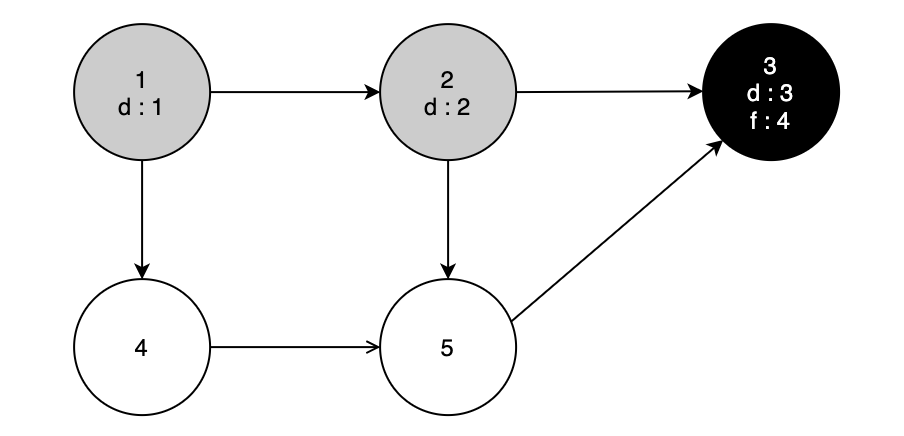
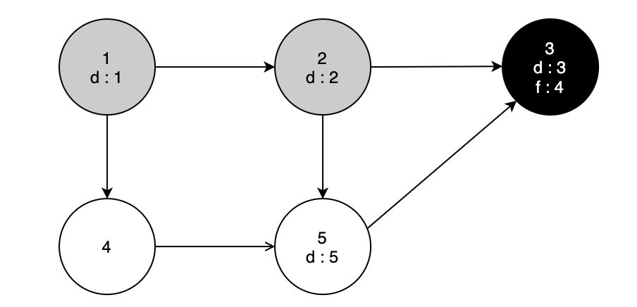
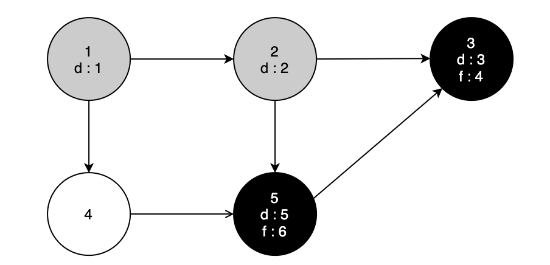
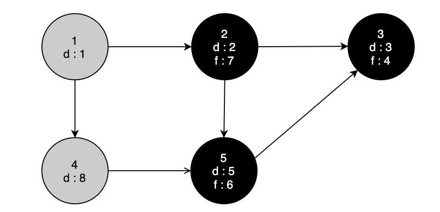
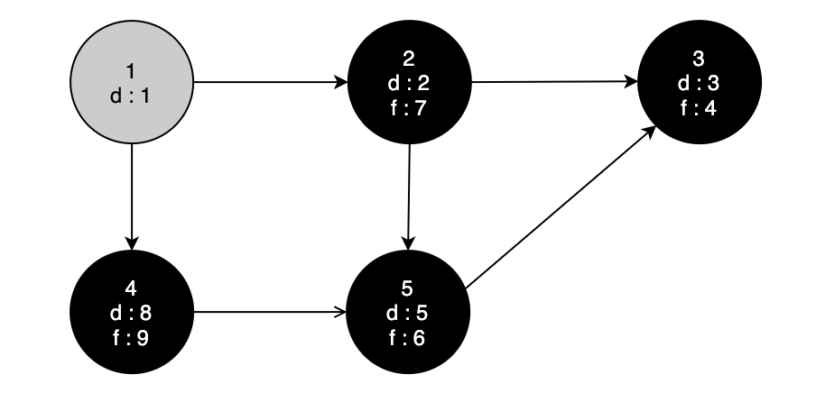
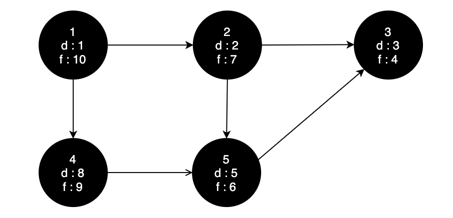

# Depth First Search

DFS는 그래프를 순회하기 위해 사용하는 알고리즘 전략으로, 한 노드로부터 시작해서 자식노드를 계속 따라가며 더 이상 자식노드가 나타나지 않을 때까지 진행하고 더 이상 자녀가 없을 때는 왔던 길을 다시 거슬러 올라가며 탐색하지 않은 다른 노드들을 같은 방법으로 순회하는 알고리즘이다.

## Algorithm Steps

DFS 를 적용하기 위한 다양한 방법이 있지만 강의에서 소개된 방법은 색깔을 통해 각 노드의 상태를 표현하고, 해당 노드가 발견된 시간(실제 시간을 기록하진 않는다), 탐색이 끝난 시간을 기록하는 방법으로 노드들을 순회한다.

### Node State

DFS가 탐색할 각 노드 혹은 vertex 는 다음 세개 중 하나의 색깔로 상태를 나타낸다.

1. White : 아직 발견되지 않은 노드
2. Gray : 발견은 되었지만 아직 해당 노드의 모든 자식과 자손 노드들을 탐색하지 않은 노드
3. Black : 해당 노드로 부터 파생된 모든 자손 노드들의 탐색이 끝난 노드

가장 초기에는 대상이 되는 그래프의 모든 노드들이 흰색으로 초기화 되어 있을 것이다.

### Timestamp

각 노드들은 색깔과 더불어서 두 종류의 timestamp를 가지게 된다. 여기서 timestamp는 실제 시간이 아니라 처리가 끝난 순서를 기록하게 된다.

1. d[v] : discorvery time. 어떤 노드가 발견된 시간, 즉 color 상태가 white 이었다가 gray 가 된 순간을 기록한다.
2. f[v] : finish time. 어떤 노드의 하위 노드들의 탐색이 모두 끝나고 해당 노드로 다시 돌아온 시간 즉 color 상태가 gray에서 black이 된 순간을 기록한다.

따라서 어떤 노드 v에 대해서 d[v]는 항상 f[v] 보다 작은 값을 가지고 있어야 한다.

### Pseudo Code

```cpp
DFS(V, E)
1 for each u in V
2   do color[u] = white
3 time = 0

4 for each u in V
5   do if color[u] = white
6     then DFS-VISIT(u)
```

위 pseudo code 는 DFS를 시작하는 노드이다. 어떤 그래프 안에 노드들이 연결되어 있지 않을 수도 있기 때문에 여러개의 트리를 DFS로 각각 탐색해야하는 경우가 있을 수도 있다. 1~2 번째 라인에서는 주어진 그래프 내에 있는 모든 노드들을 하나씩 꺼내서 그 색깔을 흰색으로 초기화 해준다. 그리고 3번째 라인에서는 전역변수로 사용되는 time 변수를 0으로 초기화해준다. 이 변수는 timestamp를 계속해서 기록하는데 사용하게 된다.

4 ~ 6째 라인에서는 각 노드들을 기준으로 트리를 만드려는 시도를 하게 되는데, 만약 모든 노드들이 다 연결되어 있다면, 트리가 만들어진 이후에 색깔이 검은색으로 변경된 상태일 것이기 때문에 더 이상 반복하지 않게된다. 만약 모든 노드들이 연결되어 있지 않다면 흰색으로 남아있는 노드가 존재한다는 것이기 때문에 새로운 트리를 만드는 시도를 반복적으로 할 수 있게 된다.

```cpp
DFS-VISIT(u)
1 color[u] = gray
2 time = time + 1
3 d[u] = time

4 for each v in adj[u]
5   do if color[v] = white
6     then DFS-VISIT(v)
7 color[u] = black

8 time = time + 1
9 f[u] = time
```

이 함수는 시작함수로부터 전달된 시작점이 될 노드부터 트리를 만들기 시작한다. 1 ~ 3 번째 라인에서는 노드를 방문했기 때문에 일단 색깔을 gray로 변경시키고 discovery time을 기록한다. 그리고 해당노드의 adjacency list, 즉 해당 노드와 연결되어 있는 노드를 하나씩 꺼내보고 만약 그 노드가 아직 방문 되지 않은 노드라면 그 노드를 시작점으로 재귀적으로 같은 작업을 반복한다. 이렇게 하면 초기 시작 노드로부터 더 이상 자녀노드가 없을 때까지 반복적으로 노드들을 체크해줄 수 있을 것이다.

### Example



위 와 같은 그래프가 있다고 하자. 만약 초기 노드로 1번 노드를 선택하고 dfs를 시작한다면,



다음과 같이 시작노드를 gray 로 색칠하고 discover time을 1로 설정하게 된다.



이제 1번 노드와 연결된 2번노드를 선택해서 재귀적으로 같은 작업을 수행한다. 2번노드가 흰색이므로 회색으로 색칠하고, discover 시간을 1 올려서 2로 표시해준다.




같은 작업을 계속 진행하면 3번 노드는 이제 더 이상 갈 곳이 없으므로 black 으로 칠하게 되고 backtrack 을 통해서 부모노드로 다시 올라간다.



리턴된 이후에 2번 노드에 대한 자식노드가 아직 adjacency node 남아있는 상태이기 때문에 5번 노드로 이동한다. 이런 과정을 계속해서 반복하게 되면 다음과 같이 그래프가 완성된다.







## Algorithm Analysis

DFS 알고리즘의 시간복잡도는 모든 노드를 순회하는 시간 𝛩(E + V) 의 시간과 각 노드에 대해 adjacency list 를 모두 확인하는 시간 𝛩(E) 만큼 걸리게 된다. 따라서 DFS의 시간 복잡도는 𝛩(E + V) 로 표현할 수 있다.
