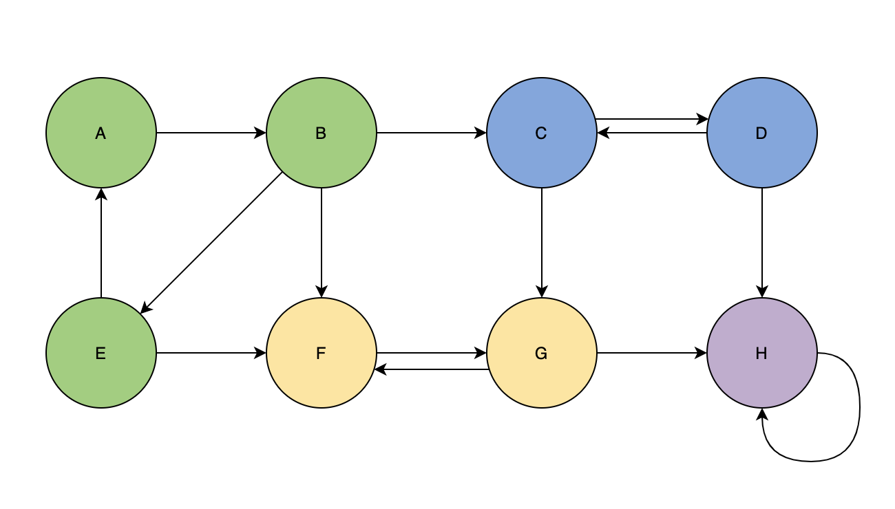
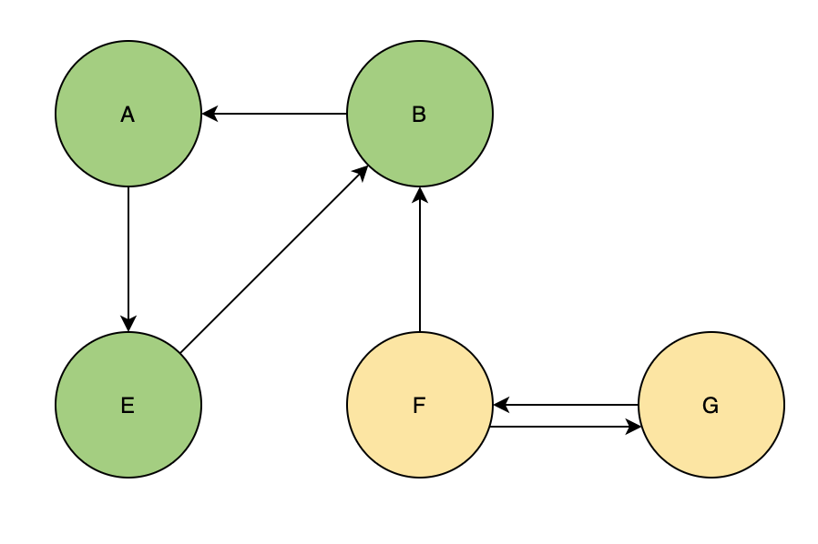

# Strongly Connected Component

`강한 연결 요소(SCC)` 라고도 하는 Strongly Connected Component 는 방향 그래프에서 다음과 같은 조건이 성립하는 정점들의 집합이다.

1. SCC 내에 있는 어떤 두 정점에 대한 경로가 항상 존재한다. 즉, 사이클이 존재한다.
2. 서로 다른 SCC에 속하는 두 정점은 서로 양방향으로 연결될 수 없다. 즉, SCC 간에는 사이클이 존재할 수 없다.



위와 같은 그래프에서 {A, B, C}, {C, D}, {F, G}, {H} 네 개의 Strongly Connected Component 가 있는 것을 확인할 수 있다.

## Algorithm

그래프에서 Strongly Connected Graph를 찾는 것은 우리가 눈으로 한번에 알 수 있는 것과는 조금 다르다. 만약 정점이 굉장히 많은 그래프가 주어졌다면 어떤 방법으로 컴퓨터가 SCC 를 구별할 수 있게 할 수 있을까?

여러 방법이 있겠지만, 정석적인 방법은 DFS를 활용하는 것이다.

## Applying DFS

DFS를 이용해서 SCC를 찾을 때는 다음과 같은 작업을 거친다.

1. DFS 로 각 정점의 `finish time`을 기록한다.
2. 현재 그래프를 `Transpose` 한다. 즉, 각 Edge의 방향을 반대로 취한다.
3. Transpose한 그래프에 대해서 DFS를 적용하여 그래프 내에 있는 모든 트리를 찾아준다. 이때, 트리를 만들기 시작할 루트 노드는 `finish time이 가장 늦은 정점 순으로 진행`이 된다.

## Proof

알고리즘은 무척이나 간단해보이는데, 어떻게 이런 방법으로 SCC를 찾는 것이 가능할까?

### Lemma 1

어떤 두 SCC X 와 Y가 있다고 하자. 만약 X에 속한 정점인 u 가 Y에 속하는 정점 v와 일방향으로 연결되어 있다면, v는 A에 속하는 다른 어떤 정점과도 연결될 수 없다. 왜냐하면 만약 v가 X에 속한 정점 중 하나를 가르키게 되면 두 SCC 사이에는 사이클이 생기게 되고, SCC의 성질을 잃게되기 때문이다.


위와 같은 두 SCC로 이루어진 그래프가 있다고 할 때, 초록색 SCC에 속하는 B 노드가 노란색 SCC에 속하는 F를 가르키고 있는 상황에서 F가 B를 가르키는 edge가 생기게 되면 위 두 SCC 모두 더 이상 SCC가 아니게 된다.

### Lemma 2

더불어서, 만약 어떤 두 SCC를 연결하는 edge 가 있다고 했을 때, edge의 시작점에 있는 SCC의 정점들 중 가장 늦은 finsh time은 edge가 가르키는 SCC의 finish time 보다 빨라야 한다. 여기서 finish time은 한 SCC에 있는 정점 중 탐색이 완전히 끝나는데 가장 오랜 시간이 걸리는 노드를 의미한다. 이 정리는 단순하고 당연한 것인데, 한 SCC에서 다음 SCC로 넘어가는 길이 항상 한 방향이어야 한다는 Lemma 1의 정리에 의해 어떤 SCC는 항상 그 SCC가 가르키는 SCC 이전에 탐색될 수 밖에 없다.


이 그림에서도 B에서 F로 연결되는 edge가 일방향이기 때문에 {A, B, C}로 이루어진 SCC가 {F, G} 로 이루어진 SCC 보다 항상 먼저 탐색된다.

### Corollary

이제 각 edge에 역방향을 취해서 transpose 된 그래프로 변형시켜보자. 이때 우리는 앞선 정리에 의해서 또 다른 정리를 도출해 낼 수 있다. Lemma 2 에서 정리했던 바에 따르면 어떤 두 SCC A 와 B가 연결되어 있다고 했을 때, A에서 B 방향으로 연결되어 있다면, SCC A의 끝나는 시간이 항상 SCC B 가 끝나는 시간보다 작다. 따라서 그래프에 역방향을 취하게 되면, 이 edge는 반대방향을 가르키게 되고 이제 SCC B가 끝나는 시간이 SCC A가 끝나는 시간보다 작아질 것이다.



이 그림에서도 쉽게 확인할 수 있다. {F, G} 로 이루어진 SCC의 탐색이 끝나야 {A, B, E} 로 이루어진 SCC로 이동할 수 있다.

그리고 이 정리에 이어 Lemma 1에 의해 {A, B, E} 로 이루어진 SCC로부터 {F, G} 로 이루어진 SCC로 연결되는 edge가 있을 수 없다는 것 또한 증명된다.

## Implementation

[[백준 알고리즘] 2150번: Strongly Connected Component](https://www.acmicpc.net/problem/2150)

공부한 내용을 토대로 위 문제를 풀어보았다. 생각보다 쉽지 않아서 구글링으로 로직을 더 공부하면서 풀었다. SCC에서 중요한 점은 끝난시간 순서대로 역방향 탐색을 진행해야 한다는 것이다. 따라서 Topology Sort 를 구현할 때 썼던 전략을 그대로 사용해서 끝나는 시간에 따라 노드들을 스택에 쌓아두고, 역방향으로 탐색할 때는 스택에 있는 노드들을 하나씩 꺼내서 루트노드로 삼는 것이 가장 구현하기에 간편하다. 역방향에 대한 표현은 최초에 사용자에게 입력을 받을 때, 인접노드리스트를 만들면서 정반대 방향으로의 리스트도 같이 작성해주면 된다.

```cpp
#include <cstdio>
#include <queue>
#include <vector>
#include <stack>
#include <algorithm>

using namespace std;

bool visited[10001];
vector<vector<int>> result;
vector<vector<int>> adj;
vector<vector<int>> adjTrans;

stack<int>stk;

void dfs(int root){
    visited[root] = true;
    for (int  i = 0 ; i < adj[root].size() ; i++){
        if (!visited[adj[root][i]]){
            dfs(adj[root][i]);
        }
    }
    stk.push(root);
}

void scc(int root){
    visited[root] = true;
    for (int  i = 0 ; i < adjTrans[root].size() ; i++){
        if (!visited[adjTrans[root][i]]){
            scc(adjTrans[root][i]);
            result.back().push_back(adjTrans[root][i]);
        }
    }
}

int main (){
    int V, E;

    scanf("%d %d", &V, &E);

    adj.resize(V+1);
    adjTrans.resize(V+1);

    for (int i = 0 ; i < E  ; i++){
        int a, b;
        scanf("%d %d", &a, &b);
        adj[a].push_back(b);
        adjTrans[b].push_back(a);
    }

    for (int i = 1 ; i <= V ; i++){
        if(!visited[i]){
            dfs(i);
        }
    }

    for (int i = 0 ; i <=V ; i++) visited[i] = false;

    while(!stk.empty()){
        if (!visited[stk.top()]){
            vector<int> temp(1);
            temp[0] = stk.top();
            result.push_back(temp);
            scc(stk.top());
        }
        stk.pop();
    }

    printf("%lu\n", result.size());

    for (int i = 0 ; i < result.size() ; i++){
        sort(result[i].begin(), result[i].end());
    }

    sort(result.begin(), result.end());
    for (auto v : result){
        for (auto i : v){
            printf("%d ", i);
        }
        printf("-1\n");
    }
}
```
