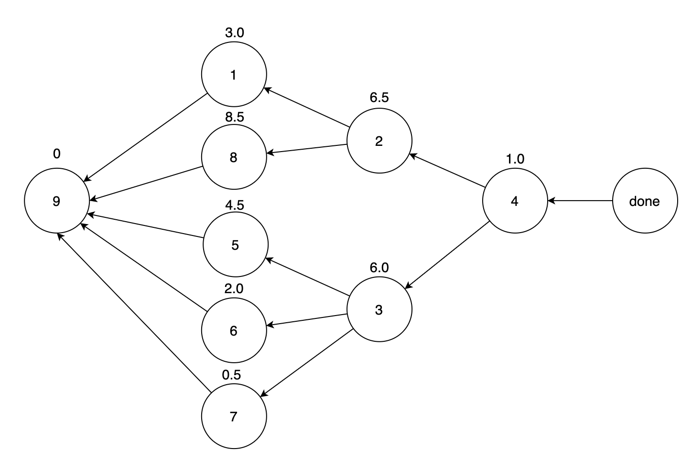
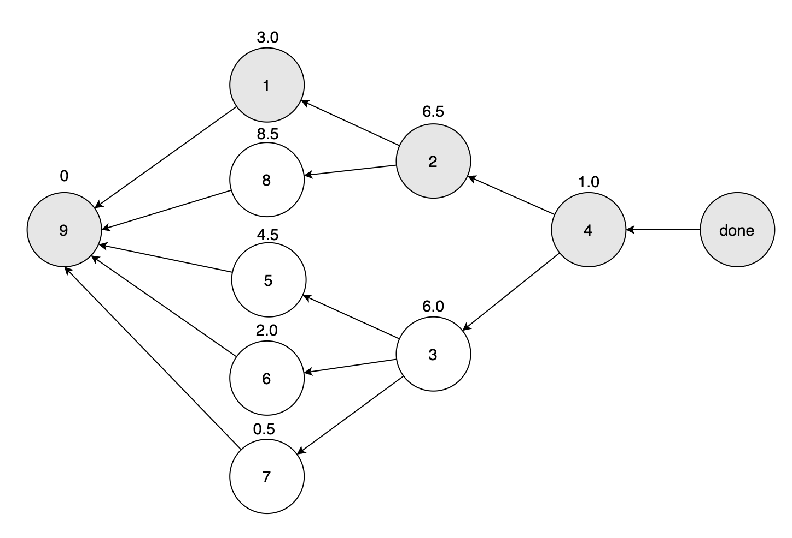
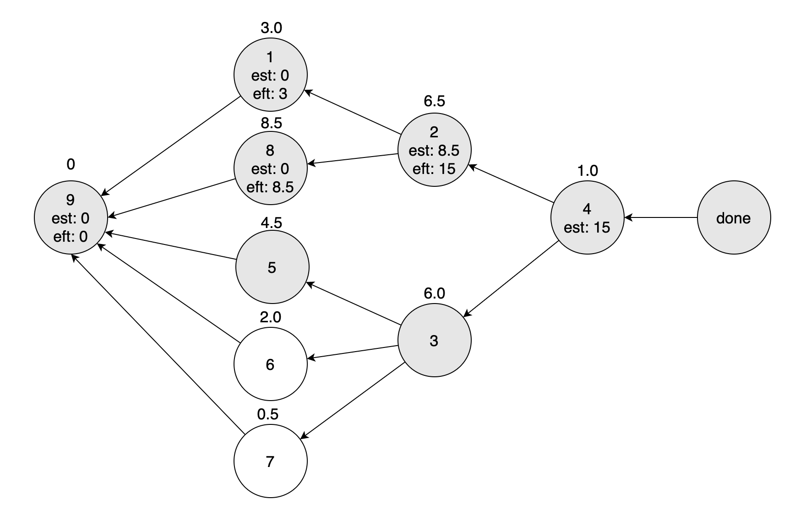
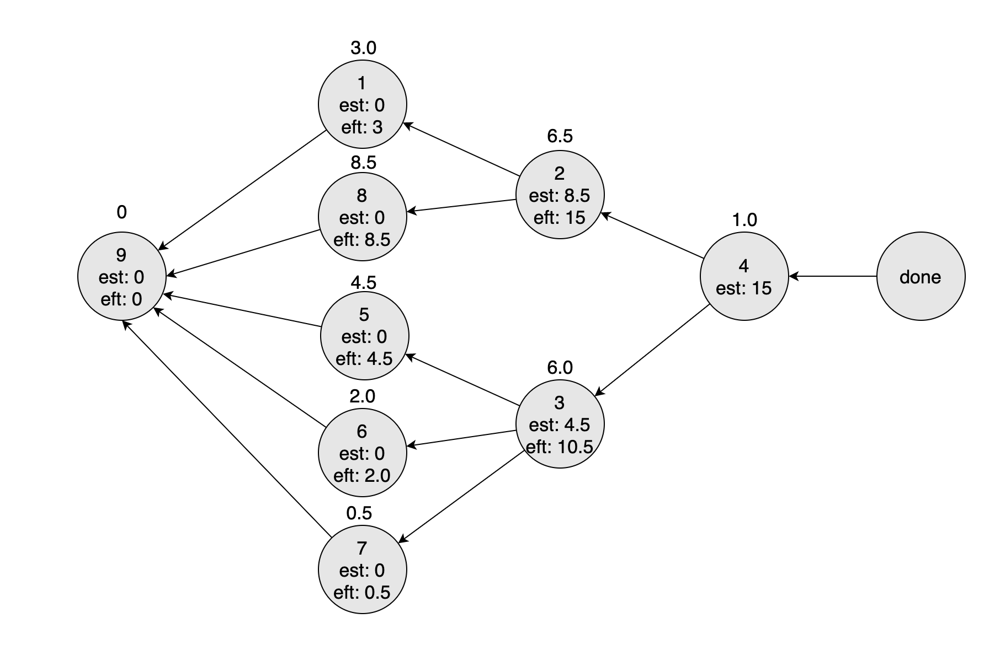

# Critical Path (임계경로)

방향 그래프는 위상정렬에서 보았던 것 처럼 어떤 순서를 표현하는 것이 가능하다. `Critical Path` 는 방향 그래프에서 어떤 정점까지 도달하는데 가장 오래 걸리는 경로를 의미한다. 가장 짧은 경로를 구하는 것이 더 의미있게 느껴질 수도 있겠지만, 가장 오래걸리는 경로를 구한다면, 가능한 모든 경로가 해당 경로의 거리나 시간 이내로 마칠 수 있다는 것을 의미하기 때문에 상당히 의미가 있다.

## Alogrithm Concepts

이 알고리즘 전략에서도 DFS가 사용된다. 사실상 `Topological Sort`에서 사용했던 개념이 다시 등장한다. Topological Sort 를 사용하게되면 각 정점마다 걸리는 최대 거리를 알 수 있게 되는데 이번에는 각 간선에 가중치가 있다는 조건에서 문제를 해결한다. 이를 위해서 그래프의 간선을 모두 역방향으로 만들고 각 노드들에 대해서 두가지 정보를 기록해야 한다:

1. `est (Earlist Start Time)`
2. `eft (Earlist Finish Time)`

### Node Dependency

est 와 eft는 Node dependency 에 의해서 정해진다. 만약에 어떤 노드가 다음에 해야할 일이 정해져 있지 않다면 그 노드는 dependency 가 없다고 할 수 있다. 즉 어떤 노드를 가르키는 간선을 가지는 노드를 dependency가 있다고 말할 수 있는 것이다.

각 노드들은 다음 세 상태 중 하나에 속하게 되고 각 경우마다 est의 계산 조건이 달라진다.

1. 더 이상 진행할 다음 노드가 없을 경우 : est = 0
2. 진행할 수 있는 다음 노드가 하나인 경우 : 다음 노드의 eft가 현재 노드의 est가 된다.
3. 진행할 수 있는 다음 노드가 여러개인 경우 : 연결된 다음 노드들의 eft중 가장 큰 값이 현재 노드의 est가 된다. eft는 _est + 간선 가중치_ 로 계산한다.

조금 헷갈릴 수도 있지만, 생각해보면 단순하다. topological sort를 생각해보면, finish time이 가장 늦는 노드를 알 수 있는데, 해당 노드로부터 경로를 backtrack 하면서 길이가 제일 긴 간선만 선택한다면 가장 시간이 오래걸리는 경로를 알아낼 수 있다.

### Modify DAG

Critical Path 를 찾기 위해서 그래프를 조금 수정해야할 필요가 있다.

- 그래프를 topological sort 했을 때 가장 마지막에 있는, 즉 아무 노드도 가르키지 않는 노드들에 새로운 노드를 연결한다. 그리고 이 노드를 `done` 이라고 부른다. 이 작업을 마치면 dependency가 없는 노드들은 모두 done을 가르키게 될 것이다. 이제 이 done 노드로 부터 역방향으로 가능한 모든 경로를 탐색하게 된다. 그리고 이 경로들 중에서 가장 큰 est를 선택하면서 다시 done으로 백트래킹 하다보면 최종적으로는 가장 시간이 오래걸리는 경로를 선택하게 될 것이다.

## Example



위와 같이 위상정렬을 진행하고 간선의 방향을 역방향으로 바꾼 그래프가 있다고 하자. 각 노드 위에 적힌 숫자들은 해당 노드로부터 다음 노드까지 이동하는데 걸리는 시간(가중치)이다. 위에서 설명했던 node dependency에 따른 est, esf 계산 조건을 생각하면서 따라가보자.

```
1. 더 이상 진행할 다음 노드가 없을 경우 : est = 0
2. 진행할 수 있는 다음 노드가 하나인 경우 : 다음 노드의 eft가 현재 노드의 est가 된다.
3. 진행할 수 있는 다음 노드가 여러개인 경우 : 연결된 다음 노드들의 eft중 가장 큰 값이 현재 노드의 est가 된다. eft는 est + 간선 가중치로 계산한다.
```

done 에서부터 탐색을 시작하게 되면, DFS이기 때문에 leaf node 까지 진행할 것이다. 9번 노드에 다다르고 다시 백트래킹을 시작할 때, est와 eft의 계산이 시작된다.

#### Phase 1



1. `9번 노드에 방문했을 때`: 9번 노드는 더 이상 진행할 노드가 없기 때문에 est 가 0이 된다.
2. `1번 노드로 백트랙 했을 때`: 1번 노드는 다음 노드가 9번 노드 하나뿐이다. 2번 조건에 만족하기 때문에 9번 노드의 eft가 1번 노드의 est 가 된다. 따라서 1번 노드의 est + 1번 노드의 시간 = 0 + 3.0 = 3.0 이 1번 노드의 eft가 된다.
3. `2번 노드로 백트랙 했을 때`: 2번 노드 다음으로 연결된 노드는 1번과 8번이다. 두 노드 중 eft가 더 큰 노드를 현재 노드의 est로 만든다. 아직 8번 노드의 eft를 모르지만 일단 2번 노드의 eft를 현재시점에서 가장 큰 값이라고 고려할 수 있다. 2번 노드의 est를 1번 노드의 eft로 만들어주자.

#### Phase 2


첫 탐색에 대한 계산이 끝났을 때, 각 노드의 est, eft는 위 그림처럼 설정된다. 이제 DFS에 의해서 8번 노드로 탐색이 이어진다. 이번 역시 진행할 수 있을만큼 앞으로 진행하고 백트래킹을 하면서 값을 계산한다.

1. `9번 노드에 방문?`: 9번 노드는 한번 방문했던 노드이기 때문에 방문하지 않는다.
2. `8번 노드에 탐색을 마치면서`: 9번 노드로 진행하지 않았기 때문에 곧바로 8번 노드에 대한 계산이 이루어진다. 8번 노드는 2번 조건에 해당돼서 9번 노드의 eft인 0 이 8번 노드의 est가 되고, eft는 자신의 이동 시간인 8.5를 더해 8.5가 된다.
3. `2번 노드로 백트랙 했을 때`: 2번 노드에 대한 탐색이 모두 끝났다. 8번 노드에서 리턴되면서 2번 노드에 다시 방문하게 됐기 때문에 현재 2번 노드의 est인 3 과 8번노드의 eft인 8.5 중 더 큰 값인 8.5를 선택해서 est로 만든다. 그리고 2번 노드의 eft는 `8.5 + 6.5 = 15` 가 된다.
4. `4번 노드로 백트랙 했을 때`: 2번 노드의 탐색이 종료되면서 4번 노드로의 백트랙이 진행된다. 여기에서도 같은 논리로 4번 노드의 est 를 15로 설정해준다.

#### Phase 3



이제 3번 노드부터의 탐색이 진행된다. 앞선 단계에서와 같이 계속 진행해보자.

1. `5번 노드에서의 계산`: 이번에도 역시 9번 노드는 방문하지 않는다. 5번 노드의 est는 0, eft는 0 + 4.5 인 4.5 가 된다.
2. `5번 노드에서 3번 노드로 백트랙`: 3번 노드의 탐색이 아직 끝나지 않았지만 현재시점에서 가장 큰 5번 노드의 eft를 자신의 est로 만든다. 따라서 현재 est는 4.5가 된다.
3. `6번 노드로 탐색`: 6번 노드는 3번 노드와 상황이 같다. est 는 0, eft는 0 + 2.0 = 2가 된다.
4. `6번 노드에서 3번 노드로 백트랙`: 3번 노드의 현재 est는 4.5이다. 6번 노드의 eft인 2.0보다 크기 때문에 업데이트 하지 않고 넘어간다.
5. `7번 노드로 탐색`: 6번 노드와 상황이 같다. est 는 0, eft는 0 + 0.5 = 0.5가 된다.
6. `7번 노드에서 3번 노드로 백트랙`: 3번 노드에는 est로 4.5 저장되어 있다. 이 값이 7번 노드의 eft보다 크기 때문에 업데이트를 하지 않는다.

#### Phase 4



여기까지 진행이 되면 위와 같이 est, eft가 각 노드에 저장된다. 이제 마무리만 잘 해주면 된다.

1. `3번 노드에서 4번 노드로 백트랙`: 4번 노드의 est에는 2번 노드의 탐색을 끝냈을 때의 값인 15가 저장되어 있다. 3번 노드가 탐색이 완료되고 백트랙했을 때, 3번 노드의 eft인 10.5는 현재 4번 노드의 est인 15보다 작기 때문에 4번 노드는 est를 업데이트 하지 않는다.
2. `4번 노드 탐색종료`: 4번 노드의 탐색이 끝났기 때문에 eft를 계산할 수 있다. 현재 4번 노드의 est인 1.0 과 이동시간 1.0을 더해서 최종적으로 4번 노드의 eft는 16.0이 된다.
3. `done으로 백트랙`: 모든 하위 노드들의 탐색을 마치고 done 에 돌아오게 되면, done의 est 와 eft는 0으로 초기화 되어있기 때문에 자연스럽게 done의 est와 eft는 모두 16이 된다.

이 예제에서 최종적으로 나온 답은 9에서 4까지 이동하는데 걸리는 시간이 아무리 오래걸려서 16 이하라는 것을 알 수 있게 된다.
