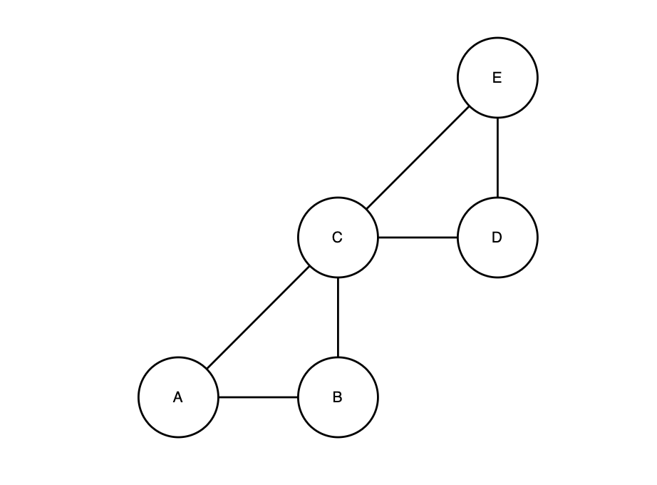
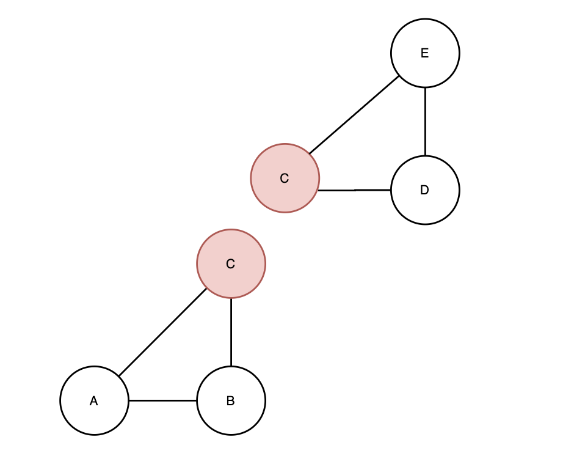
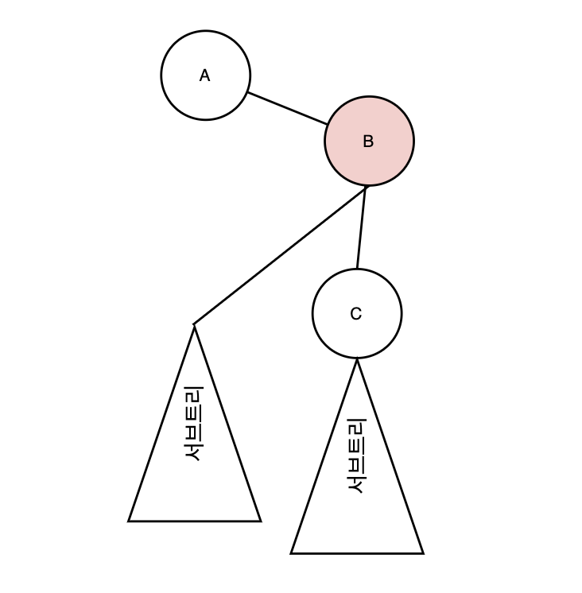
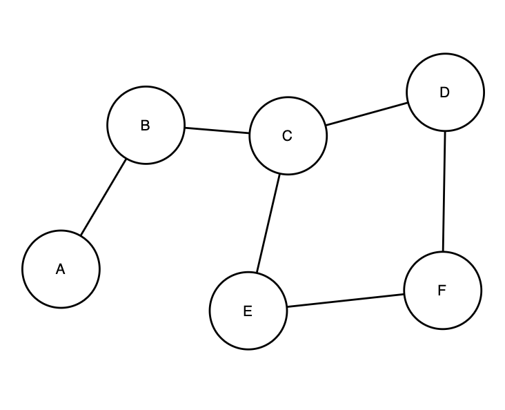
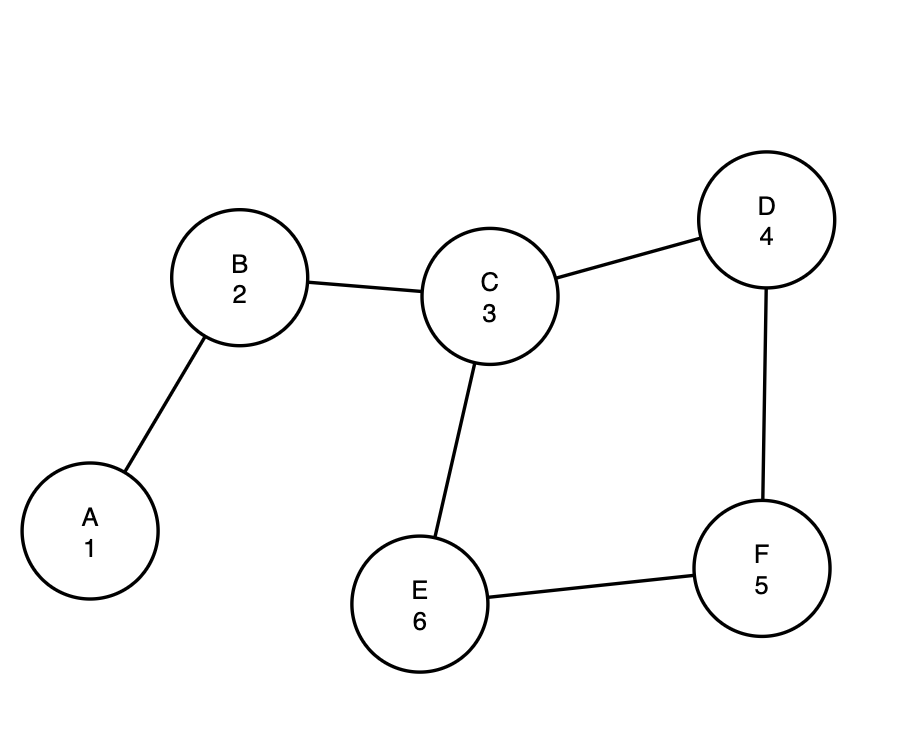
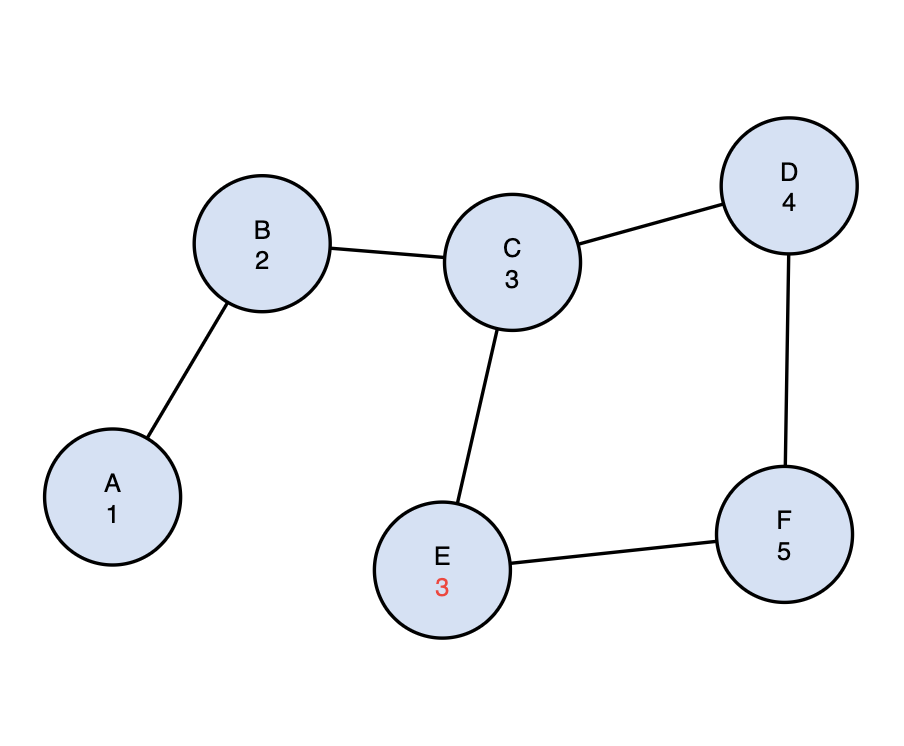
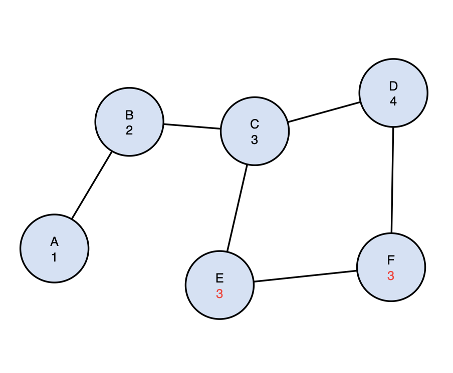
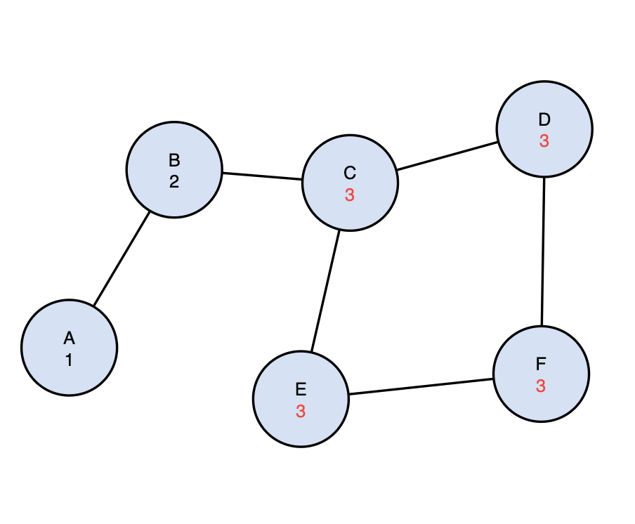

# Articulation Point (단절점)

방향이 없는 그래프에서 어떤 정점(vertex)를 제거했을 때, 두 개 이상의 그래프가 형성되게 하는 정점을 Articulation Point 라고 한다. 조금 더 쉽게 이야기하자면, 이 정점이 두 그래프의 연결점이 되는 것과 같다. 다음 그래프를 한번 살펴보자.



이 그래프는 정점 C를 기준으로 두 그래프로 나눌 수 있다.



이런식으로 어떤 두 그래프의 연결지점이 되기도 하고, 또 다르게 생각해보면 이 정점을 제거했을 때, 완전히 다른 두개의 그래프가 생성되기도 한다. 이런 정점을 Articulation Point 라고 부르고, 우리 말로는 단절점이라고 한다.

## Algorithm Concept

그렇다면 단절점을 찾기 위해서는 어떻게 접근해야 할까? 우선 이전 강의에서 우리는 방향이 없는 그래프에서는 Tree Edge 와 Back Edge 만이 존재할 수 있다는 것을 증명했다.

### 사실 내가 까먹어서 다시 적는 Edge의 종류

1. Tree Edge: 현재 정점으로부터 새로운 정점에 방문할때 생기는 Edge

2. Back Edge: 트리에서 자손이 되는 노드가 조상의 노드와 이어질 때 생기는 Edge

3. Forward Edge: 조상 노드가 자손 노드와 이어질 때 생기는 Edge

4. Cross Edge: 현재 탐색중인 (서브)트리가 탐색이 끝난 다른 (서브)트리와 이어질 때 생기는 Edge

다시 본론으로 돌아와 정리해보자면, 방향이 없는 그래프를 탐색할 때, 새로운 노드가 탐색되는 경우, 그리고 자손 노드가 조상 노드의 이어지는 경우만 존재할 수 있다. 이 특성을 기억한 채로 다음 그래프를 살펴보자.



위 그래프를 보면 만약 C를 루트노드로 하는 서브트리에 B로 연결되는 Back Edge 가 없다면, 우리는 B를 C 서브트리의 단절점이라고 정의할 수 있다. 왜냐하면 C 노드의 밑에 위치한 모든 노드들은 C을 거치지 않는다면, 절대로 B에 도달할 수 없기 때문이다. 따라서 만약 B 노드를 이 그레프에서 제거하게 되면 기존 그래프와 연결이 끊어지고 C를 루트로 하는 별도의 새로운 그래프가 생성되는 것이다.

구현이 정말 쉬울지는 두고봐야겠지만 우리는 결국 DFS를 통해서 모든 정점들을 순회하면서 Back Edge를 통해 연결되지 않는 정점을 찾으면 된다.

## Algorithm

그럼 본격적으로 알고리즘을 살펴보자.

### Pseudo Code

```
For all vertex v under vertex y, check back edge vw
    initialize 'back' to discover time of v

    when encountered with back edge vw
    back of v = min (back of v, discover time of w)

    when backtracking from v to u,
    back of u = min (back of u, back of v)

    when backing up from root of the sub-tree(z) to its parent node
        if all vertices in z has higher back then discover time of d y, y is a Ariticulation Point Candidate

        else if there is back value lower than discover time of y, y cannot be Articulation Point
```

영어로 써두니 더 복잡해 보인다.. 정리해보자.

1. 일단 우리는 모든 정점을 다 순회해야 한다. 정점을 방문할 때마다 discover time 을 back 이라는 변수에 기록한다. 이 변수는 각 노드마다 연결되어 있는 트리에서 제일 위에 위치한 조상노드의 discover time을 기록하게된다. 이게 무슨 의미인지는 계속 진행해가면서 이해해보자.

2. 어떤 정점(y)에 대해서 그 하위에 존재하는 모든 노드를 탐색하면서 Back Edge 를 검사한다. Back Edge 는 자신과 연결된 노드 중, 이미 방문했던 노드를 확인하면 된다. 이미 방문했던 노드가 발견되면 현재 정점의 back 값과 back edge를 만드는 부모노드를 비교해 더 작은 값을 back 값으로 업데이트 한다.

3. 각 노드가 DFS로 탐색을 마치고 더 이상 진행할 자녀노드가 없어 백트랙 하게되면, 탐색을 마친 부모 노드는 방금 탐색을 마치고 돌아온 자녀노드가 가진 back 값과 자기 자신의 back 값을 비교해서 더 작은 값을 자신의 back 값으로 만든다. 이 시점에서, 탐색을 마친 노드는 자신의 하위에 있는 노드들과 연결된 노드 중 가장 높은 level에 있는(루트노드와 제일 가까운) 노드의 discovery time을 가지게 된다.

4. 위 작업을 루트 노드로 돌아올 때까지 반복하게 되면, 마지막에 가지게 되는 back 값이 단절점이 되는 노드의 discovery time이 되기 때문에 Articulation Point 를 찾게 될 것이다.

### Example



위 그래프의 단절점을 찾아보자. 탐색을 시작할 노드는 임의로 A로 정하자.



먼저 DFS로 그래프를 순회하면서 Discover Time 을 back 값으로 지정해준다.


DFS로 탐색하기 때문에 더 이상 진행할 수 없을 때까지 진행하다보면 E 노드에서 C 노드로 탐색을 하려는 시도를 하게 된다. 그렇지만 C는 이미 방문된 상태이기 때문에 진행할 수 없다. 즉, C 와 E 사이에 Back Edge가 존재하는 것이 확인된다.



따라서 미리 정해둔 규칙에 의해서 E는 자신의 back 값과 C 노드의 Back 값 중 더 작은 값을 자신의 back 값으로 업데이트한다. 따라서 E의 back 값은 3이 되었다.



E 노드로부터 백트랙하면서 부모노드인 F는 자신의 back 값과 E의 back 값인 3을 비교하게 된다. 이 경우에는 E의 back 값이 3, F는 5였기 때문에 F의 back 값은 3으로 업데이트 된다.

이 과정을 계속 진행하다보면 그래프의 back 값은 다음과 같이 채워진다.



백트랙을 진행하면서 가장 작은 back 값인 3으로 C까지 진행되었다. C의 Discovery Time이 C의 서브트리에서 올라온 back 값과 같기 때문에 C 아래로는 C 위에 있는 노드들과 연결된 노드들이 없다는 것을 알 수 있게 된다. 따라서 C는 Articulation Point 가 된다.

하나의 단절점을 찾았지만 아직 DFS는 끝나지 않았다. C의 탐색이 마치고 B로 백트랙하게 되면 더 작은 값인 2가 그대로 유지될 것이다. 그런데 한가지 의문점이 생긴다. 위 그래프에서는 결국 마지막까지 돌아왔을 때 중간에 어떤 과정이 있었든지 루트노드가 항상 최소의 back값이 된다. 뭔가 이상하다.

그래서 Articulation Point 를 판단하는데는 한가지 조건이 추가된다. 어떤 정점이 articulation point 가 되려면 반드시 `두 개 이상의 서브트리`를 포함하고 있어야 한다. 따라서 A노드는 B노드 하나만을 자녀노드로 가지기 때문에 단절점의 조건을 만족하지 못하고, 해당 지점 이전까지 가장 작았던 back값에 해당하는 B가 또 다른 단절점이 된다.

따라서 이 그래프에서 단절점은 B, C 두 개가 있다고 할 수 있다.
