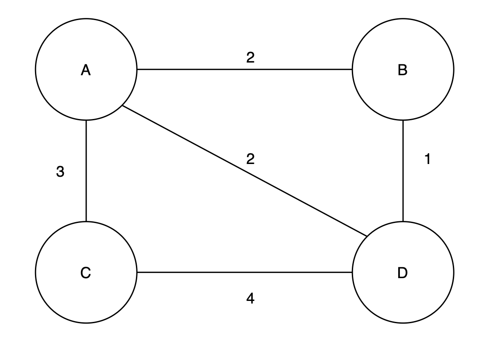
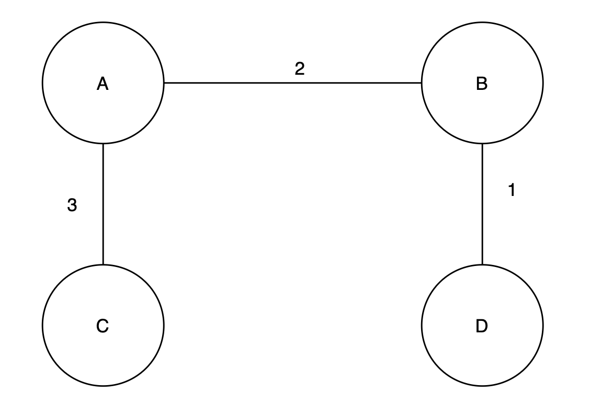
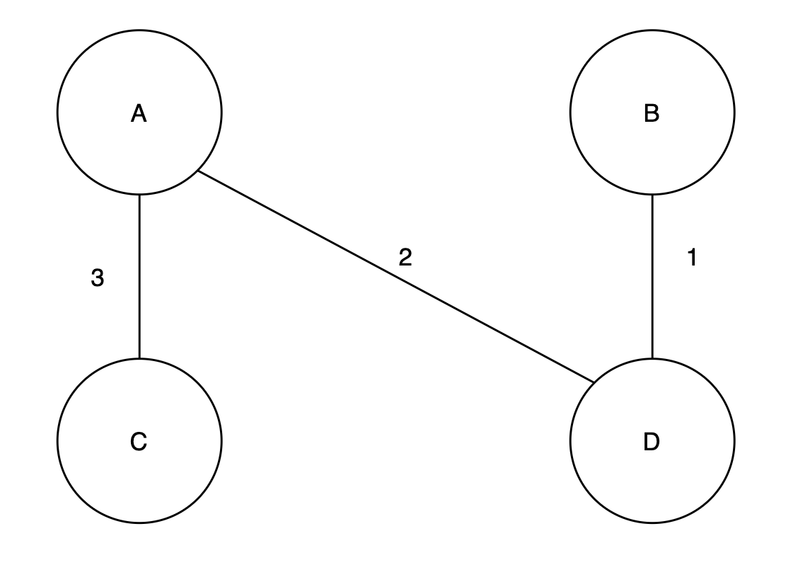
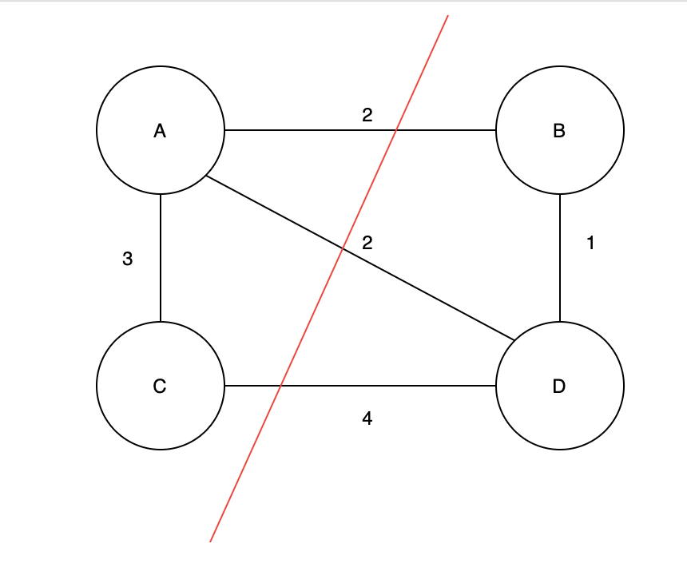
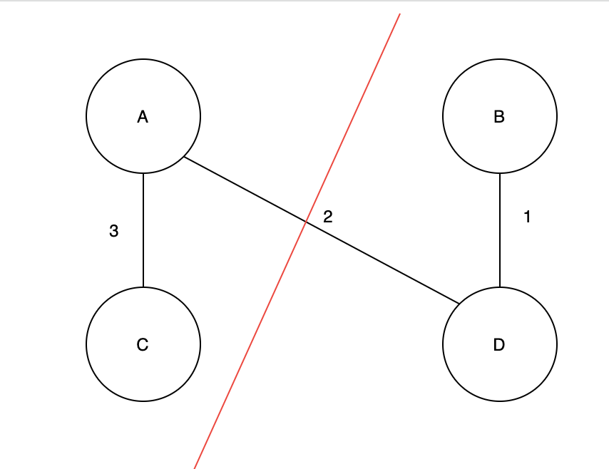
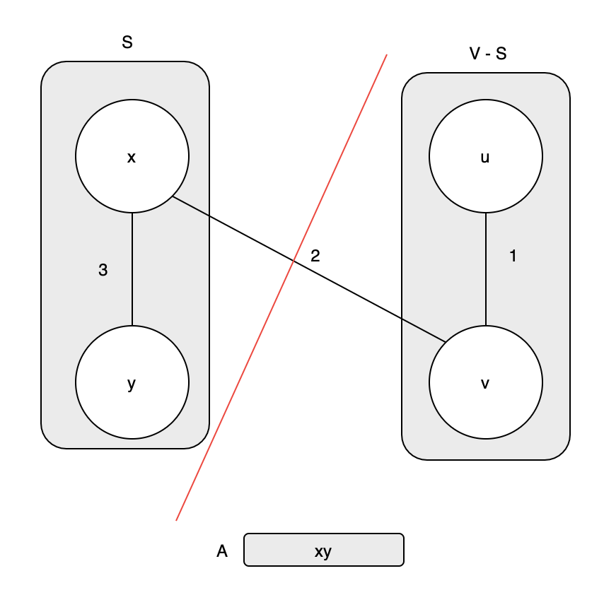
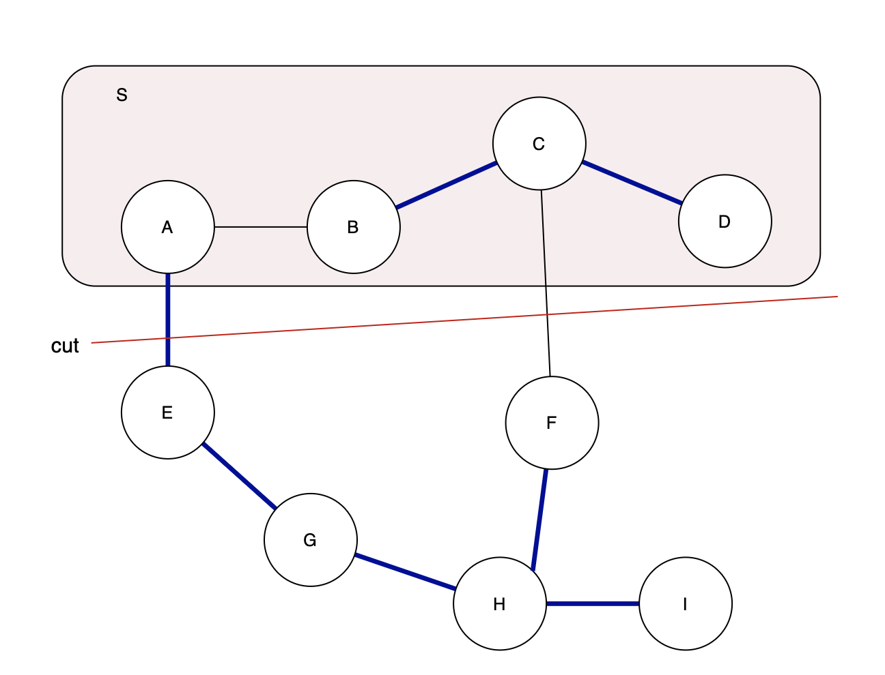

# Spanning Tree

Minimum Spanning Tree 를 시작하기 전에, Spanning Tree가 무엇인지 정리해보자.

## Spanning Tree Condition

`신장트리` 라고도 하는 스패닝 트리는 다음과 같은 조건이 성립해야한다.

1. N개의 정점을 가지는 그래프에서 최소 N-1 개의 간선으로 연결되어 있다.
2. 그래프의 모든 정점을 포함한다.

그래프의 모든 정점을 가지고 있어야 신장트리의 조건이 만족되기 때문에, 간선의 갯수는 항상 N-1 개가 될 수 밖에 없고, N-1개의 간선과 N개의 정점으로 이루어진 그래프는 전체 그래프에 대한 사이클이 존재할 수 없기 때문에 항상 트리의 형태가 된다.

따라서 우리가 DFS나 BFS 로 탐색하면 각 정점들을 연결하게 되면 자연스럽게 Spanning Tree 가 완성이 된다.

# Minimum Spanning Tree (MST)

`최소 신장 트리` 라고도 하는 MST는 그래프 안에서 간선들에 가중치가 존재할 때, 가장 적은 비용을 사용하면서 신장트리를 만드는 것을 말한다.

위 와 같은 그래프가 있을 때, 탐색 방향을 어디로 두는지에 따라서 탐색을 마친후 생성되는 트리의 가중치가 달라진다. 왜냐하면 위 그래프의 정점의 갯수는 4개이기 때문에 주어진 모든 간선을 사용하지 않고 3개만 사용하면 트리가 만들어지기 때문이다.

예를 들면, 위 처럼 그래프를 연결하면 간선의 가중치 합이 6으로 최소 신장트리를 만들 수 있다.

## Algorithm Approach

최소 신장 트리를 찾기 위해서는 다음과 같은 과정이 필요하다.

1. 간선을 넣을 집합 A를 만들자.
2. 이 집합에 Safe Edge 를 하나씩 넣는다.

### Safe Edge

여기서 Safe Edge(안전간선) 라는 개념이 등장한다. 그리고 Safe Edge 정의하기 위해서 몇가지 개념들을 정리해보자.

- `Cut(단절)` : Cut은 트리의 모든 정점들의 집합을 V라고 할 때, 이 정점들을 두개의 집합으로 나누는 것을 의미한다.

위 그림처럼 그래프를 이루는 정점의 집합 {A, B, C, D} 를 {A, C}, {B, D} 로 나눌 수 있다. 반드시 두 집합의 정점의 수가 같게 나누어져야하는 것은 아니고 전체 집합에서 두 집합으로 나누어지기만 하면 된다.

- `Cross (교차)` : Cross 는 Cut 를 통해 나누어진 두 집합 사이에 연결된 간선이 존재할 때, 두 집합이 교차한다고 할 수 있다.

위 처럼 나누어진 그래프가 있을 때, 서로 다른 집합에 속하는 A와 D가 연결되어 있기 때문에 간선 AD는 두 집합을 교차한다고 말할 수 있다.

- `Respect (따름)` : 어떤 집합 A가 MST의 부분집합이라고 한다면, A에 속하는 정점 중에 cut 으로 나누어진 다른 집합으로 cross 하는 edge가 없다는 것을 의미하고 이런 경우를 cut이 A를 repect 한다고 힌다. 위에서 사용한 그림을 다시 보면 AD는 두 집합 사이를 교차하기 때문에, 만약 A의 간선 집합이 MST의 부분집합이라면 cut은 A를 repect 하지 않는 것이다.

- `Light Edge (경량 간선)` : cut을 cross 하는 간선들이 여러 개 있을 때, 그 중 가중치가 최소인 간선을 말한다.

위 개념들을 사용해서 Safe Edge를 정의하면, 어떤 간선의 집합 A가 MST 의 부분집합이고, cut에 의해 그래프의 정점집합 V가 S 와 V-S 로 나누어져 있을 때, 이 cut이 A를 respect 한다고 하자. 즉 A의 간선들이 다른 집합으로 연결되어 있는 상태가 아니라고 할 때, 어떤 light edge x-v가 존재한다면, 이 간선을 A의 안전 간선이라고 한다.

이 그림을 확인해보자.

1. 전체 정점의 집합 V{x, y, u, v} 는 S{x, y}외 V-S{u, v}로 나누어져 있다.

2. MST의 부분집합인 A에는 간선 xy가 저장되어 있다. 따라서 현재까지 cut 은 A에 respect 하다.

3. 이때 간선 xv 가 발견되었다고 하자. 간선 xv는 S 와 V-S 를 cross 하는 간선 중 가장 가중치가 작은 간선인 light edge 이다. 그러므로 이 간선은 Safe Edge 이다.

따라서 Safe Edge 는 그래프 전체 정점을 포함하는 두 개의 부분 집합을 잇는 가장 작은 가중치를 가진 간선이므로, 그래프를 잘개 쪼개어서 모든 정점을 포함할 때까지 Safe Edge를 구해서 정점들을 연결하다보면 최소 신장 트리가 완성된다. 최소 신장 트리를 찾는 과정은 Greedy Algorithm과 같다.

### Proof

말은 간단한데 어떻게 이게 가능할까? 증명을 해보자.

위와 같은 그래프가 있다고 하자. 진한 파란색으로 표현된 간선은 모두 MST의 부분 집합이 되는 간선들이라고 하자. 그리고 우리가 정리한 정의대로 현재 확인할 수 있는 Safe Edge는 간선 AE이다. 두 정점 집합을 교차하는 가장 짧은 길이의 간선이기 때문이다.

1. 그럼 이제 light edge인 간선 AE가 MST에 속하지 않는다고 해보자.

2. 그렇다면 정점 집합이 끊어지게 되는데, MST를 만들기 위해서는 모든 정점을 다 포함해야 한다. 이제 cut에 의해 나누어진 두 집합을 이어줄 다른 경로 를 찾아야한다.

3. 간선 CF가 새로운 cross 가 되어서 두 집합을 이을 수 밖에 없다. 이 MST를 새로운 T로 정의하자.

4. 이렇게 새로 만들어진 MST T는 기존 AE를 사용해 만든 MST와 다른 모든 간선이 같고 cross 하는 Edge 만 다르다고 한다면, T의 가중치 합은 항상 AE를 포함하는 기존의 MST보다 클 수 밖에 없다. 왜냐하면 AE는 처음에 light edge로 정의되었고, light weight는 cross하는 간선 중 가장 작은 가중치를 가지는 간선이기 때문이다.

5. 따라서 두 정점집합을 cross 하는 edge가 light edge라면, 이 간선은 Safe Edge 가 되고 MST는 언제나 성립한다.
