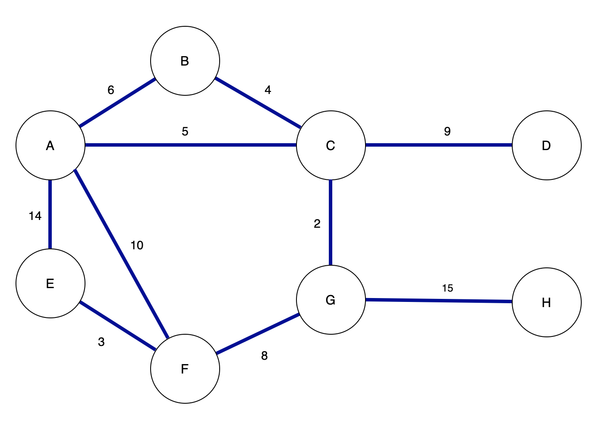
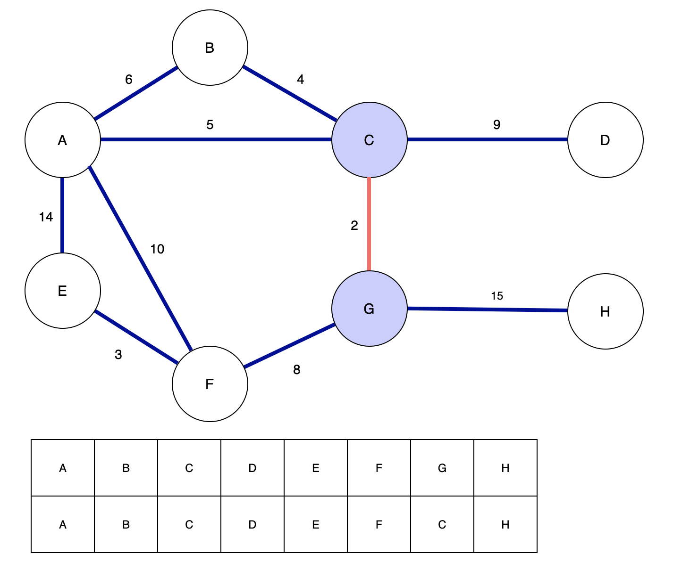
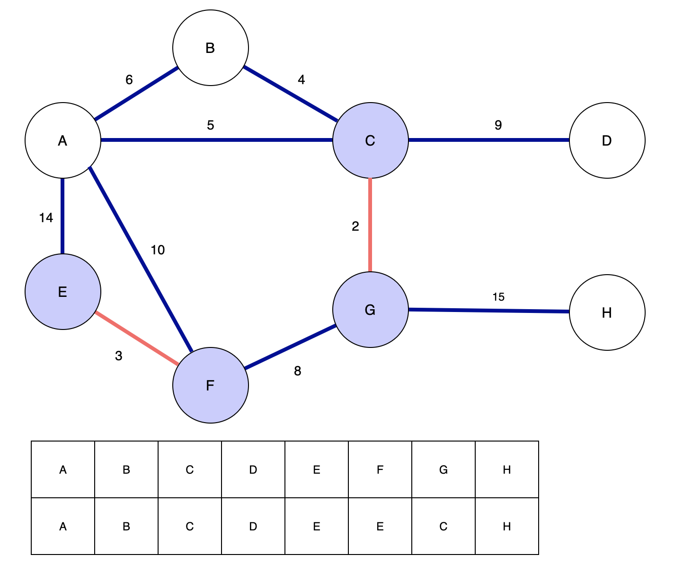
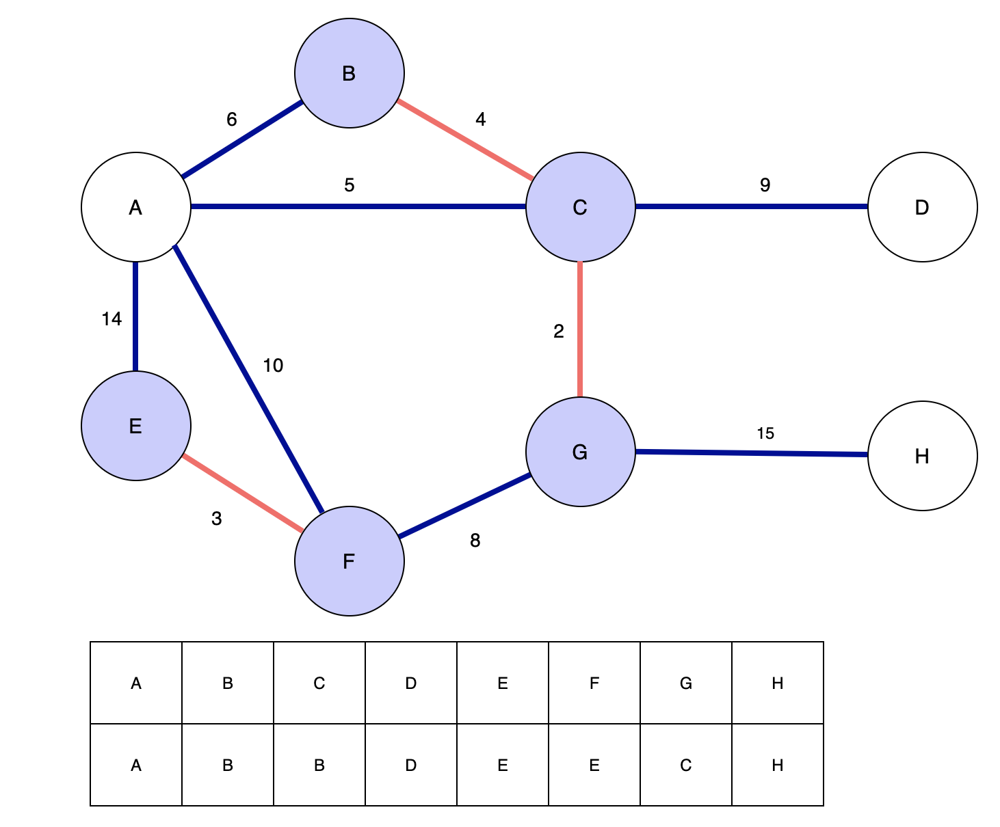
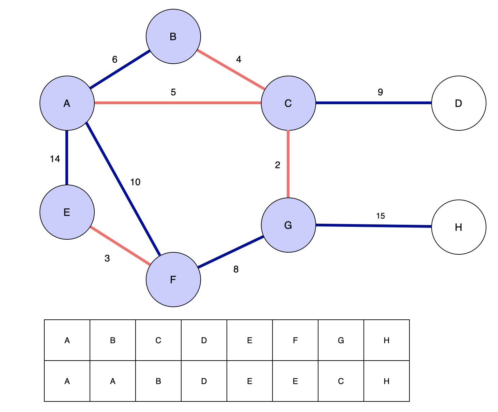
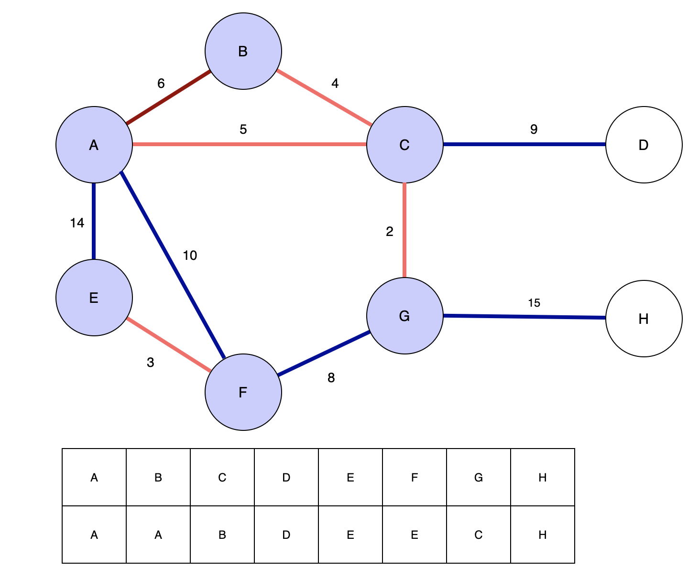
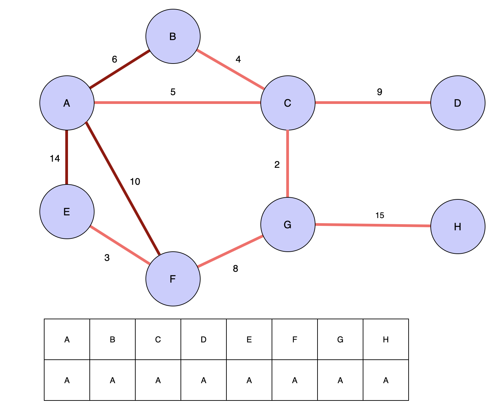
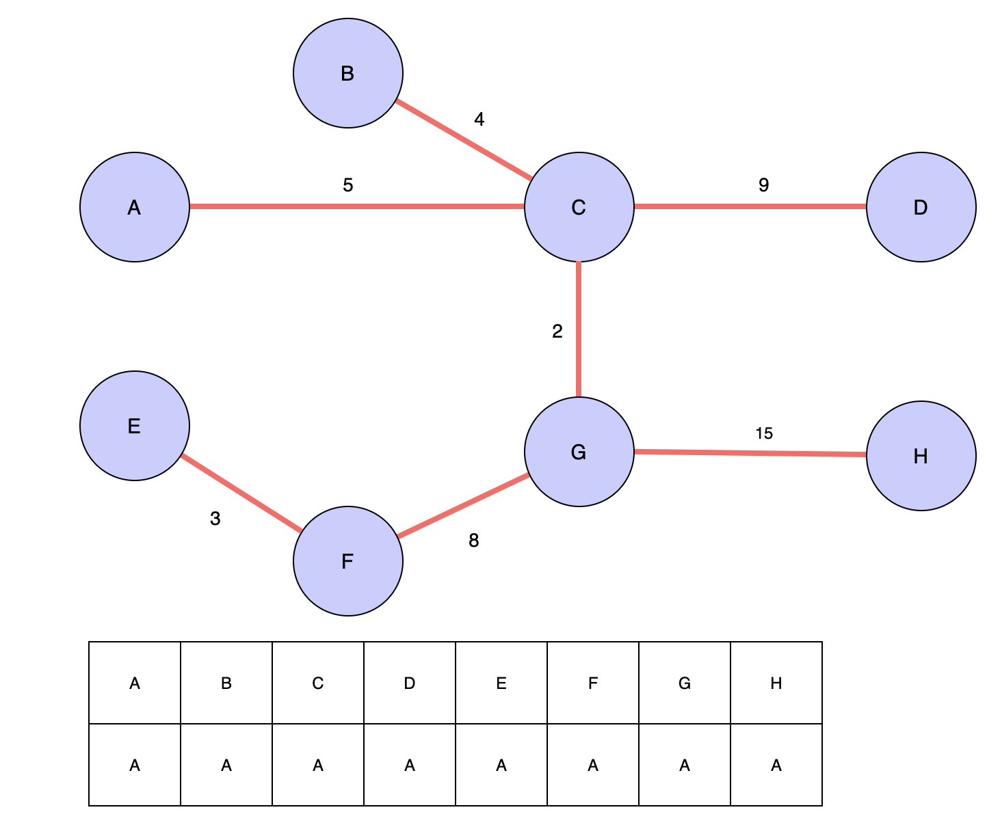

# Kruskal MST Algorithm

최소 신장 트리를 구하는 알고리즘 중 하나인 크루스칼 알고리즘을 알아보자.

## Algorithm Concept

크루스칼 알고리즘은 Greedy Algorithm을 적용해서 가중치가 가장 적은 간선들을 계속 선택한다. 알고리즘은 다음과 같은 과정으로 이루어진다.

1. 그래프의 모든 간선을 가중치가 낮은 순서대로 정렬

2. 순서대로 꺼내면서 MST를 만든다.

3. 이때, MST에 추가하면 사이클이 만들어지는 간선은 제외한다.

무척 간단해보이지만, 3번째 조건인 사이클을 검사하는 것이 가장 핵심적이고 쉽지 않은 내용이다. 이를 위해서는 Union Find 를 통해 각 간선의 양 끝 정점들이 같은 집합 내에 있는지 확인해야한다. 유니온 파인드 자료구조의 구성과 사용은 [여기](<https://jeonyeohun.github.io/articles/2020-05/Union-Find(%EC%9C%A0%EB%8B%88%EC%98%A8-%ED%8C%8C%EC%9D%B8%EB%93%9C)>)에 정리해두었다.

## Example

이 그래프에서 최소 신장 트리를 찾아보자.

### Phase 1

우선 간선의 가중치가 작은 순서대로 정렬을 해주자. 그러면 다음과 같이 정렬 할 수 있을 것이다.

| ID  | Weight |
| :-: | :----: |
| CG  |   2    |
| EF  |   3    |
| BC  |   4    |
| AC  |   5    |
| AB  |   6    |
| FG  |   8    |
| CD  |   9    |
| AF  |   10   |
| AE  |   14   |
| GH  |   15   |

우리가 가지고 있는 간선은 총 10개이지만 앞서 정리했다시피, Spanning Tree 는 정점의 갯수 - 1 개의 간선을 가지기 때문에 여기서 7개만이 선택될 것이다.

단순하게 생각해보면 위에서 부터 7개를 고르면 될 것 같지만, 우리는 사이클을 고려해야한다. 따라서 유니온 파인드 자료구조를 사용해야 한다. 각 노드의 루트노드를 저장하는 배열은 각 노드 자신으로 최초에 초기화 한다.

#### Phase 2

가장 간선의 비용이 적은 {C}와 {G}를 꺼내서 Union Find 넣는다. merge 연산을 이용하게 되면 C가 루트노드가 되고 G가 그 밑으로 붙게 된다. merge 연산 안에는 find 함수를 사용하여 사이클이 존재하는지 확인하게 되기 때문에 사이클이 존재하지 않는다면 두 정점을 한 집합으로 합칠 수 있다. 따라서 루트노드를 저장하는 테이블에서 C는 자기 자신을, G는 C를 가지게 된다. 일반적으로 숫자를 사용하지만 이 예제에서는 알파벳을 사용해서 표현하도록 하겠다. C 가 G보다 사전순서 상으로 앞에 있으므로 루트노드로 지정했다.

이 시점에서 MST는 {C, G} 가 된다.

#### Phase 3

다음으로 비용이 적은 간선을 이루는 정점 {E} 와 {F}를 선택한다. 유니온 파인드에 넣으면 위와 같이 루트노드 테이블이 업데이트 되고, MST는 {C, G}, {E, F} 로 구성된다.

#### Phase 4

한번 더 진행하면 B와 C를 연결하는 간선이 선택되는데, C는 이미 {C, G}로 합쳐져 있기 때문에 유니온 파인드의 merge 에서는 {C} 와 {C, G}를 합치게 된다. merge 에서는 트리 불균형을 최소화하기 위해서 두 트리 중 길이가 더 짧은 트리의 루트노드에 다른 트리를 붙이게 되기 때문에 {C, G}는 B아래에 붙어 있게 된다. 따라서 루트 노드 테이블 에서 C의 루트노드가 B로 업데이트 된다. 아직 find 함수를 수행하지 않았기 때문에 G의 루트노드는 C로 계속 남아있는다.

#### Phase 5

다음으로 비용이 적은 간선을 이루는 저점 {A}와 {C}를 선택한다. 유니온 파인드를 통해 합치면 C 가 속해있는 루트노드 B의 트리 높이가 더 짧기 때문에 A를 루트노드로 집합에 편입된다.

#### Phase 6

다음 정점인 {A} 와 {B}를 선택한다. 그리고 유니온 파인드로 유니온 연산을 수행하게 되면, 루트 노드 테이블은 A와 B에 대해 같은 루트노드를 가지고 있기때문에, 이미 한 트리 안에 속한 정점들이라고 판단한다. 따라서 별 다른 연산없이 반환된다. 유니온 연산을 통해 두 정점이 이미 한 트리에 있다는 것이 확인되었다면, 간선을 MST에 추가하면 안된다. 트리안에 있는 두 정점을 새로운 간선으로 잇게되면 사이클이 발생하기 때문에 MST의 조건에 위배된다. 따라서 간선 AB는 MST에 추가되지 않고 건너뛴다.

#### More Steps..

위 과정들을 계속 반복하면서 테이블의 마지막 간선까지 검사하게 되면 위와같은 테이블이 완성된다. 사이클이 만들어지기 때문에 제거한 간선들을 모두 없애고 간선들의 가중치를 합해보게되면 아래와 같이 가중치의 합이 43인 최소 신장 트리가 완성된다.

