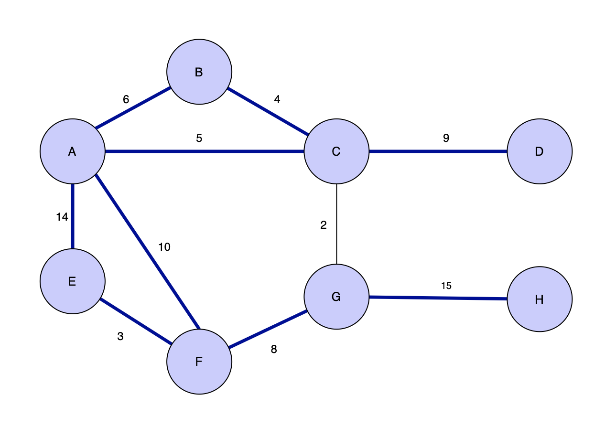
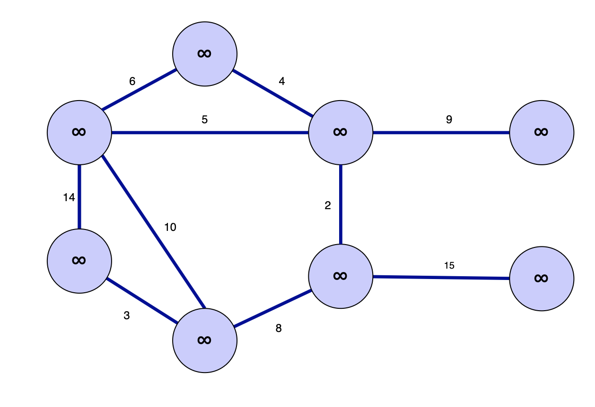
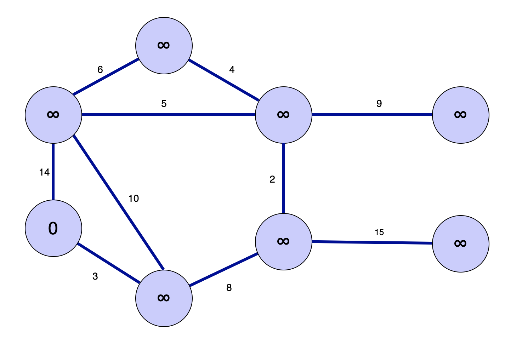
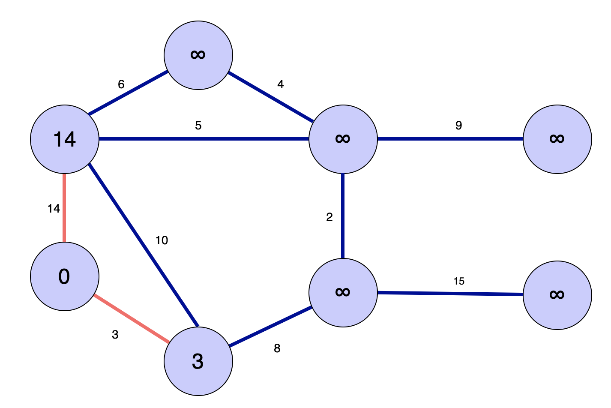
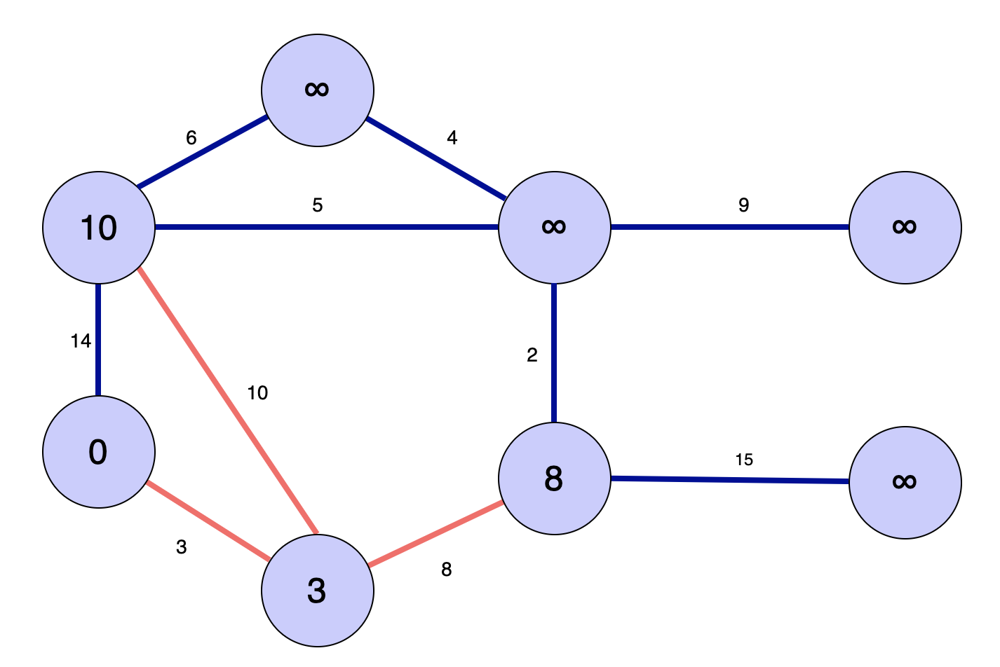
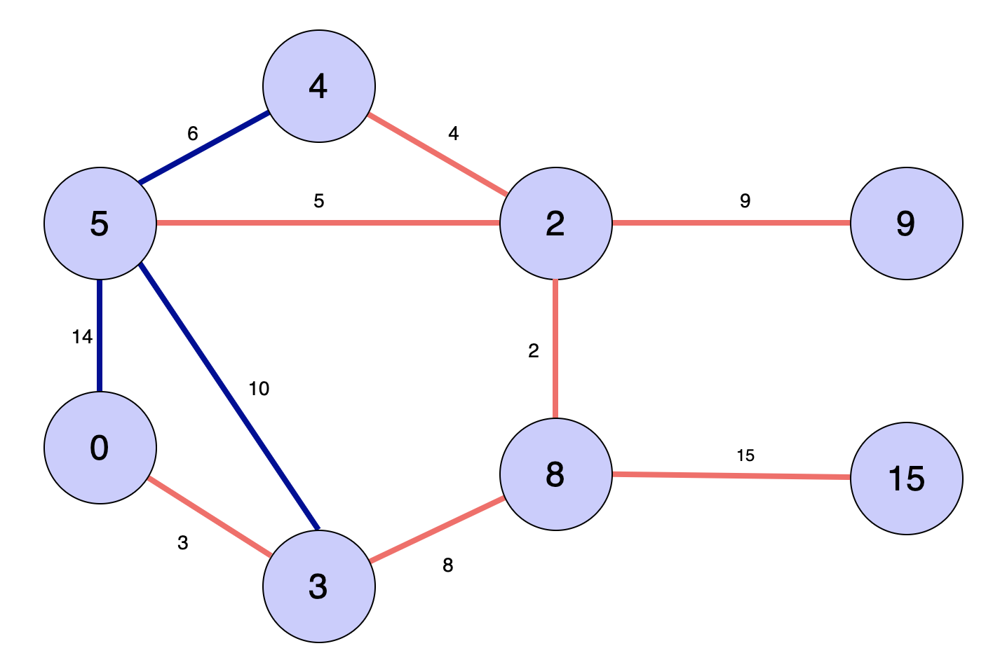

프림 알고리즘은 크루스칼 알고리즘처럼 간선의 가중치가 낮은 간선부터 선택해서 MST를 만들어 나가지만, 크루스칼 알고리즘과는 다르게 여러 트리들을 만들고 점점 합치는 것이 아니라 하나의 트리를 유지해가면서 새로운 간선을 추가해나가는 방식으로 진행한다.

## Algorithm Concept

프림 알고리즘은 다음과 같은 과정으로 진행된다.

1. 임의의 루트노드 r을 포함하는 트리 A를 만든다.

2. 트리 A에 속하는 정점들과 속하지 않는 다른 모든 정점들을 cross 하는 간선들 중 가중치가 가장 낮은 light edge 를 찾는다.

3. 해당 light edge를 트리 A로 편입시킨다.

4. 빠른 light edge 탐색을 위해 min heap 을 이용한 priority queue 를 사용한다.

## Pseudo Code

```
MST-Prim(G, w, r)
    priority queue Q <- arbitrary vertex from graph G
    for each vertex u in Q
        key[u] = INFINITY
        parent[u] = NIL

    key[root] = 0
    parent[root] = NULL

    while(Q is not empty)
        u = Extract Min from Q
        for each v in adjacency list adj[u]
            if v is in Q and w(u, v) is less than key[v]
                parent[v] = u
                key[v] = w(u, w);

```

간단하게 설명해보면, 우선순위 큐에 들어있는 노드들 중 key 값을 기준으로 가장 작은 key를 가진 정점을 뽑고, 해당 점정과 이어져 있는 다른 정점들을 두 정점 사이에 간선이 가진 가중치와 정점이 가진 key 값과 비교하여 더 작은 값은 key값으로 설정하는 것이다.

## Example


크루스칼 알고리즘에서 썼던 동일한 그래프를 프림 알고리즘으로 풀어보자</center>

### Phase 1



일단 각 정점의 key를 INFINITE으로 초기화 해준다. 이 key 값들은 우선순위 큐에 들어있다. 그리고 임의의 정점하나를 지정한다. 이 정점이 시작점이 될 것이다. 어차피 프림 알고리즘은 하나의 트리를 계속 확장해나가는 과정이기 때문에 시작점은 크게 상관없다.

### Phase 3



선택한 초기의 정점의 key를 0으로 지정했기 때문에 우선순위 큐에서 dequeue 를 진행하면 0이 나오게된다. 이제 이 key값을 가진 정점과 연결된 모든 노드들을 검사한다.

### Phase 4



우선 바로 위에 연결되어 있던 정점에 찾아간다. 해당 정점의 key값은 처음에 초기화했던대로 무한대가 들어가 있을 것이다. 기준이 되는 정점으로부터 이 정점으로 이어지는 간선의 가중치는 14이다. 이 중 더 작은 값을 정점의 key 값으로 업데이트 해주자. 이제 루트노드 상단에 있던 노드의 key 값은 무한대가 아니라 간선의 가중치였던 14가 된다.

같은 방법으로 루트노드와 이어진 모든 노드에 대해서 이 과정을 수행하면 아래에 붙어있던 정점의 key값은 3으로 설정된다.

### Phase 5



루트 노드의 처리는 끝났다. 그렇지만 아직 우선순위 큐가 비어있지 않기 때문에 dequeue 를 수행한다. 루트노드는 이미 pop 되었기 때문에 다음으로 key 값이 작은 3을 가진 정점이 나온다. 이 정점과 연결된 노드들이 이전과 같은 방법으로 key를 업데이트 하게된다.

1. 14 를 key로 가지던 정점은 새로운 간선의 가중치인 10을 만나게 되고, 더 작은 값인 10을 key의 값으로 업데이트 한다.

2. 간선 가중치 8로 연결된 정점은 무한대의 key 값을 가지고 있었기 때문에 key의 값이 더 작은 값인 8로 업데이트 된다.

### Phase 6


다음에 dequeue 되는 정점은 방금 전에 key 가 8로 업데이트 된 정점이다. 이 정점과 연결된 모든 정점의 key를 업데이트 하면 위와 같이 key가 설정된다.

### Phase 7



한번 더 진행하면 각 정점의 key는 다음과 같이 업데이트 된다.

### More Steps...

큐 안에 아직 정점들이 남아있지만, 각 정점들을 꺼내 확인해보면, 더 이상 key를 업데아트 하는 큐가 없음을 확인할 수 있다. 따라서 몇차례 같은 과정을 계속 수행해야 하긴 하지만 최종 MST는 Phase 7과 동일한 트리가 완성된다.
