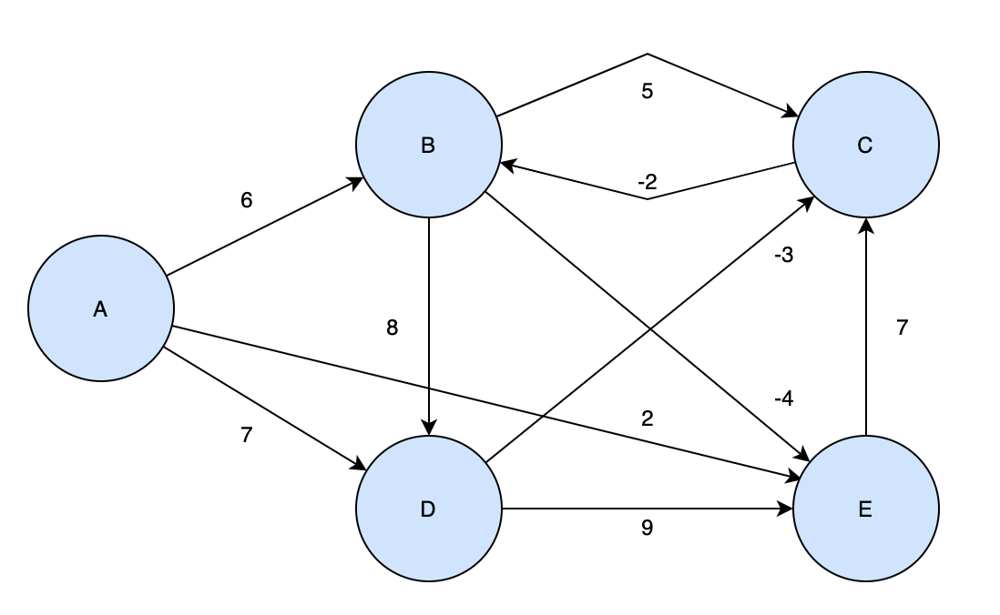
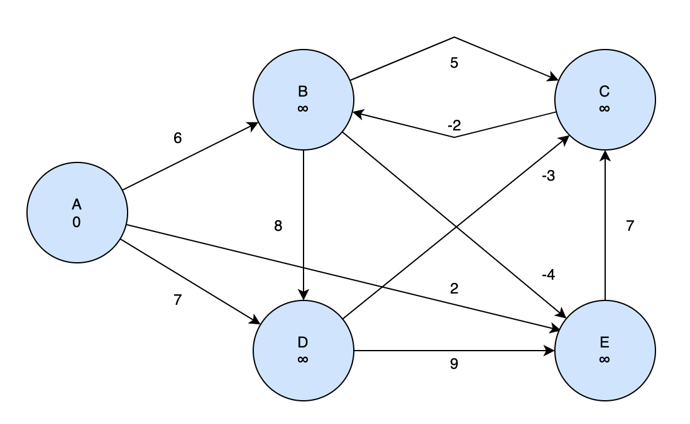
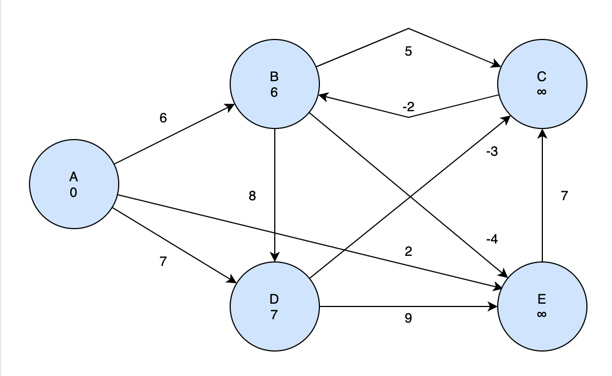
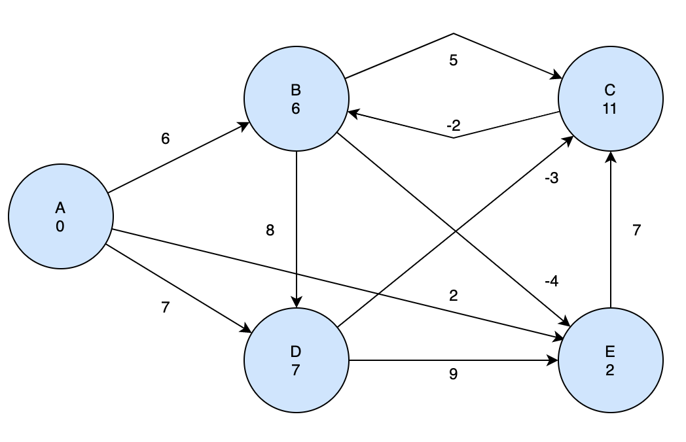
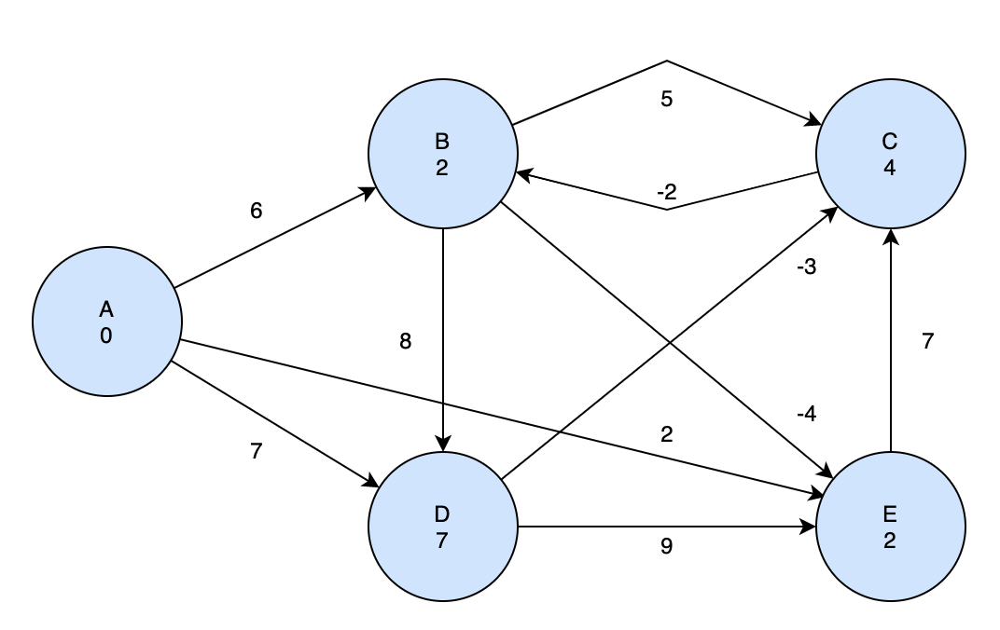
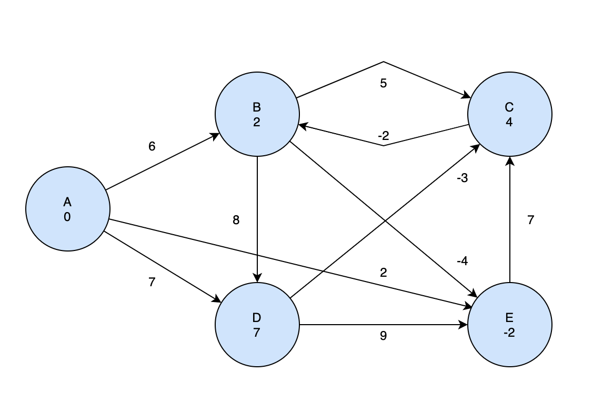

이제 본격적으로 SSP를 해결하기 위한 알고리즘을 살펴보자. 처음으로 소개할 알고리즘은 Bellman-Ford 알고리즘이다. 우리 말로는 벨만-포드 알고리즘이라고 한다.

## Bellman-Ford Algorithm

벨만-포드 알고리즘의 특징은 SSP를 해결하는 알고리즘 접근 중 유일하게 negative weight 이 존재하는 그래프에서도 최단경로를 찾을 수 있다는 것이다. 그렇지만 negative weight cycle이 존재할 때는 해답을 찾을 수 없다.

따라서 벨만포드 알고리즘은 Negative Cycle이 존재하는지 여부를 확인해서 존재할 때는 `FALSE`, Negative Cylcle이 없을 때는 `TRUE`를 반환한다.

## Algorithm Steps

벨만-포드 알고리즘을 단계별로 나누어서 진행해보자.

### Step 1 : Initialization - 𝛩(# of vertice)

일단 현재 그래프의 모든 노드를 초기화 한다. 이 때 시작점을 제외한 모든 정점들의 최단길이를 양의 무한대로 만들고 모든 정점들의 부모노드는 NIL 로 만든다. 그리고 시작점의 최단길이는 0으로 만든다.

```
for each vertice in V
    do d[v] = INFINITE
        p[v] = NIL
d[s] = 0
```

### Step 2 : Rexation - 𝛩(# of edges)

모든 정점에 대해서 relaxation을 진행한다. 각 정점마다 이어진 정점으로의 최단 경로와 그 정점을 저장한다.

```
for i = 1 to N(number of edges)
    for each edge(u, v) in set of edges
        if (d[v] > d[u]+w)
            d[v] = d[u]+w
            p[v] = u
```

### Step 3 : Test for Negative Weight Cycle - 𝛩(# of edges)

이미 Step 2에서 Relaxation이 진행되었기 때문에, 만약에 한번 더 모든 노드를 순회하면서 relaxation을 수행했을 때, 업데이트가 가능한 정점이 발견된다면, 해당 정점은 Negative Weight Cycle을 만드는 정점일 것이다. 따라서 false 를 반환한다.

```
for each edge in set of edges
    if d[v] > d[u] + w(u, b)
        return False
```

## Example



위 그래프를 예시로 벨만포드 알고리즘을 적용해보자.

### Phase 1



먼저 시작정점을 정하고 각 정점들의 값을 초기화 해주어야 한다. 이 예시에서는 시작점을 A로 정하겠다. 그리고 A만 길이 변수를 0으로 초기화 하고 나머지 정점들에 대해서는 양의 무한대를 지정한다.

### Phase 2



시작점인 A 정점으로부터 연결되어 있는 노드들에 대해 Relaxtion 을 진행한다.

1. B 정점에 저장된 최단거리 값은 양의 무한대였는데, A로부터 B까지의 거리인 6이 더 작기 때문에 d[B]는 6이 되고, p[B]는 A가 된다. p[v]는 최단경로에서 정점 v 바로 직전에 나온 정점을 의미한다.
2. 같은 맥락으로 A로부터 D까지의 거리를 계산하게 되면 d[D]는 7이 된다.

### Phase 3



이제 정점 A에 대한 Relaxation 이 끝났으니, 다른 정점들도 모두 Relaxation을 진행해야한다. 다음 정점은 B 정점이다(사실 순서는 상관없다). 우리는 시작점 A로부터 B와 연결된 모든 정점들 까지의 거리를 구하면 된다.

1. B와 연결된 C정점까지 도달하기 위해서는 A에서 B까지의 최단 거리인 6에 B에서 C로 이동하는 최단거리를 더해주면 된다. 현 시점에서 C까지 도달하는 최단거리는 양의 무한대로 설정되어 있으므로 간선 BC를 통해 연결되는 것이 가장 작을 수 밖에 없다. 따라서 d[C]는 6+5 인 11이 된다.

2. B와 연결된 정점 E에 도달하는 최단거리 역시 위와 같은 과정을 통해 6-2로 4가 되는 것을 알 수 있다.

3. B와 연결된 마지막 정점 D에 도달하기 위해서는 거리 AB와 거리 BD를 더해주어야 한다. 그럼 거리가 6+8=14가 되는데, 이 거리는 A에서 곧바로 D로 이동하는 거리보다 크다. 우리는 최단거리를 유지해야하기 때문에 D까지의 최단거리는 A에서 곧장 이동하는 7로 유지한다.

### Phase 4


이제 정점 D에 대한 Relaxation을 진행해보자. 정점 D는 C와 E로 연결된다.

1. 정점 D를 거쳐서 C로 이동하게 되면 총 거리가 `7 - 3 = 4`가 된다. 기존에 C까지의 최단거리는 B를 통해가는 11로 설정되어있었기 때문에 더 짧은 최단거리가 나왔으므로 d[C]를 새로운 값으로 갱신해준다.

2. 정점 D를 거쳐서 정점 E로 이동하게 되면 총 거리가 `7 + 9 + 11`이 된다. 이 거리는 기존에 최단거리였던 정점 B를 거쳐서 E로 이동하는 거리보다 작기 때문에 새로 갱신하지 않고 넘어간다.

### Phase 5



C에 대한 Relaxation을 진행해보자. 현재 정점 C까지의 최단경로를 거쳐서 B로 이동하게 되면, A에서 바로 B로 이동하는 거리보다 짧다. 따라서 B의 새로운 최단거리는 `4 - 2 = 2` 가 된다.

### Phase 6


E정점에 대한 Relaxation을 진행하면 E를 거쳐 C로 가는 최단거리는 9이기 때문에 현재 C까지 가는 최단 경로보다 크다. 따라서 최단 경로를 업데이트 하지 않고 끝낸다. 이렇게 하면 한번의 relaxation 세트가 끝나게 된다. 이 작업을 `시작 노드를 제외한 노드의 수 만큼` 반복한다.

### Phase 7



relaxation을 V-1 번 반복하게 되면 다른 간선들의 값은 변하지 않고 B에서 E로 가는 간선의 값이 업데이트 된다. 이 이후로 모든 rexlation 값은 변하지 않으므로 그래프 도식은 생략하기로 하겠다.

### Phase 8

Relaxation은 끝났지만, negative weight cycle이 있는지 확인하기 위해서 위 작업을 한번 더 거쳐야 한다. 현재 각 정점에 대한 최단거리가 기록되어 있는데 만약 이 거리가 새로운 최단거리로 갱신될 수 있다면, negative weight cycle이 존재한다는 의미일 것이다. 이때는 false 를 반환해서 지금까지 구한 최단거리가 의미가 없음을 알린다.

## Algorithm Analysis

벨만 포드 알고리즘은 각 노드 초기화(𝛩(V)) + Rexlaxation을 v-1번 반복(𝛩(E \* (V-1))) + 음수 사이클 체크(𝛩(E)) 의 연산을 수행하기 때문에 시간 복잡도는 `𝛩(VE)` 가 된다.
