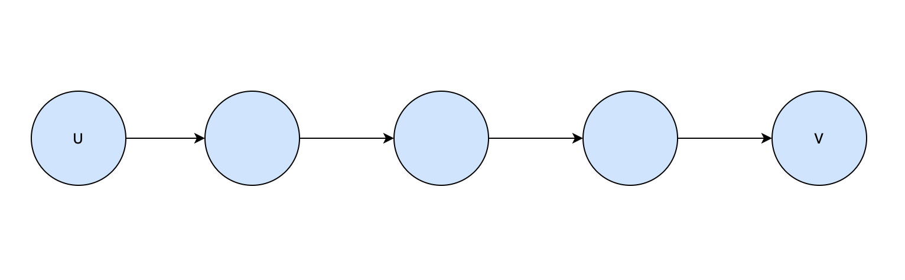
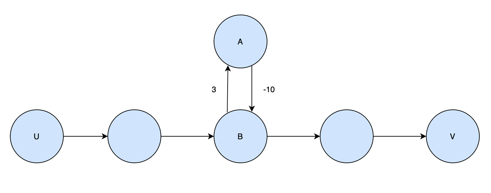

`Shortest Path(최단 경로)`는 가중치가 있는 그래프에서 어떤 정점에서 다른 정점으로 이동하기까지 가장 짧은 가중치의 합으로 목적지에 도달하는 방법을 찾기 위한 전략이다.

최단 경로문제는 몇가지 유형으로 나누어진다.

1. Single Source: 하나의 노드로부터 출발해서 다른 모든 노드의 최단 경로를 찾는 문제
2. Single Destination: 모든 노드로부터 하나의 목적지 까지의 최단 경로를 찾는 문제
3. Single Pair: 주어진 하나의 노드로부터 하나의 목적지까지의 최단 경로를 찾는 문제
4. All pair: 모든 노드 쌍에 대한 최단 경로를 찾는 문제

이번 수업에서 주로 다룰 내용은 `SSP` 라고도 부르는 Single-source Shortest Path 이다.

## Lemma

일단 Shortest Path 문제를 어떻게 풀 수 있을지 생각해보자.



_명제:_
위와 같이 어떤 지점 U로 부터 V까지 가는 경로가 있다고 하고 이 경로가 U에서 V로 가는 가능한 짧은 경로라고 해보자. 즉, 경로 UV는 U에서 V로 가는 SSP의 `Global Optimal Solution` 이다. 그리고 이 경로 안에 속하는 다른 모든 경로는 해당 지점까지의 최단 경로이다. 즉, `Optimal Sub Structure` 가 존재한다.

_증명:_
Proof by Contradiction으로 증명해보자. 만약 경로 UV가 최단 경로일 때, 해당 경로에 속하는 subpath 가 Optimal substructure 가 아니라면, 해당 subpath 보다 더 짧은 subpath가 있다는 것을 의미한다. 현재 subpath 보다 짧은 subpath 가 있다면, global optimal solution을 위해서는 해당 subpath을 최종 solution에 반드시 포함해야 하고, 이는 곧 초기에 설정했던 경로 UV가 더 이상 최단경로가 될 수 없음을 의미한다. 따라서 어떤 최단 경로가 있다면, 그 안에 속한 다른 모든 경로들도 최단 경로이다.

## Properties

위 증명에 따라 우리는 다음과 같은 결론을 낼 수 있다.

- 어떤 경로 UV가 최단 경로라면, 이 경로의 길이는 그래프 내에 다른 정점들을 거쳐서 오는 모든 경로보다 같거나 작다.

## Negative-Weight Cycle

그래프의 최단 경로를 찾는 것은 그래프에 negative-weight cycle 이 없을 때만 가능하다. `Negative-Weight Edge`는 음수를 가중치를 가지는 간선인데 이 간선이 그래프에 포함되어 있고, 다른 간선과 사이클을 만든다고 생각해보자.



위 그래프에서 정점 A와 정점 B가 만드는 사이클에 도달하게 되면, 사이클을 만드는 두 가중치의 합이 -7이기 때문에, 탐색을 거듭할 때마다. 가중치의 합이 계속해서 작아지면서 결국 -∞ 에 수렴하게 된다. 이렇게 되면 우리는 최단경로를 구할 수가 없게된다.

## Other Cycles?

그럼 이런 의문이 들 수도 있다. `"단순히 사이클이 문제인가?"`. 정답은 "아니다" 이다. Negative weight cycle 외에 가능한 다른 사이클들은 다음과 같다.

1. Postivie Weight Cycle: 이 사이클은 탐색을 거듭할수록 양수 값으로 증가하기 때문에 결국엔 +∞ 로 길이가 수렴하게 된다. 우리가 구하고자 하는 값은 최단 거리이기 때문에 어차피 양의 무한대로 수렴하는 사이클이라면 이 사이클을 그냥 무시해도 우리가 최단 경로를 구하는데는 아무 지장이 없을 것이다.

2. Zero-Weight Cycle: 이 사이클은 사이클을 이루는 두 간선의 합이 0일 때 생기는 사이클인데, 이 사이클을 포함하든 포함하지만 않든 전체 최단 경로의 값에 영향을 주지 않기 때문에 고려하지 않아도 된다.

## Algorithm Strategy for SSP

여러 알고리즘 접근을 알아보기 전에 SSP 알고리즘 접근에 통용되는 몇가지 용어와 방법들을 정리해보자. 일단 SSP는 어떤 정점에 대해 다른 모든 정점으로의 최단경로를 구하는 전략이라는 것을 기억하자.

### Distance

어떤 두 정점 사이의 길이를 저장하기 위해 배열을 사용한다. `d[v]` 는 시작점으로 부터 정점 v까지의 최단 길이를 저장한다. 따라서 여러 경로가 발견될 때 가장 길이가 짧은 경로의 길이 합을 이 배열에 저장해야한다. 최단 길이를 저장해야하기 때문에 가장 초기값은 +∞로 지정되어야 할 것이다.

### Predecessor

어떤 정점에서 최단경로로 연결된 다른 정점을 표현하기 위해서 배열을 사용한다. `p[v]` 는 최단 경로를 구성하는 정점들 중 v의 부모노드가 되는 정점을 저장한다.

### Relaxation

최단 경로를 찾는 문제에서 가장 핵심이 되는 것이 이 relaxation 기법이다. `Relaxation`은 어떤 한 정점으로부터 연결된 모든 정점을 탐색하고 그 중에서 가장 길이가 짧은 정점을 찾아 Shortest Path를 만드는 것이다.

```
Relax (u, v, w){
    if(d[v] > d[u]+w)
        then
            d[v] = d[u]+w;
            p[v] = u;
}
```

수도코드는 위와 같다. 현재까지 알고있던 최단 경로가 s->v 라고 했을 때, s에서 u를 거쳐 v에 도달할 때 그 길이가 더 짧다는 것이 발견된다면, 해당 값을 최단경로로 지정하는 것이다.
