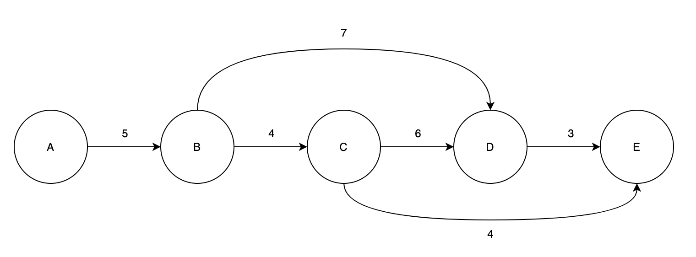
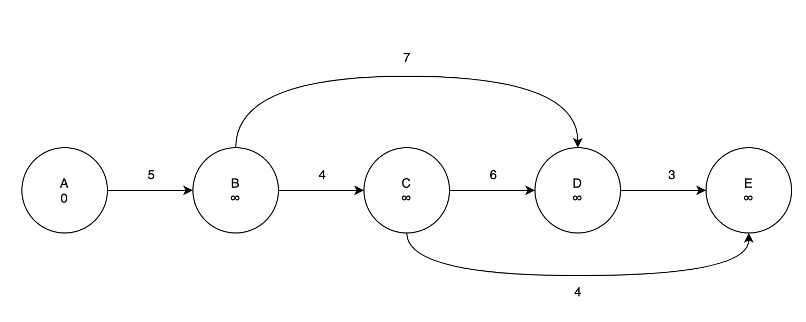

DAG는 `Directed Acyclic Graph` 이다. 풀어서 써보면, `방향이 존재하고 사이클이 없는 그래프` 라고 할 수 있다. 벨만-포트 알고리즘의 가장 큰 문제는 음수 사이클이 있는지 확인하기 위해 걸리는 시간이었다. 그러나 DAG에서는 사이클이 존재하지 않고, 방향이 있기 때문에 추가적인 연산없이 최단거리를 찾는 것이 가능할 것이다.

## Algorithm Strategy

방향이 있고 사이클이 없는 그래프라는 것은 곧 모든 정점이 탐색되는 순서를 가진다는 것이다. 이 성질을 이용해서 한 정점으로부터 다른 정점으로 이동할 때의 최단거리를 추적해가다보면, 가장 마지막 정점에 도착하기까지 최단거리를 구할 수 있을 것이다. 이를 구현하기 위해서 다음과 같은 과정을 거친다.

1. Topological Sort 를 통해서 방문순서대로 정점을 정렬한다. 위상정렬이라고 부르는 Topological Sort는 [여기](https://jeonyeohun.github.io/articles/2020-05/Topological-Sort)에 정리해두었다.

2. 각 정점마다 Relaxation 을 진행해서 해당 정점과 연결되어 있는 정점들 중 최단거리를 찾는다.

## Example

위와 같은 DAG가 있을 때, 최단 경로를 한번 찾아보자. 설명을 간소화하기 위해 이미 위상 정렬이 끝난 그래프를 사용했다. 

### Phase 1

벨만-포드 알고리즘에서 했던 것처럼 모든 정점의 최단거리를 양의 무한대로 초기화 하고, 시작점이 되는 가장 앞에 있는 노드는 0으로 초기화 한다.

### Phase 2

정렬된 정점들을 순서대로 꺼내서 Relaxation을 진행해보자. 일단 시작점에 있는 A에 대해서 Relaxation 을 수행하면, 연결된 정점이 B 하나뿐이기 때문의 B가 가지고 있는 최단거리와 A와 B 사이의 간선 거리를 비교해서 더 작은 값을 최단거리로 업데이트 한다. A와 B의 간선거리는 5이고, B의 최단거리는 양의 무한대로 초기화되어 있는 상태이기 때문에 B의 최단거리를 5로 갱신한다.

### Phase 3

다음의 정점 B와 연결된 정점들의 대해서 Relaxation을 진행한다.

1. 정점 D: B까지의 최단거리는 5이기 때문에 정점 D까지 가는 간선 거리 7을 더하면 총 12의 거리를 얻는다. 현재까지 정점 D에 저장된 최단거리는 양의 무한대이므로, 새로운 최단거리 12을 설정한다.

2. 정점 C: 위와 같은 과정을 거쳐서 C의 최단거리를 `5 + 4 = 9` 로 갱신된다.

### Phase 4

다음은 정점 C를 꺼내서 Relaxation을 해보자.

1. 정점 D: 정점 C가 가진 최단거리는 9이기 때문에, 정점 C에서 정점 D로 이동할 때 계산되는 최단거리는 `9 + 6 = 15` 이다. 현재 D에 저장된 최단거리는 12이기 때문에 정점 C를 거쳐서 D로 가는 경로는 최단경로가 아니다. 따라서 최단거리를 업데이트하지 않고 끝낸다.

2. 정점 E: 정점 E의 최단거리는 양의 무한대이기 때문에 C를 통해서 도달하는 경로가 최단거리로 업데이트될 것이다. E의 최단거리는 `9 + 4 = 13`이 된다.

### Phase 5

D 노드에 대해서 Relaxation을 수행하게되면 E로 연결된 경로만 확인해주면 된다. D를 거쳐서 E로 가게되면 15의 거리가 발생한다. 현재 E로 가는 최단거리는 13이기 때문에 업데이트 하지 않는다.

### Phase 6

마지막에 위치한 정점은 더 이상 연결할 정점이 없기 때문에 Relaxation을 수행하지 않고 마친다.

## Algorithm Analysis

DAG에서 최단 경로를 구하는 시간복잡도는 다음과 같다.

1. 위상정렬을 수행하는 시간 𝛩(V+E)
2. 최초에 모든 정점을 초기화하는 시간 𝛩(\|V\|)
3. 각 정점에 대한 Relaxation을 수행하는 시간 𝛩(\|E\|)

따라서 최종 시간 복잡도는 위의 세 연산을 다 합쳤을 때의 점근표기인 𝛩(V+E) 가 된다.
