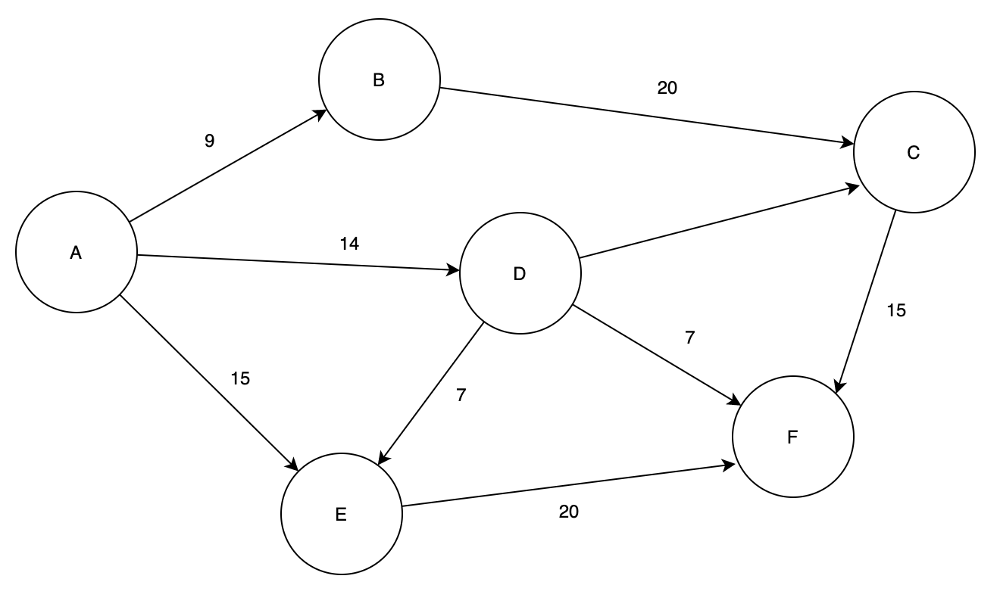
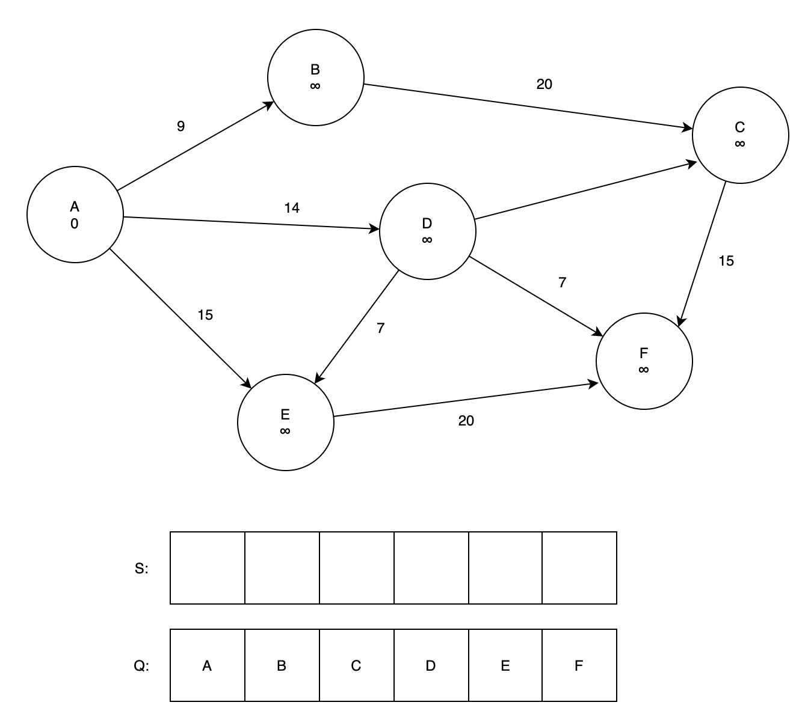
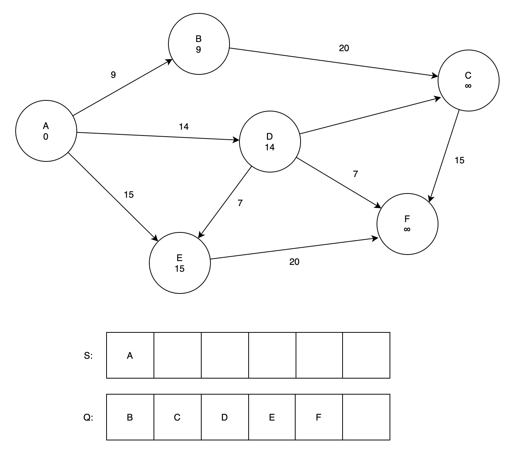
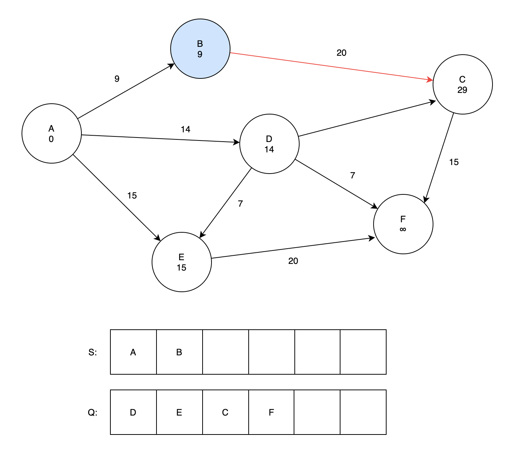
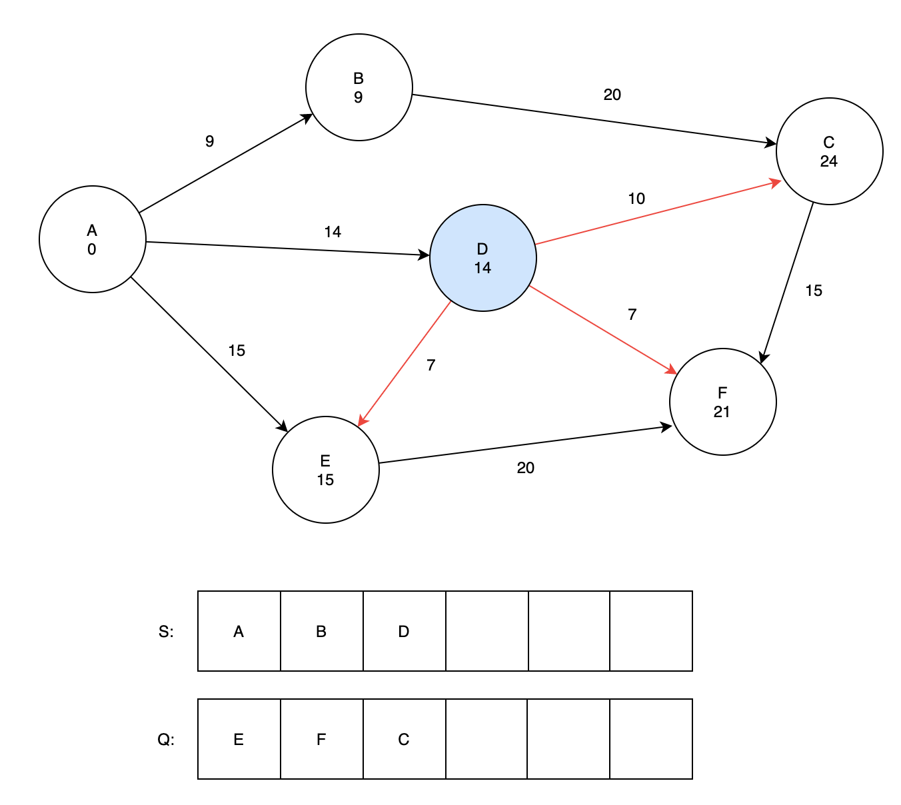
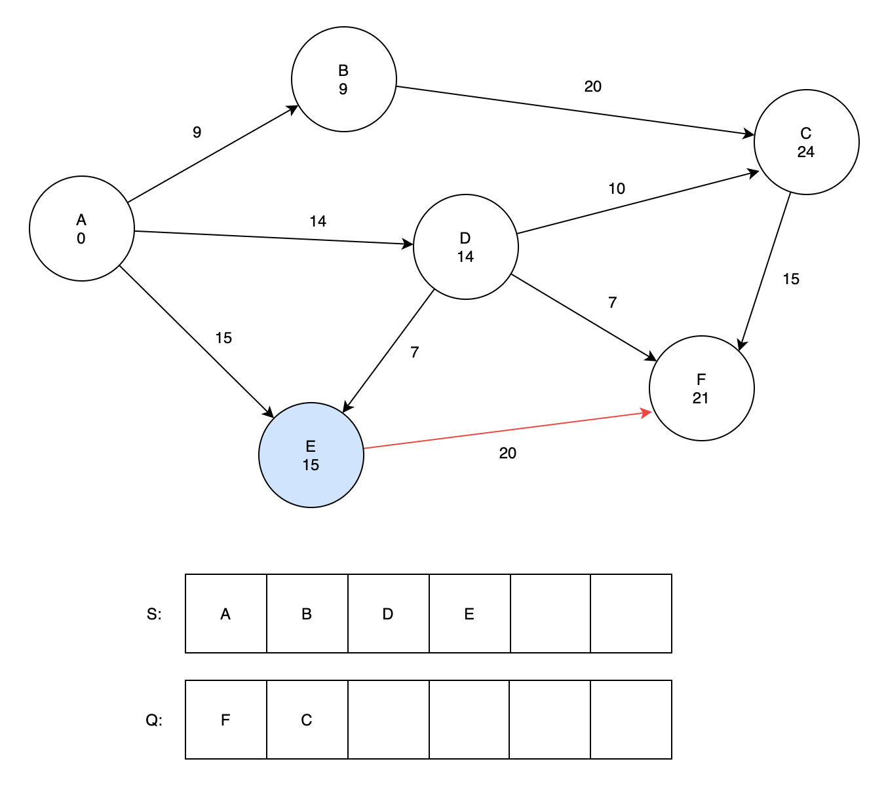
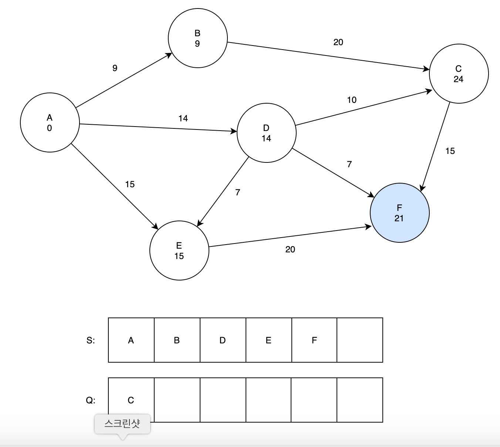
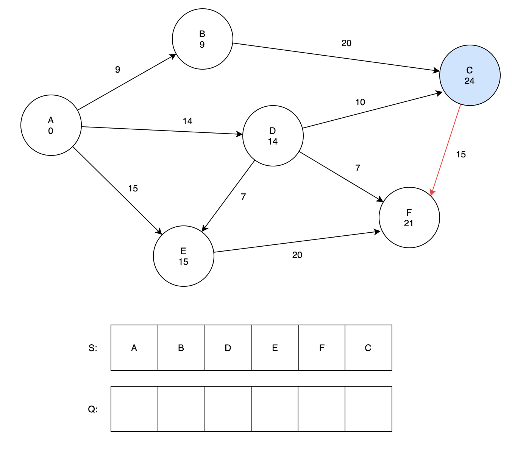

다익스트라 알고리즘은 SSP 문제를 해결하기 위한 알고리즘 중 벨만-포드 알고리즘에 비해서 속도가 더 빠른 알고리즘이다. 하지만 음수 간선이 있을 때는 해답을 찾지 못한다. 그래서 만약 알고리즘 문제에서 음수 간선이 입력으로 주어진다면 벨만-포드 알고리즘을 사용해야하고, 양수 간선으로만 이루어진 그래프가 주어진다면, 벨만-포드 알고리즘과 다익스트라 알고리즘을 모두 사용가능하지만, 속도가 더 빠른 다익스트라를 사용하도록 하자.

## Algorithm Concept

다익스트라 알고리즘은 BFS에 간선 거리를 추가한 것과 비슷하다. 다익스트라 알고리즘은 두 개의 정점 집합을 사용한다.

1. S : 해당 지점까지의 최단 경로가 이미 구해진 정점들
2. Q : S에 속하지 않는 나머지 모든 정점들

그리고 알고리즘은 아래 순서로 진행된다.

1. 시작점을 제외한 모든 정점의 최단거리를 양의 무한대로 초기화한다. 시작점은 0으로 초기화 한다.
2. 모든 정점을 집합 Q에 넣는다.
3. Q에서 가장 최단거리가 짧은 정점을 꺼낸다. 이 작업을 더 빠르게 하기 위해서 우선순위 큐를 사용하자.
4. 꺼낸 정점과 이어진 모든 정점에 대해 Relaxation을 수행한다. Relaxation은 [여기](https://jeonyeohun.github.io/articles/2020-05/%EC%95%8C%EA%B3%A0%EB%A6%AC%EC%A6%98-%EC%B5%9C%EB%8B%A8%EA%B2%BD%EB%A1%9C)에 정리되어 있다.
5. 집합 Q가 빌 때까지 위 과정을 반복한다.

시작 지점에서부터 인접해 있는 모든 정점들에 대해 최단거리를 계산하고, 그 다음으로 이동하는 정점의 위치는 최단거리가 가장 짧은 정점이 되기 때문에 이 방법을 사용하면 그 순간 우리가 검사하고 있는 정점에 대한 최단경로를 계속해서 더해가는 방식이다. 따라서 이 알고리즘은 Greedy Algorithm의 성격을 가진다.

## Example

위와 같은 그래프가 주어져있다고 했을 때, A를 시작점으로 하는 다른 노드들의 최단거리를 구해보자

### Phase 1

1. 우선 각 정점이 가지는 최단거리 값을 양의 무한대로 초기화 해준다. 이때 시작점의 최단거리는 0으로 초기화 한다.
2. 모든 정점을 Q 에 넣는다.

### Phase 2

1. 최단거리 값이 가장 작은 정점을 꺼낸다. 우선순위 큐를 사용하면 손쉽게 꺼낼 수 있다. 가장 처음에는 시작점을 제외한 모든 정점들의 최단거리가 양의 무한대로 설정되어 있기 때문에 당연하게도 시작점이 추출된다.

2. A가 나왔기 때문에 A와 인접한 다른 모든 정점들을 방문해서 Relaxation으로 최단거리를 업데이트 한다. A와 인접한 정점들을 다 체크해보면,

   - B 정점: A에서 B로가는 최단 경로는 간선 가중치인 9이다. 현재 B에는 양의 무한대가 들어가 있으므로 더 작은 값인 9로 업데이트한다.
   - D 정점: 위와 같은 과정을 거치면 D의 최단거리는 14가 된다.
   - E 정점: 위와 같은 과정을 거치면 E의 최단거리는 15가 된다.

3. 최단거리가 변경되었기 때문에 우선순위 큐의 루트노드도 변경되었음을 생각하자.

### Phase 3

이제 본격적으로 시작이다.

1. A의 노드들에 대한 검사가 끝났기 때문에, 다시 큐에서 최단거리가 가장 짧은 정점을 꺼낸다. 이때 B의 최단거리가 가장 짧기 때문에 B가 선택된다.

2. B와 연결된 정점들에 대한 Relaxation을 진행한다. B는 C와 연결되어 있기 때문에 Relaxation을 끝내면 C의 최단거리는 `9 + 20 = 29`으로 갱신된다.

### Phase 4

큐에서 정점 하나를 또 뽑아보면 이번엔 D가 나온다. D와 연결된 다른 정점들에 대해서 Relaxation을 수행해보자.

1. 정점 E : 정점 D를 거쳐서 정점 E로 가는 경로의 최단거리는 `14 + 7 = 21`이다. 정점 E에는 이미 최단 경로인 15가 저정되어 있는데, 이 값이 D로부터 계산된 값보다 작기 때문에 최단거리를 업데이트 하지 않고 유지한다.

2. 정점 F : 정점 F에는 양의 무한대가 저장되어 있기 때문에, D로부터 오는 최단거리 `14 + 7 = 21`이 새로운 최단거리가 된다.

3. 정점 C : 정점 C가 가지고 있는 최단거리는 29인데 D를 거쳐서 가는 거리는 `14 + 10 = 24`이므로 기존에 저장된 거리보다 짧다. 따라서 C의 최단거리를 24로 업데이트한다.

### Phase 5

다음 정점은 E이다. E와 연결된 정점은 F 하나 뿐인데, F에 저장되어 있는 최단거리는 21이다. E를 통해 F로 가게되면 최단거리가 15 + 20 = 35가 되기 때문에 이번에는 최단거리를 업데이트 하지 않고 끝낸다.

### Phase 6

다음으로 검사할 정점은 F이다. 그렇지만 F와는 연결되어 있는 정점이 없기 때문에 곧바로 끝낸다.

### Phase 7

한번 더 진행해보자. 우선순위 큐에서 정점하나를 더 뽑아오면, C가 나온다. C는 F와 연결되어 있지만 C를 거쳐 F로 가는 최단거리는 `24 + 15 = 39` 이다. 따라서 현재 F의 최단거리를 유지한다.

## Alogrithm Analysis

다익스트라 알고리즘은 우선순위 큐를 사용하기 때문에 어떤 종류의 우선순위 큐를 사용하는지에 따라서 속도가 달라진다. 가장 일반적인 Binary Heap 을 사용하게 되면 각 연산은 O(lg V) 의 시간이 요구되므로 이 연산을 모든 relaxation에 대해 진행하기 때문에 전체 시간 복잡도는 `O(E lg V)` 가 된다.
