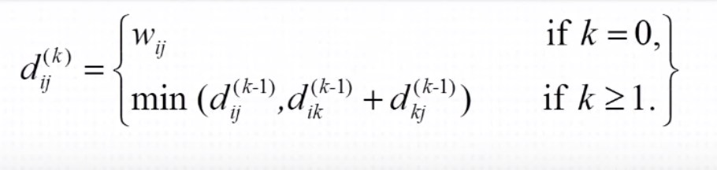
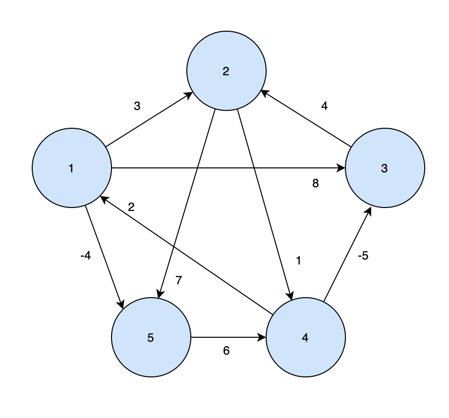
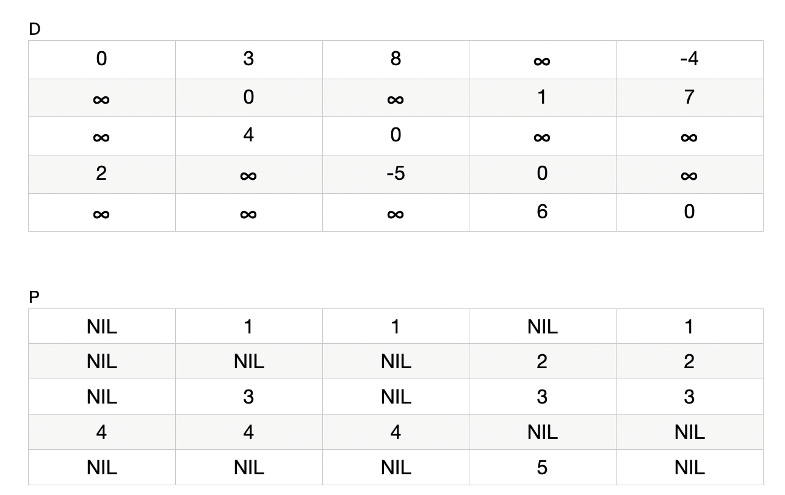
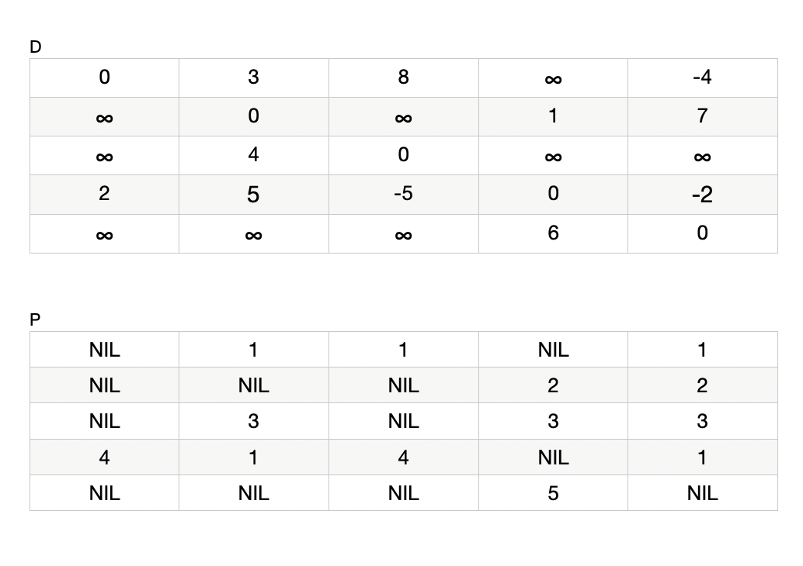
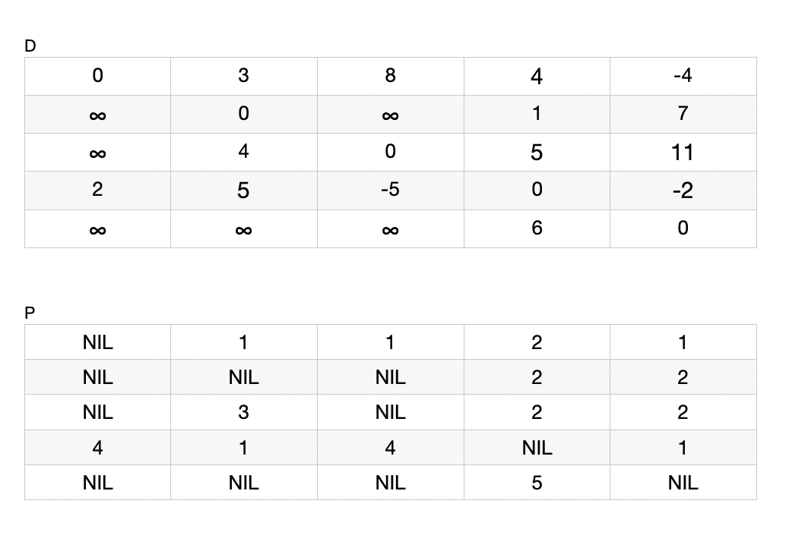
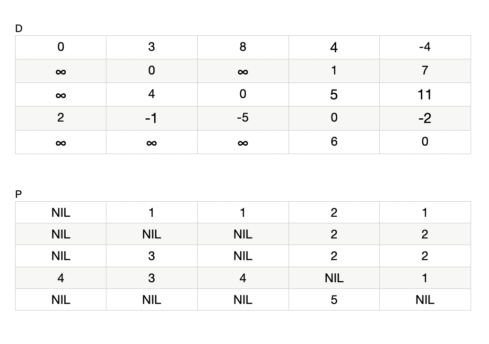
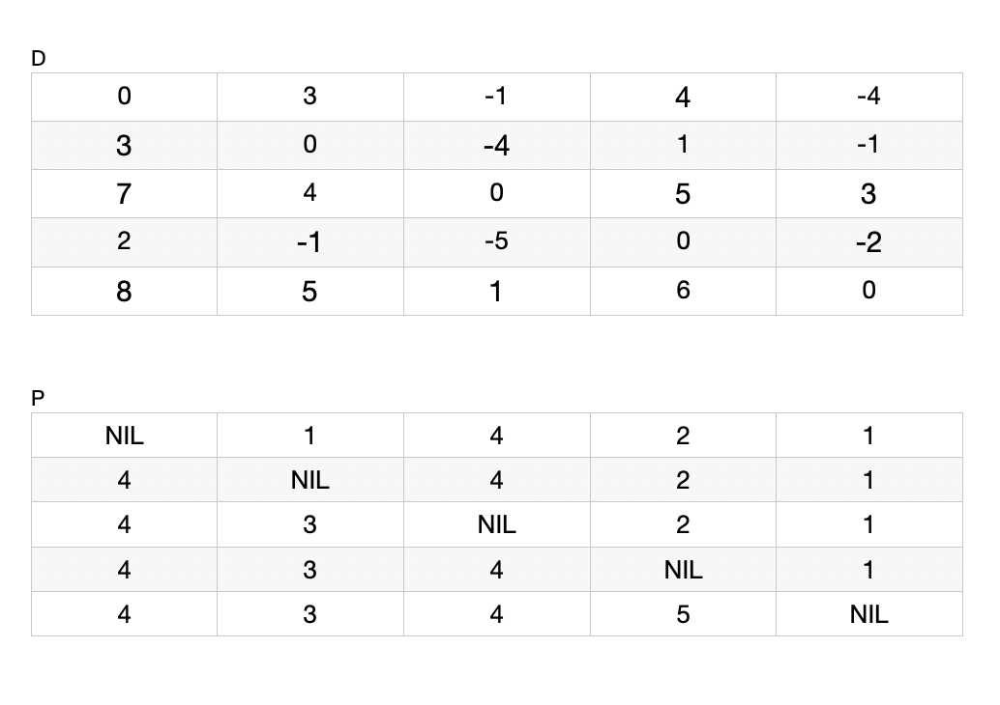
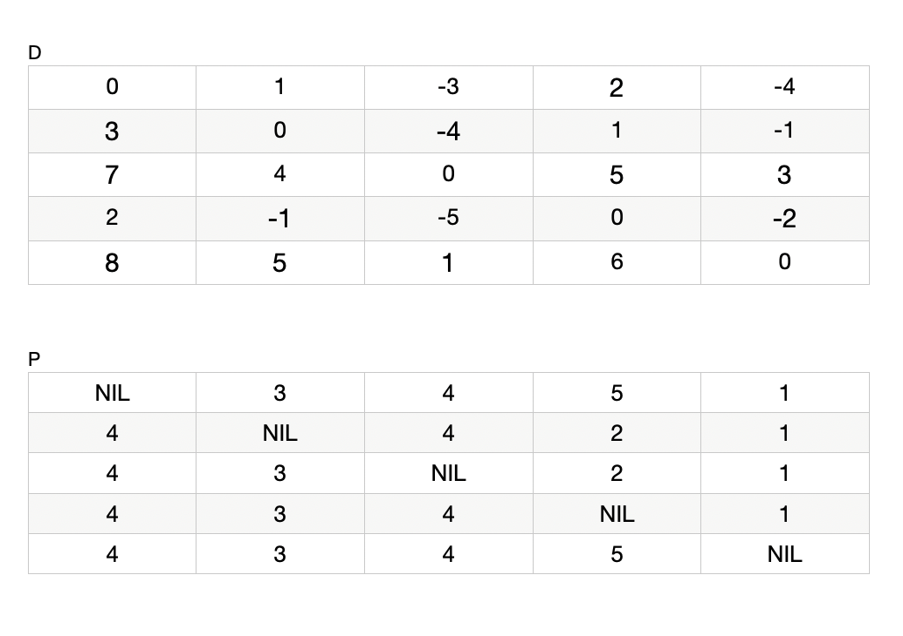

## All Pairs Shortest Path

지금까지 다뤘던 다익스트라 알고리즘이나 벨만포드 알고리즘은 모두 하나의 정점으로부터 다른 모든 정점까지의 최단거리를 구하는 `Single source Shortest Path(SSP)` 문제를 풀기위한 알고리즘이었다. 오늘 소개할 플로이드-워셜 알고리즘은 그래프에 있는 모든 모든 정점에 대해 각 정점들이 다른 정점들까지 도달하기 위해 필요한 모든 최단 거리를 구하는 문제이다.

## Concept

알고리즘의 원리는 단순하다. 어떤 정점 X로부터 Y까지의 최단거리를 구하기 위해서 중간에 거쳐갈 수 있는 모든 정점들을 확인해보고 그 중 최단 거리를 만드는 경로를 찾는 것이다. 다음 수식을 보자.



여기서 d<sub>ij</sub><sup>(k)</sup> 은 1부터 k 까지의 정점들을 거쳐가는 경로 중 최단 경로의 길이를 나타낸다. 최단 경로를 구하기 위해서는 두 가지의 경우를 생각해 볼 수 있다.

### k = 0

d<sub>ij</sub><sup>(0)</sup> 은 아무곳도 거쳐오지 않고 정점 i 에서 정점 j까지 곧바로 이동한 경우를 의미한다. 그리고 이것을 다르게 표현하면, 정점 i와 j 사이의 간선거리를 의미하기 때문에 우리는 w<sub>ij</sub> 라고도 표현할 수 있을 것이다.

### k > 1

k 가 0보다 크다는 것은 i 부터 j까지 가는 길에 경유할 수 있는 정점이 있다는 것을 의미한다. 이 경우에는 ij의 길이와 i 에서 k 까지의 길이와 k부터 j 까지의 길이의 합을 구해서 더 값이 작은 것을 최단경로의 길이로 정한다.

## Implementation - O(N^3)

플로이드 와샬 알고리즘은 2차원 배열을 만들어서 DP로 접근한다. 배열의 각 요소는 i 와 j 사이에 계산된 최소의 비용을 저장한다. 각 정점에 대해서 모든 정점에 대해 거쳐가는 비용을 계산해야하기 떼문에 3중으로 중첩된 for 문을 통해서 계산을 수행한다.

```cpp
Floyd_Warshall(w, n){
    for (int i = 0 ; i <= n ; i++){
        for (int j = 0 ; j <= n ; j++){
            if (i == j) d[i][j] = 0; // 자기 자신에 대한 거리는 0으로 초기화
            else d[i][j] = INF; // 이외의 정점은 무한대로 초기화

            d[i][j] = w[i][j]; // 입력받은 그래프의 간선정보로 최단거리를 초기화
        }
    }
}

for (int k = 0 ; k <= n ; k++){
    for (int i = 0 ; i <= n ; i++){
        for (int j = 0 ; j <= n ; j++){
            if (d[i][k] + d[k][j] < d[i][j]){
                d[i][j] = d[i][k] + d[k][j]; // k를 거쳐서
                pred[i][j] = k; // 경로 정보를 저장
            }
        }
    }
}

```

## Example



플로이드-워셜 알고리즘이 어떻게 적용되는지 위 그래프를 통해서 알아보자.

### Phase 1 (k = 0)



먼저 그래프를 기반으로 두 개의 2차원 배열을 초기화 한다. 각 배열 요소 [i][j]는 i부터 j까지의 간선 정보를 의미한다. 배열 D는 현재까지 계산된 최단 거리를 저장하고, P는 해당 최단거리를 만드는 바로 이전 정점을 저장하게 된다.

연결이 만들어있지 않은 정점끼리는 무한대로 표시하고, 이전 정점이 없는 경우에는 NIL로 표기한다.

### Phase 2 (k = 1)



이제 모든 정점에 대해서 정점 1을 거쳤을 때의 거리를 계산해 기존 거리보다 짧다면 최단거리와 최단 경로로 업데이트 한다. 플로이드 알고리즘에서는 중간지점을 거쳐갔을 때의 거리를 확인해서 최단경로를 갱신하기 떄문에 모든 배열 요소에 대해서 다음과 같은 작업을 거쳐야한다.

1. 중간지점으로 선택한 k로 i 와 j를 이은 간선을 나눈다.
2. 이러면 간선 ik 와 kj 가 만들어지는데, 이 간선은 이미 테이블에 저장되어 있는 간선이기 때문에 두 값을 더해 경유했을 때의 거리를 구한다.(d[i][k] + d[k][j])
3. 현재 최단거리와 경유했을 때의 간선거리를 비교해서 더 작은 값으로 최단거리를 업데이트 한다.

d[4][5]를 보면, k가 0이었을 때는 무한대 값이지만, k가 1일 때 1번 정점을 거쳐간다고 하면, `d[4][1]=2` 와 `d[1][5]=-4` 를 더해 -2 의 거리를 얻게되고 이 값은 무한대 값보다 작기 때문에 새로운 최단거리는 -2로 업데이트 된다.

더불어서 새로운 최단거리가 생겼기 때문에 경로의 이전 정점을 저장하는 P 배열의 P[4][5] 도 경유한 1로 변경된다.

또, d[4][2] 역시 무한대 였던 최단거리와, 1을 경유했을 때의 거리인 `d[4][1] + d[1][2] = 2 + 3 = 5` 가 4에서 바로 2로 가는 경로인 무한대보다 작기 때문에 새로운 값인 5로 업데이트 되고 경로 테이블에서도 NIL에서 1로 업데이트 된다.

### Phase 3 (k = 2)



이제 정점 2번을 거쳐가는 모든 거리를 계산한다.

1. d[1][4] 는 `d[1][2] + d[2][4] = 3 + 1 = 4` 가 기존 최단거리인 무한대 보다 작기 때문에 새로운 최단거리는 4 로 업데이트 된다.

2. d[3][4] 는 `d[3][2] + d[2][4] = 4 + 1 = 5` 가 기존 최단 거리인 무한대 보다 작기 때문에 새로운 최단거리는 5 로 업데이트 된다.

3. d[3][5] 는 `d[3][2] + d[2][5] = 4 + 7 = 11` 이 기존 최단 거리인 무한대 보다 작기 때문에 새로운 최단거리는 11 로 업데이트 된다.

이번 회차에 업데이트된 자리들은 모두 이전 정점이 2로 갱신된다. 왜냐면 2를 거쳐왔으니까..!

### Phase 4 (k = 3)



3번 정점에 대해 최단거리를 계산해보자.

1. d[4][2] 는 `d[4][3] + d[3][2] = -5 + 4 = -1` 이 기존 최단 거리인 5 보다 작기 때문에 새로운 최단거리는 -1로 갱신된다.

### Phase 5 (k = 4)



4번 정점을 거쳐가는 최단거리를 계산해보자

1. d[1][3] 는 `d[1][4] + d[4][3] = 4 + -5 = -1` 이 기존 최단 거리인 8보다 짧기 때문에 최단거리는 -1로 갱신된다.

2. d[2][1] 은 `d[2][4] + d[4][1] = 1 + 2 = 3` 이 기존 최단 거리인 무한대 보다 작기 때문에 최단거리는 3이 된다.

3. d[2][3] 은 `d[2][4] + d[4][3] = 1 + -5 = -4` 가 기존 최단거리인 무한대 보다 작기 때문에 최단거리는 -4로 갱신된다.

4. d[2][5] 은 `d[2][4] + d[4][5] = 1 + -2 = -1` 가 기존 최단 거리인 7보다 작기 때문에 최단거리는 -1로 갱신된다.

5. d[3][1] 은 `d[3][4] + d[4][1] = 5 + 2 = 7` 이 기존 최단 거리인 무한대 모다 작기 때문에 최단거리는 7로 갱신된다.

6. d[3][5] 는 `d[3][4] + d[4][5] = 5 + -2 = 3` 이 기존 최단거리인 11보다 작기 때문에 최단거리는 3으로 갱신된다.

7. d[5][1] 은 `d[5][4] + d[4][1] = 6 + 2 = 8` 이 기존 최단 거리인 무한대 보다 작기 때문에 최단거리는 8로 갱신된다.

8. d[5][2] 는 `d[5][4] + d[4][2] = 6 + -1 = 5` 이 기존 최단거리인 무한대 보다 작기 때문에 최단거리는 5로 갱신된다.

9. d[5][3] 은 `d[5][4] + d[4][3] = 6 + -5 = 1` 이 기존 최단거리인 무한대보다 작기 때문에 최단거리는 1이 된다.

이번 반복에서 갱신된 모든 정점들은 이전 경로가 4로 갱신된다.

### Phase 6 (k = 5)



마지막으로 정점 5를 경유하는 최단거리를 계산해보자

1. d[1][2] 는 `d[1][5] + d[5][2] = -4 + 5 = 1` 이 기존 최단경로인 3보다 작기 때문에 최단거리는 1이 된다.

2. d[1][3] 은 `d[1][5] + d[5][3] = -4 + 1 = -3` 이 기존 최단경로인 -1보다 작기 때문에 최단거리는 -3이 된다.

3. d[1][4] 는 `d[1][5] + d[5][4] = -4 + 6 = 2` 가 기존 최단경로인 4보다 작기 때문에 최단거리는 2가 된다.
