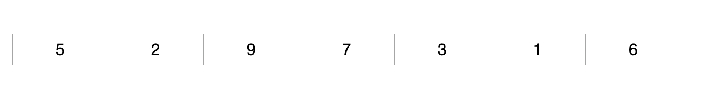
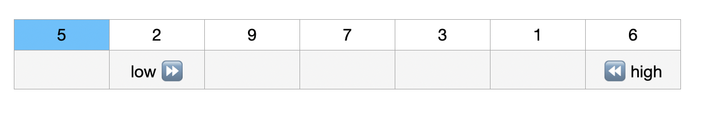
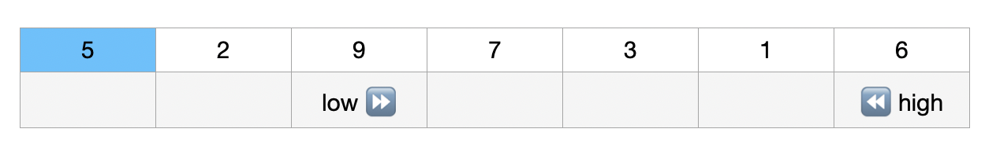
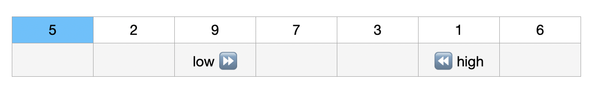
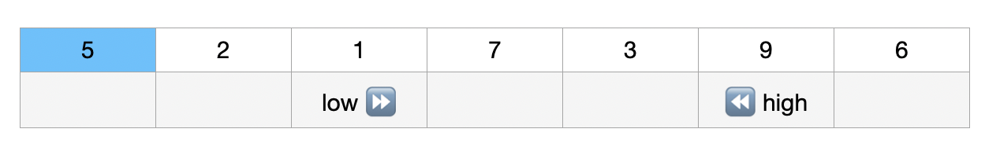
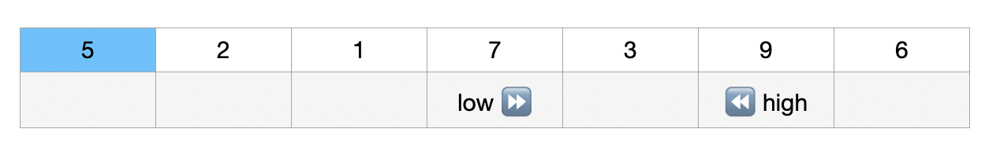
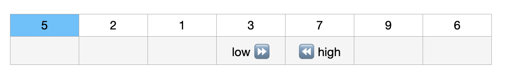
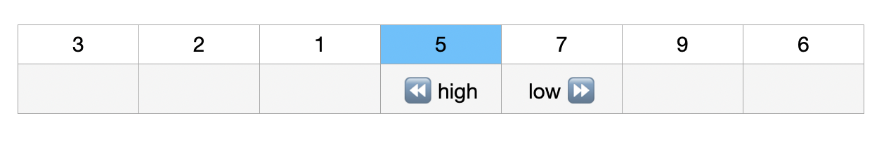

## 퀵소트

퀵 정렬은 이름 그대로 매우 빠르게 정렬을 수행하는 알고리즘이다. 기본적으로 분할정복의 성격을 가지고 있고 실제로도 많이 사용되는 대표적인 정렬 알고리즘이다. 동시에 자료구조 수강생들을 괴롭게 하는 친구 중 한명이긴 하지만..

## Algorithm Concept

퀵 정렬은 다음과 같은 과정으로 정렬을 진행한다. 정렬은 오름차순으로 진행한다고 가정하자.

1. 주어진 배열에서 하나의 요소를 선택하고 이를 pivot(피벗) 으로 삼는다.
2. 배열 내부의 모든 값을 검사하면서 피벗 값보다 작은 값들은 왼쪽에, 큰 값들은 오른쪽에 배치한다.
3. 이렇게 하면 배열이 두 부분으로 나뉜다. 나뉜 이 두 개의 배열에서 각각 새로운 피벗을 만들어서 두개의 배열로 다시 쪼개어 준다.
4. 더 이상 배열을 쪼갤 수 없을 때까지 진행한다.

이 과정은 분할 정복의 원리를 이용한 것이다. 피벗을 중심으로 문제를 `분할` 하고, 피벗을 기준으로 해서 작은 값과 큰 값을 나열하는 `정복` 과정을 거친 뒤, 모든 결과를 `결합` 해서 큰 전체 문제를 해결한다.

## Pivot Selection

퀵정렬에서 가장 핵심이 되는 부분은 어떻게 pivot을 선정하는지에 대한 부분이다. 퀵정렬의 최악의 경우의 시간복잡도는 O(N<sup>2</sup>) 이고 평균 복잡도는 𝛩(NlogN) 이기 때문에 피벗값을 잘못 선정하면 버블소트나 다름없는 성능을 보여준다.

피벗에 따라 시간복잡도가 극과극인 이유는 피봇을 통해 나누는 배열의 위치 때문이다. 만약 이미 정렬된 배열이나 역순으로 정렬된 배열이 있다고 하자. 이때 가장 처음값을 피벗으로 삼게되면 퀵소트 과정은 다음과 같이 진행된다.

1. `| 1 | 2 | 3 | 4 | 5 |` 이런 배열이 있을때, 1을 피벗으로 선택하게 되면,
2. 1을 기준으로 1보다 작은 값은 모두 왼쪽에 두고 큰 값은 모두 오른쪽에 두어야 하는데, 1보다 작은 값은 없기 때문에, 5부터 2까지 내려오면서 1과 비교하는 연산이 n-1번 수행된다.
3. 첫 분할이 끝나고 나면 다음 피벗은 2로 지정이 될텐데 이 때 역시 비교하는 연산이 n-1번 수행된다.
4. 따라서 피벗이 n에 도달할때까지 비교연산이 계속 진행되기 때문에 시간 복잡도는 `n-1 * n` 이 되어서 O(N^2) 가 되게된다.

반면에 배열이 정확하게 혹은 거의 근사하게 반으로 계속 나뉘어진다면 배열의 요소 갯수로 만들어지는 완전이진트리의 높이인 log n 에 대해 비교연산이 n번 수행되므로 시간 복잡도는 𝛩(nlogn) 이 된다.

이런 문제점에도 불구하고 퀵소트가 여전히 빠른 알고리즘으로 인정받는 이유는 완전히 정렬된 배열에 대해 퀵정렬을 수행할 가능성이 매우 적기 때문이다.

그렇다면 피봇을 어떻게 정해야지 최대한 성능을 끌어올릴 수 있을까? 일반적으로 정렬을 수행하기 위해 받는 데이터의 내부 요소들이 어떻게 배치되어 있는지 알지 못한채로 정렬을 수행하는 경우가 많다. 따라서 아무리 최악의 경우가 일어난 확률이 적다고 해도 피봇을 잘 선정해서 최악의 경우를 피하는 것은 필요할 것이다. 피봇의 선정은 대표적으로 세 개의 방법으로 나뉜다.

1. 첫번째 값이나 마지막 값을 피벗으로 선정한다.
2. 첫번째 값, 가운데 값, 마지막 값 중에 중간값을 피벗으로 선정한다.(Median of Three)
3. 무작위 값을 피벗으로 선정한다.

Median of Three 를 사용하면 배열의 분할이 거의 이등분으로 유지가 될 가능성이 높기 때문에 이 방법이 가장 좋은 피벗 선정법이라고 알려져있다. 그러나 이 포스트에서는 퀵소트의 원리와 과정을 이해하기 가장 용이한 첫번째 값을 피벗으로 선정하는 방법으로 설명을 이어가도록 하겠다.

## Example

퀵소트 알고리즘이 어떻게 동작하는지 자세히 알아보자.



### Phase 1



일단 피봇을 선정하고 피벗보다 더 작은값과 더 큰 값을 탐색할 low 와 high 를 피벗을 제외한 배열의 양끝점에 둔다.

### Phase 2



먼저 low를 계속 움직이면서 배열 요소를 검사해보자. 한칸 이동했을 때 low는 배열요소 9를 만나게 되는데, 이 값은 피벗값인 5보다 큰 값이다. low의 뒤에는 항상 피벗보다 작은 값이 있어야 하기 때문에 여기서 일단 멈춘다.

### Phase 3



low가 멈추면 high를 움직인다. high를 한칸 옮기면 배열 요소 1에 도착하게 되는데 이 값은 피벗값인 5보다 작은 값이기 때문에 high의 영역에 있으면 안된다. high 도 여기서 일단 정지시킨다.

### Phase 4



low 와 high가 모두 중단되면 중단된 위치를 먼저 확인해본다. 만약 low 와 high가 서로 위치가 역전된 상태가 아니라면 중단된 지점에 있던 두 요소를 교환한다. 따라서 1과 9가 교환되었다.

### Phase 5



다시 low를 이동시킨다. 이번에도 역시 확인한 배열요소가 피벗보다 큰 값을 가지고 있기 때문에 중단한다.

### Phase 6


이제 high 를 이동시키자. high도 새로 검사한 배열의 요소가 피벗보다 작은 값을 가지고 있기 때문에 현 위치에서 중단한다.

### Phase 7



low 와 high 가 아직 교차하지 않기 때문에 두 배열 요소를 교환한다.

### Phase 8


low가 한번 더 이동하면 피벗보다 큰 값을 만나기 때문에 다시 또 중단하게 된다.
high도 한번 더 이동하면 피벗보다 작은 값을 만나기 때문에 중단하게 된다.

이번 경우에는 low와 high의 위치가 역전됐기 때문에 교환되지 않고 정렬을 끝낸다.

### Phase 9



1차로 정렬이 끝나면 피벗으로 설정된 배열요소를 high가 가르키는 배열요소와 교환해준다. 이제 피벗을 중심으로 왼쪽과 오른쪽에 피벗보다 작고 큰 값들이 위치했음을 확인할 수 있다.

### More...

피벗을 중심으로 나뉘어진 두 그룹은 두 개의 배열처럼 취급되어서 위에서 거쳤던 과정을 똑같이 거칠 수 있다. low가 만들어낸 그룹의 피벗은 3이 될 것이고, high 가 만들어낸 그룹의 피벗은 7이 될 것이다. 이 작업을 분할된 배열의 길이가 1이나 0이 될 때까지 계속 반복한다.

## Implementation

```cpp
#include <stdio.h>

int partition (int arr[], int p, int r){
    int low, high;
    int pivot = arr[p]; // pivot 값 설정

    low = p + 1; // low 는 pivot의 바로 다음 위치에서부터
    high = r; // high는 전달된 끝지점

    while(low <= high){
        while(arr[low] < pivot) low++; // pivot 보다 작은 값이 나올때마다 이동
        while(arr[high] > pivot) high--; // pivot 보다 큰 값이 나올때마다 이동

        if (low <= high){ // low와 high 가 중단된 지점이 서로 위치가 역전된 지점이 아니라면
            int temp = arr[low];    // low 와 high 의 값 변경
            arr[low] = arr[high];
            arr[high] = temp;
        }
    }

    // 피벗과 high 위치 교환
    int temp = arr[p];
    arr[p] = arr[high];
    arr[high] = temp;

    return high; // 피벗 위치 반환

}

void quick_sort(int arr[], int left, int right){
    if (left < right){
        int pivot = partition(arr, left, right);

        quick_sort(arr, left, pivot-1); // 피벗을 기준으로 왼쪽 배열 정렬
        quick_sort(arr, pivot+1, right); // 피벗 기준으로 오른쪽 배열 정렬
    }
}
int main (){
    int arr [] = {3, 2, 1, 5, 7, 9, 6};

    quick_sort(arr, 0, sizeof(arr)/sizeof(arr[0])-1);

    for (int i = 0 ; i < sizeof(arr)/sizeof(arr[0]) ; i++){
        printf("%d ", arr[i]);
    }
}

```
