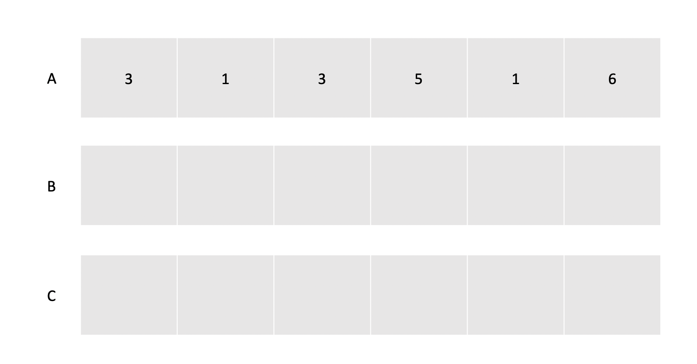
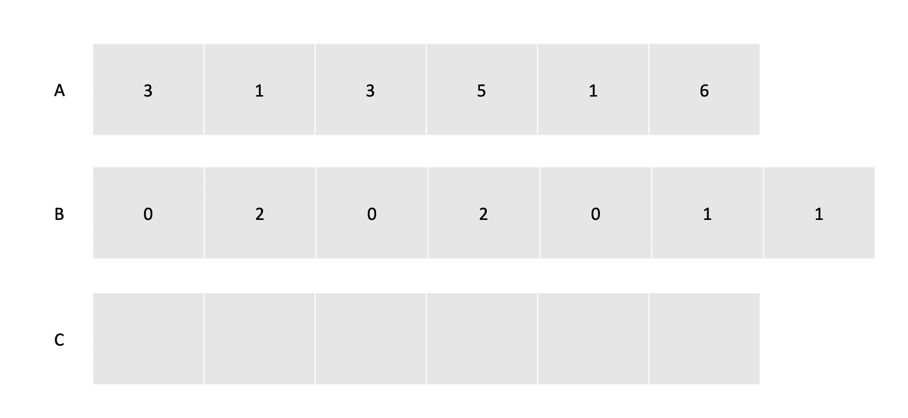
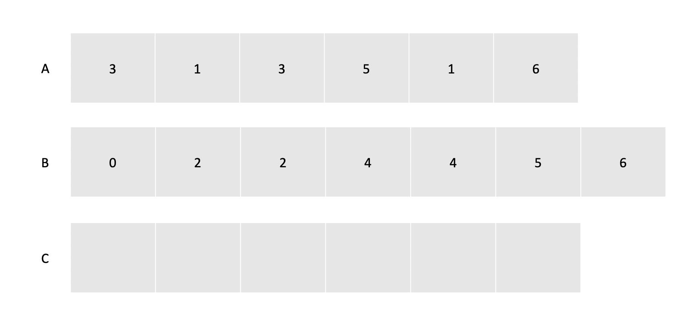
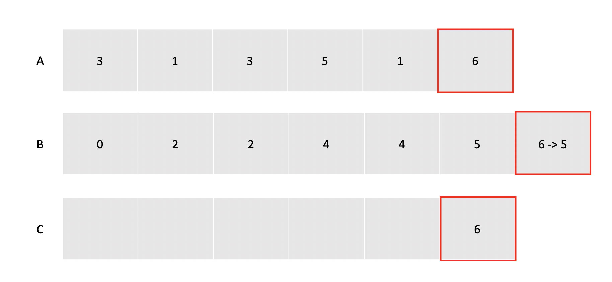
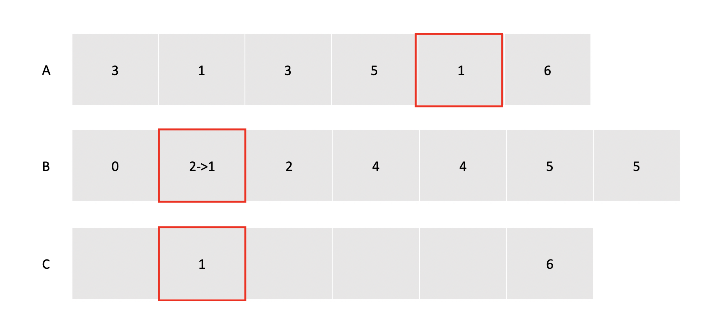
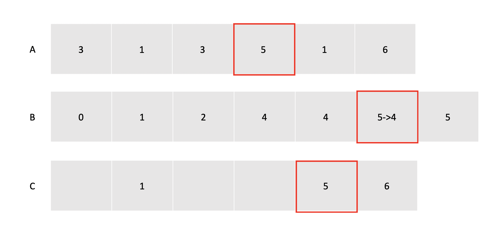
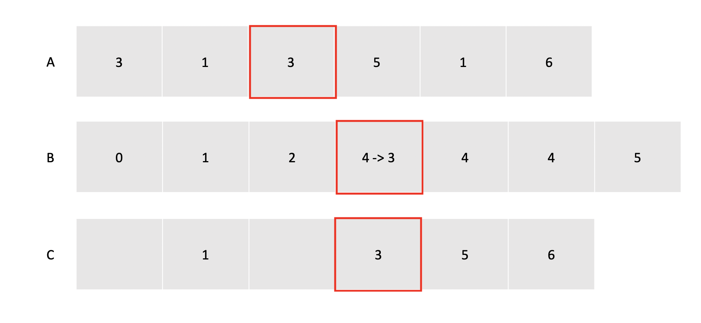
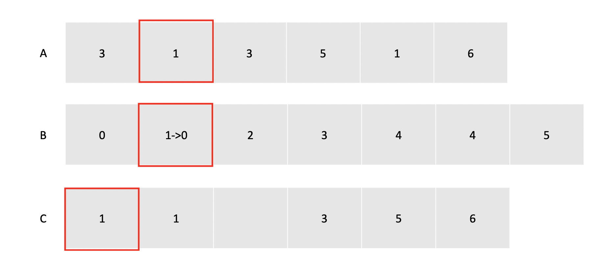
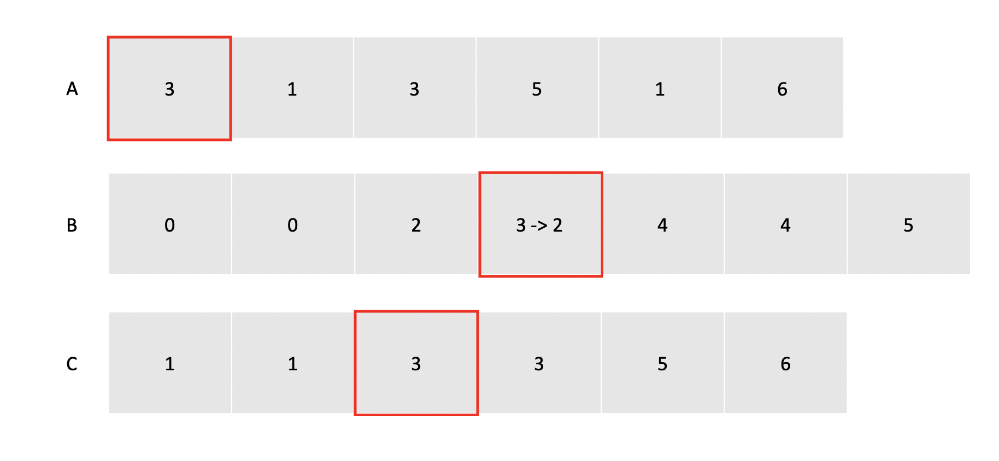

## Comparison Sort

모든 정렬 알고리즘은 기본적으로 배열의 요소들을 검사하는 과정이 포함되어 있다. 결국 배열의 데이터들을 비교하기 위해서는 Decision Tree 를 만들어 경우의 수를 따져볼 수 있는데, 이로부터 우리는 decision tree 의 높이인 logn 만큼 비교연산이 일어난다는 것을 알아낼 수 있다. 비교연산의 시간 복잡도는 Օ(n) 이므로 비교연산을 사용하는 정렬 알고리즘은 아무리 빨라도 Օ(nlogn)보다 빠를 수가 없다.

우리가 자주 언급하는 빠른 정렬알고리즘인 퀵소트, 머지소트 역시 Օ(nlogn)을 복잡도로 가진다.

## Counting Sort

그렇다면 만약 비교연산을 사용하지 않는다면 어떨까? 비교연산을 사용하지 않는다면 Decision Tree 의 제약사항 없이 더 빠른 정렬이 가능하지 않을까?

계수정렬 혹은 카운팅 소트는 이런 아이디어를 기반으로 해서 나온 `Օ(n+데이터의 최대값 k)`의 속도가 보장되는 정렬 알고리즘이다. 카운팅 소트는 이름 그대로 배열 내에 특정한 값이 몇번 등장했는지에 따라 정렬을 수행하기 때문에 비교연산이 사용되지 않는다.

## Algorithm Concept

카운팅 정렬은 다음과 같은 과정으로 수행된다.

1. 입력받은 배열 A의 요소값들의 등장횟수를 저장할 배열 B와 최종적으로 정렬된 값들을 담을 배열 C를 준비한다.
2. 입력밭은 배열에서 값을 하나씩 꺼내서 해당 값을 배열 B의 인덱스로 사용해 B 의 요소 값을 하나 증가시킨다. `(B[A[i]]++)`
3. B가 완성되면 B의 각 요소들을 누적합으로 갱신한다. `B[i] = B[i] + B[i-1]`
4. A 의 가장 뒤에서 부터 값을 하나씩 꺼내서 해당값을 B의 인덱스로 사용하고 참조된 B의 값을 배열 C의 인덱스로 사용해서 배열 C에 A에서 꺼낸 값을 넣는다. `C[B[A[i]]] = A[i]`
5. 사용된 B의 값을 하나 감소시킨다. `(B[A[i]]--)`
6. A의 모든 요소에 대해 4번, 5번 과정을 반복한다.

배열이 여러개 사용되고 서로가 서로를 인덱스로 사용하는 상황이랑 글로는 이해하기가 쉽지 않다. 그림으로 알아보자.

## Example



일단 배열 A를 입력받았고, 배열 B와 C를 준비했다.

### Phase 1



제일 먼저, A를 순회하면서 A에 들어가 있는 값들의 등장 횟수를 배열 B에 저장해주었다. 예를 들어 A에서 0이라는 값은 존재하지 않기 때문에 B의 0번 인덱스는 0이되고, 3은 총 2번 등장했기 때문에 B의 3번 인덱스는 2로 걍신되었다.

주목할 점은 B의 배열길이는 A에 있는 최댓값에 따라 결정된다는 것이다. 이후에 이것이 성능에 어떤 영향이 있을지 논의해보자.

### Phase 2



B 배열의 값들을 1부터 마지막 값까지 바로 이전 값과 계속 더해서 누적합으로 만들어준다.

### Phase 3



1. 배열 A의 가장 뒤에서 부터 값을 하나씩 꺼낸다. 이번에 꺼낸 값은 6이기 때문에 이 값을 배열 B의 인덱스로 사용해서 접근한다.
2. 배열 B의 6번 인덱스에 있는 값은 6이기 때문에 이 값을 사용해서 C에 접근한다. 이것은 배열 A에는 6보다 같거나 작은 값이 총 6개가 있음을 의미한다.
3. 배열 C의 6번째 요소에 6을 넣는다. 배열 A에 6보다 같거나 작은 값이 6개 있기 때문에 최종 배열의 6번째 칸에 넣어주면 6보다 작은 값은 모두 이 인덱스의 앞에 위치하고 큰 값들은 뒤에 위치하게 될 것이다.
4. 배열 B의 6번 인덱스의 값을 하나 줄여준다.

### Phase 4



1. A 배열에서 다음 값인 1을 꺼낸다.
2. B 배열의 1번 인덱스에는 2가 들어있기 때문에
3. C 배열의 2번째 위치에 A에서 꺼낸 값인 1을 넣어주고,
4. B 배열의 1번 인덱스의 카운트를 하나 줄여준다.

### Phase 5



1. A 배열에서 다음 값인 5를 꺼낸다.
2. B 배열의 5번 인덱스에는 5가 들어있기 때문에
3. C 배열의 5번째 위치에 A에서 꺼낸 값인 5을 넣어주고,
4. B 배열의 5번 인덱스의 카운트를 하나 줄여준다.

### Phase 6



1. A 배열에서 다음 값인 3를 꺼낸다.
2. B 배열의 5번 인덱스에는 4가 들어있기 때문에
3. C 배열의 4번째 위치에 A에서 꺼낸 값인 3을 넣어주고,
4. B 배열의 3번 인덱스의 카운트를 하나 줄여준다.

### Phase 7



1. A 배열에서 다음 값인 1를 꺼낸다.
2. B 배열의 1번 인덱스에는 1이 들어있기 때문에
3. C 배열의 1번째 위치에 A에서 꺼낸 값인 1을 넣어주고,
4. B 배열의 1번 인덱스의 카운트를 하나 줄여준다.

### Phase 8



1. A 배열에서 다음 값인 3를 꺼낸다.
2. B 배열의 3번 인덱스에는 3이 들어있기 때문에
3. C 배열의 3번째 위치에 A에서 꺼낸 값인 3을 넣어주고,
4. B 배열의 3번 인덱스의 카운트를 하나 줄여준다.

정렬 끝!

## Implement

```cpp

// k == max number
// n == number of data in A
void counting_sort(int A[], int B[], int C[]){

    /* 카운팅 배열 0으로 초기화 */
    for (int i = 0 ; i <= k ; i++){
        B[i] = 0;
    }

    /* 카운팅 값 갱신  */
    for (int i = 1 ; i <= n ; i++){
        B[A[i]] = B[A[i]] + 1;
    }

    /* 누적합 계산 */
    for (int i = 1 ; i <= k ; i++){
        B[i] = B[i] + B[i-1];
    }

    /* 결과 배열에 값 넣기 */
    for (int i = n ; i >= n ; i--){
        C[B[A[i]]] = A[i];
        B[A[i]] = B[A[i]] - 1;
    }
}

```

## Algorithm Analysis

앞서 잠깐 언급했던 것 처럼 이 알고리즘의 치명적인 단점은 카운팅을 위한 배열의 길이가 입력받은 배열 값들 중 최댓값에 의해 결정된다는 것이다. 만약 우리가 입력받은 배열의 값들이 (1, 100000) 이라고 한다면, 이 배열은 두 개의 값만을 가지고 있음에도 불구하고 카운팅 배열의 크기는 100000으로 설정되어야 한다.

또한 이 알고리즘의 시간 복잡도는 Օ(n \* k) 가 되는데, 배열을 참조하는 연산 O(n) 이 B 배열의 길이인 k, 즉 배열 내의 최대 값의 길이만큼 반복되기 때문이다. 따라서 입력받은 배열의 데이터개수가 k 보다 작다면 굉장히 유용한 알고리즘이 되겠지만, k 가 더 큰경우에는 비효율적인 알고리즘이 될 수도 있다.
