## 합병정렬, 머지소트, 병합정렬

합병정렬은 퀵정렬과 마찬가지로 분할정복을 이용해서 정렬을 수행하는 알고리즘이다. 퀵정렬과는 다르게 항상 𝛩(nlgn) 의 시간 복잡도를 보장한다는 장점이 있지만, 정렬을 위해 추가적인 메모리를 크게 사용한다는 단점이 있다.

## Algorithm Concept

합병정렬은 다음과 같은 과정을 통해 배열의 요소들을 정렬하게 된다. (오름차순)

1. 나누어진 배열의 길이가 1이 될때까지 배열을 반으로 계속 나눈다.
2. 나누어진 배열을 합치면서 정렬을 수행하면서 합친다.
3. 합칠때는 합칠 두 배열의 길이의 총합만큼의 별도 배열을 준비해서 두 배열에서 작은 순서대로 가져와서 배열에 넣어준다.

## Example

말로만 하면 헷갈리니까 아래 배열을 머지소트로 정렬하는 과정을 따라가보자.

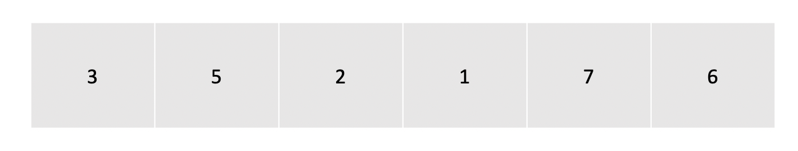

## Phase 1

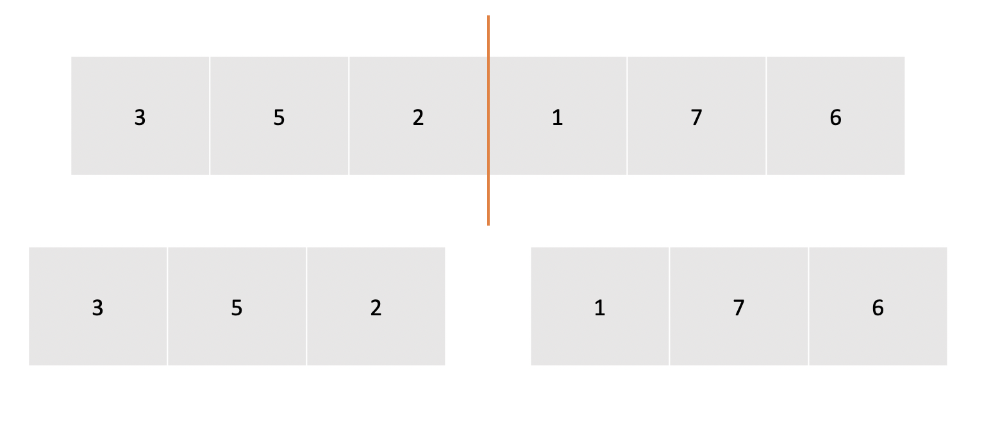

<center> 먼저 배열을 반으로 나눈다. </center>

## Phase 2


<center> 배열의 길이가 1이 되지 않았기 때문에 나누어진 배열을 각각 한번 더 나눈다 </center>

## Phase 3

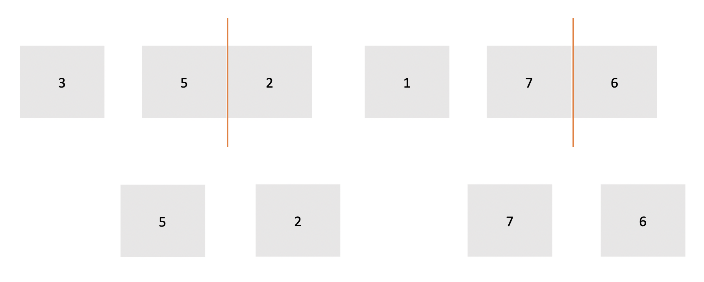

<center> 3과 1은 길이가 1이 되었기 때문에 분할을 멈추고 나머지 배열들은 다시 한번 더 반으로 나누어서 분할한다. </center>

## Phase 4

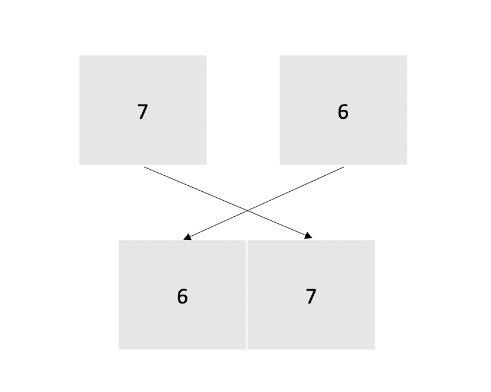

<center> 분할된 모든 배열의 길이가 1이되었기 때문에 분할을 멈추고, 마지막으로 분할된 배열부터 다시 합쳐준다. 이때 합칠 두 배열의 길이의 총합 만큼의 별도의 배열을 준비하고, 각 배열 요소를 비교해서 더 작은 요소부터 새로운 배열에 넣어준다. 이 경우에서는 6과 7을 비교했을 때 6이 더 작기 때문에 새로운 배열에 0번째 이덱스에 6을 넣고 1번째 인덱스에 7을 넣었다. </center>

## Phase 5

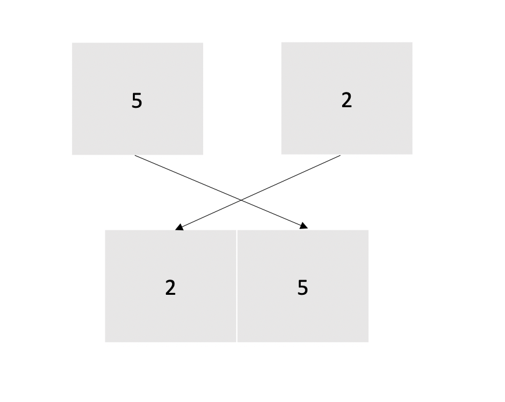

<center> 다음 배열도 같은 방법으로 합쳐준다. </center>

## Phase 6

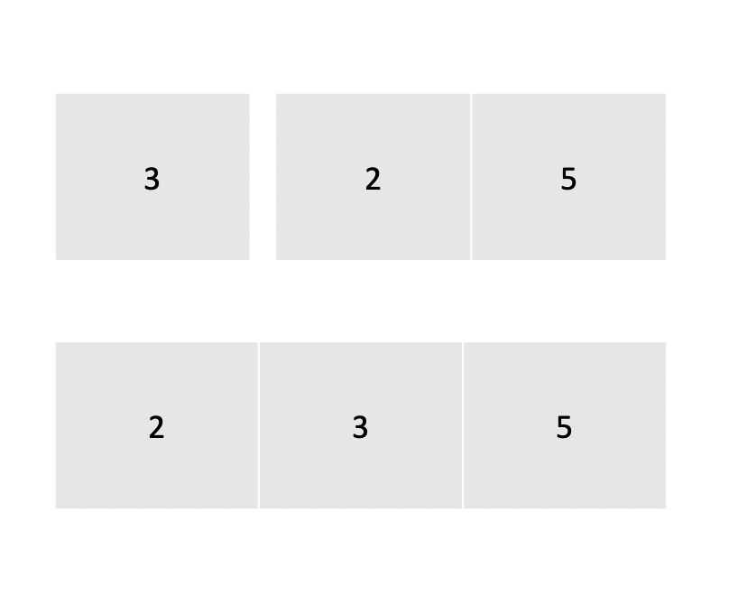

<center> 계속해서 합치는 과정을 해주는데 지금부터는 배열의 길이가 늘어나서 조금 헷갈릴 수도 있다. 합치는 과정은 정확하게 다음과 같이 진행된다. </center>

1. 합쳐야할 두 배열의 길이가 각각 1, 2 이므로 길이 3짜리 배열을 준비한다.
2. 먼저 각 배열의 처음 값인 3과 2를 비교한다. 2가 더 작기 때문에 2를 새로운 배열에 먼저 넣어준다.
3. 2 다음에 값이 있기 때문에 이번에는 3과 5를 비교해서 더 작은 값을 배열에 넣는다.
4. 남은 값이 하나이므로 이 값을 마지막으로 배열에 넣는다.

## Phase 7 and More on

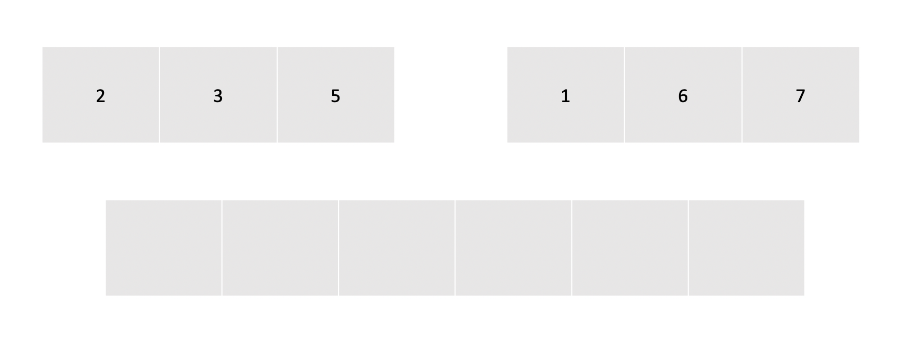

계속 진행하다보면 마지막으로 합쳐주는 구간이 나오는데, 합쳐주는 과정을 더 상세하게 보기 위해 이 구간에서 합치는 과정을 한단계씩 자세히 확인해보자. 일단 두 배열의 길이의 합인 6만큼의 새로운 배열을 만들었다.

### Step 1

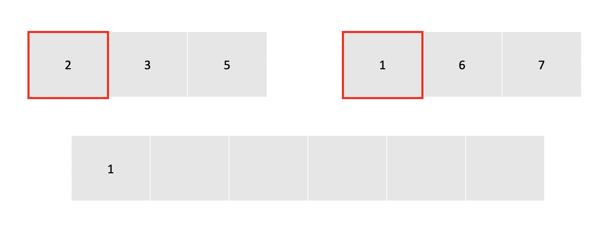

두 배열의 시작 값인 2와 1을 비교해서 더 작은 값을 새 배열에 넣어준다.

### Step 2

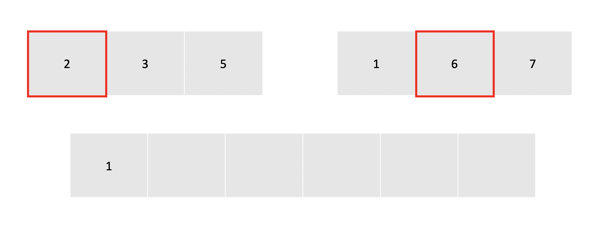

1은 이미 사용된 값이니까 검사 값을 배열의 다음값으로 바꿔준다.

### Step 3

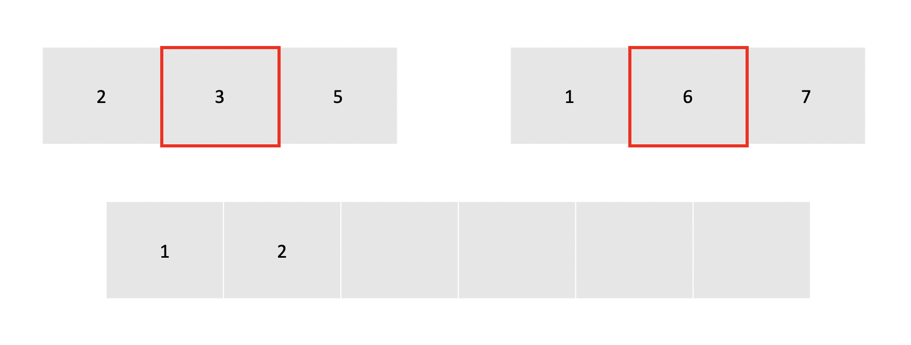

위와 마찬가지로 2 와 6을 비교하고 더 작은 값인 2를 새 배열에 넣은 뒤, 배열의 참조위치를 한칸 이동시킨다.

### Step 4

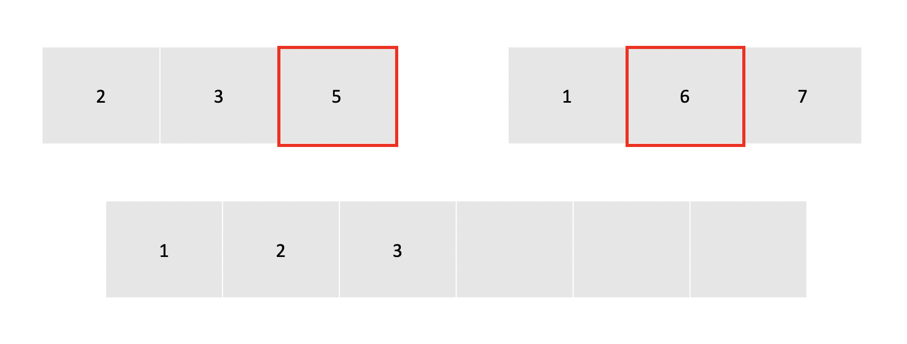

3과 6중 더 작은 값인 3을 배열에 넣고 참조값을 한칸 뒤로 이동시킨다.

### Step 5

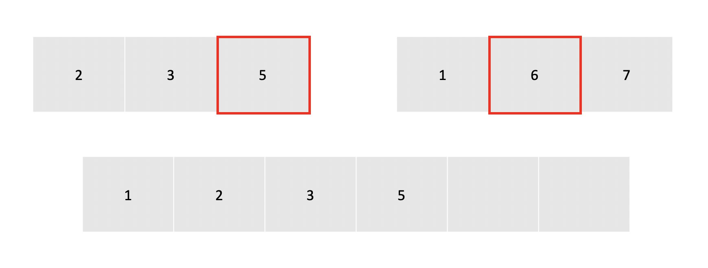

5와 6 중 더 작은 값인 5를 배열에 넣는다. 이번에는 5가 마지막 값이기 때문에 그냥 끝낸다.

### Step 6

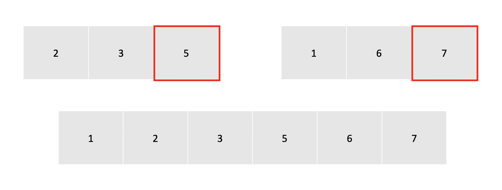

왼쪽 배열의 모든 요소에 대한 처리가 끝났기 때문에 오른쪽 배열에서 처리가 안된 값들을 순차적으로 새 배열에 채워준다. 이미 오른쪽 배열은 병합하는 과정에서 정렬이 되어있기 때문에 순서대로 넣어주기만 해도 정렬은 유지된다.

## Implmentation

```cpp
#include <stdio.h>

void merge(int arr[], int left, int mid, int right){
    int cur_left = left;     // 왼쪽 배열요소를 검사할 커서
    int cur_right = mid+1;   // 오른쪽 배열요소를 검사할 커서
    int i = left;            // 암사배열의 시작위치. 항상 0이 아님.

    int temp_arr[10];

    while (cur_left <= mid && cur_right <= right){ // 왼쪽이나 오른쪽 커서가 끝에 도달할때까지 반복
        if (arr[cur_left] <= arr[cur_right]){      // 왼쪽 커서가 가르키는 값이 오른쪽 커서가 가르키는 값보다 작으면
            temp_arr[i] = arr[cur_left];           // 해당값을 임시배열에 넣기
            cur_left++;                            // 커서 한칸 이동
        }
        else{
            temp_arr[i] = arr[cur_right];          // 오른쪽 커서가 참조하는 값이 더 큰 경우에는 오른쪽 값을 임시 배열로
            cur_right++;
        }
        i++;                                       // 임시배열의 참조위치 증가
    }

    if (cur_left > mid){                            // 왼쪽 배열의 커서가 mid 보다 크다면 적어도 왼쪽 배열 요소들은 모두 사용됨.
        for (int j = cur_right ; j <= right ; j++){ // 혹시 오른쪽 배열에 있는 값들 중 사용이 안된 값이 있을 수도 있으니까 오른쪽 커서를 쭉 돌리면서 체크
            temp_arr[i] = arr[j];                   // 남은 값들로 배열 채워주기
            i++;
        }
    }
    else{
        for (int j = cur_left ; j <= mid ; j++){
            temp_arr[i] = arr[j];
            i++;
        }
    }

    for (int j = 0 ; j <= right ; j++){
        a[j] = temp_arr[j];                         // 임시 배열의 값을 기존 배열에 복사
    }

}

void merge_sort(int arr[], int left, int right){
    int mid;

    if(left < right){                               // 배열의 길이가 1이 아니라면 계속 재귀호출로 분할
        mid = (left + right)/2;

        merge_sort(arr, left, mid);                 // 왼쪽 배열 정렬
        merge_sort(arr, mid+1, right);              // 오른쪽 배열 정렬
    }
}

```

## Alogrithm Analysis

머지소트의 시간 복잡도는 배열을 계속해서 반으로 분리하기 때문의 완전이진트리의 높이인 lgn 과 비교연산을 통해 새로운 배열을 채우는 과정이 모든 단계마다 수행되기 때문에 𝛩(nlgn) 의 복잡도를 가진다.
