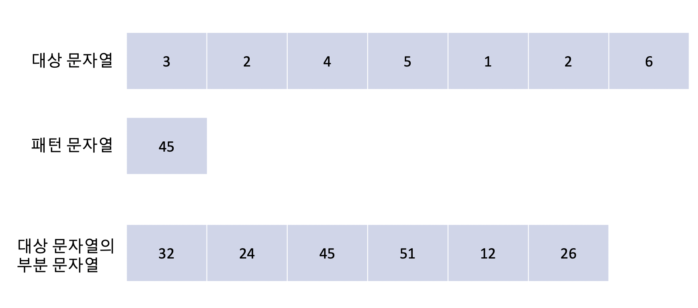
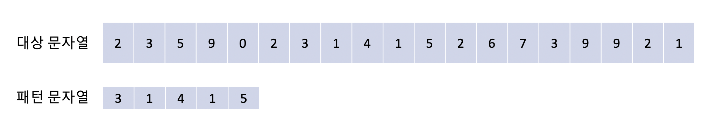

## 문자열 검색

라빈 카프 알고리즘은 문자열에 사용하는 알고리즘이다. 어떤 주어진 문자열 `"abababaab"` 에서 `"abaa"` 라는 문자열을 검색한다고 해보자. 우리가 직관적으로 떠올리는 가장 단순한 방법은 abba를 기준 문자열과 같은 시작 위치에 맞추고 기준 문자열의 시작위치를 한칸씩 뒤로 밀면서 두 문자열이 일치되는 순간을 찾는 것이다. 이 경우에는 기준 문자열의 길이 m, 검색할 문자열(패턴 문자열) n 에 대해 `O(m(n-m+1)) = O(nm)` 의 시간복잡도를 가지게 된다.

사실 이렇게 비교하는 것도 엄청나게 오래걸리는 건 아니지만 라빈 카프 알고리즘을 사용하면 좀 더 빠른 속도로 문자열을 검색할 수 있다.

## 라빈 카프 알고리즘

라빈 카프 알고리즘은 기준이 되는 문자열에서 부분문자열들을 뽑아 숫자로 만들고, 패턴 문자열 역시 숫자로 만들어서 검색을 수행한다. 이렇게 숫자로 만들게되면 문자 하나하나를 비교할 필요가 없어진다. 아래 그림을 확인해보자.

만약 어떤 문자들을 숫자로 바꾸고, 부분문자열들 역시 숫자로 바꾼다면, 패턴 문자열을 부분 문자열의 집합에 비교해보는 것으로 문자열을 손쉽게 검색할 수 있다. 위 예시에서는 진수가 고려되어 있지 않았지만 저런 개념으로의 문자열 탐색이 이루어진다는 것만 기억하자.

## 문자열의 숫자 변환

이 알고리즘의 핵심은 문자열을 숫자로 변경하는 것에 있다. 라빈카프 알고리즘에서는 `radix`라는 개념을 사용해서 문자열의 갯수에 따라 변환할 숫자의 진수를 선택한다. 예를 들어 문자열의 길이가 10이라면, 10진수를 사용하고 2라면 2진수를 사용하는 것이다. 문자열을 숫자로 변환하는 몇가지 방법들을 알아보자. 아래 방법들은 모두 radix 를 10으로 가정하고 설명한다.

### 호너의 방법(Horner's rule)

$$
p = P[m] + 10(P[m-1] + 10(p[m-2]+ ... + 10(p[2]+ 10p[1])...))
$$

호너의 방법은 각 자릿수에 따라 자릿수와 자릿수에 해당하는 값을 곱해주는 것으로 하나의 정수를 만들어 낸다. 예를 들어 [3, 1, 4, 2, 5] 라는 문자열이 있다면,

$$
p = 5 + 10 \times (2+10 \times (4+10 \times (1+10 \times 3))) = 31,425
$$

이렇게 문자열을 하나의 정수로 만들어낼 수 있다. 이 방법을 사용하면 곱하기와 더하기 연산을 각각 `m-1` 번 반복하기 때문에 `Օ(m)` 의 시간 복잡도가 요구된다. 엄청 느린 시간은 아니지만 문자열의 길이가 길어질 수록 성능이 떨어지게 된다. 대상 문자열의 모든 부분 문자열에 이 연산을 적용하기는 무리가 있기 때문에 다음 부분 문자열을 구할 때는 다음과 같은 수식을 사용해서 구한다.

$$
t_{s+1} = 10(t_s - 10 ^ {m-1} T[s+1]) + T[s + m + 1]
$$

$$
t_{s+1} = 10(31415 - 10000 \times 3) + 2 = 14,152
$$

단순하게 현재 최대자릿수에 있는 숫자를 없애고 다음 자릿수를 1의 자리로 밀어넣는 것이다.

### Modulo Operation

문자열이 길어지면 `나머지 연산(%)` 을 사용해서 문자열의 길이를 줄이는 방법을 선택한다. 예를 들어 다음과 같은 문자열과 패턴 문자열이 있다고 하자

대상 문자열을 패턴 문자열의 길이만큼 계속 쪼개서 나머지 연산을 취해주자. 이때 나머지 연산을 할 나누는 값은 13으로 정한다고 하자. 그리고 같은 값을 가지고 패턴 문자열도 나머지를 취해주자.

이렇게 하면 위와 같이 대상 문자열이 변경된 것을 확인할 수 있다. 기존의 [2, 3, 4, 9, 0] 은 정수로 변환되어 23490이 되고 이 값을 13으로 나눈 나머지를 0번째 인덱스에 넣어주면 8이 들어간다.

그런데 이런 방법으로 값을 저장하면 서로 다른 패턴인 문자열이 나머지를 취했을 때 같은 값으로 변환되는 현상이 생긴다. 예를 들어 기존의 대상 문자열에서 31415 와 67399 는 모두 13으로 나눈 나머지가 7이기 때문에 변환된 후의 문자열에 7이 들어가게 되고 패턴문자열과 일치된다고 인식된다. 그래서 최종적으로는 기존 문자열로 찾아가서 패턴문자열과 정말로 일치하는지 재확인하는 작업이 필요하다.

나머지 연산 방법을 사용할 때 다음 부분문자열을 생성하는 수식은 다음과 같다.

$$
t_{s+1} = (d(t_s - T[s+1]h) + T[s+m+1])(mod \, q)
$$

## Algorithm Analysis

라빈 카프 알고리즘을 사용하면 문자열을 정수들의 집합으로 변경시키는데 걸리는 시간 `Օ(m)` 으로 문제를 해결할 수 있다. 최악의 경우에는 `Օ((n-m+1)m)` 의 시간복잡도가 요구되는데, 이때는 나머지 연산을 수행했을 때 모든 부분문자열의 정수값이 같은 값을 가지게 될 때이다. 부분문자열을 생겅하는데 `Օ(n-m+1)` 이 걸리고 패턴 문자열의 정수값과 같은 값을 가지는 값이 대상 문자열의 모든 부분문자열의 값과 같을 때 진짜 맞는 결과인지 모두 확인해야하기 때문에 `Օ(m)` 번 확인하는 연산을 가진다.
