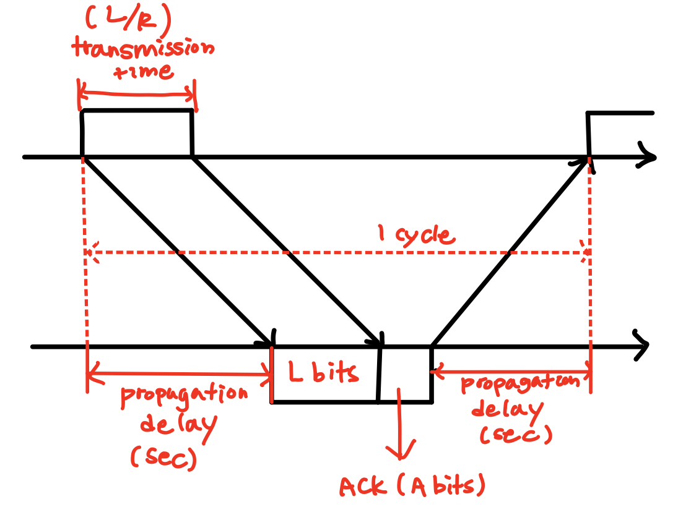

_**참고도서: 컴퓨터 네트워킹 : 하향식 접근. 7판. James F. Kurose , Keith W.Ross 지음**_

## Reliable Data Transfer

- TCP 와 같은 서비스는 신뢰적 데이터 전송을 보장한다.
- 신뢰적 데이터 전송이란, 목적지 프로세스에 항상 모든 데이터가 순서대로 도착하고, 중간에 손실되는 데이터가 없음을 의미한다.

### Forward Error Correction (FEC)

- RDT를 위해서 목적지로 데이터를 보낼때, 중복되는 비트들을 보내는 방법으로 오류를 체크하는 방법이다.
- 만약 1을 보낸다면 111을 보내고, 0을 보낸다면 000을 보내는 방식으로 중복된 값을 가진 비트를 더 추가해서 전송한다.
- 목적지에서는 이 비트를 확인하고 한 비트라도 다른 비트가 있다면 각 비트가 가진 더 많은 값을 선택해서 받는다.
  - 예를 들어 010이 도착했다면 0이 더 많은 값이기 때문에 값을 0으로 받고, 110 이 도착했다면 1이 더 많은 값이기 때문에 값을 1로 받는다.

### Retransmission - ARQ(Automatic Repeat Request)

- 수신자 측에서 오류를 판단하고 송신자에게 패킷의 재전송을 요청하는 방식이다.

#### Stop and Wait ARQ

- ARQ 중에서 가장 단순하고 구현이 쉬운 방식이다.
- 단순하게 한 패킷이 목적지에 도착했을 때, 목적지는 해당 패킷을 잘 받았다는 `ACK` 패킷을 송신자에게 다시 보내고 송신자는 `ACK` 패킷을 받을 때까지 기다렸다가 다음 패킷을 보내는 방식이다.
- 이 방법을 사용하면 Flow Control 이 자동으로 된다는 장점이 있다. 왜냐하면 `ACK` 패킷을 받을 떄까지는 송신자는 절대 다음 패킷을 보내지 않기 때문에 송신자의 전송률이 수진자의 처리율보다 더 빨라도 부하가 걸리는 일이 없기 때문이다.
  - 하지만 단순히 ACK만 이용해서는 송신자가 데드락 상태에 빠질 가능성이 높다. ACK이 도착할 때까지 무한히 기다려야하기 때문이다.
- 따라서 Stop-and-wait에서는 `Time out` 개념을 도입해서 일정시간동안 송신자가 수신자로부터 ACK을 받지 못하면 Time out 이후에 같은 패킷을 다시 한 번 보내는(`Retransmission`) 구조를 사용한다.
  - 이 방법에서도 문제가 발생하는데, 다시 전송한 패킷이 이미 수신자 측에 있는 패킷이면 패킷의 중복 문제가 발생한다는 것이다.
- 이 중복문제를 해결하기 위해서 stop-and-wait 는 각 패킷에 `sequence number`를 붙여서 수진자 측에서 해당 번호를 확인한 뒤 중복된 패킷은 버리고 해당 패킷에 대한 ACK 만 응답하도록 한다.
- 그런데 만약 각 패킷을 보내는데 걸리는 시간이 다르다면, 다음과 같은 시나리오가 발생한다.
  - 송신자가 0번째 패킷을 보낸다.
  - 수진자는 0번째 패킷을 받고 ACK을 보낸다.
  - 그런데 그 사이에 time out이 되어 송신자는 0번쨰 패킷을 다시 보낸다.
  - 그 사이에 송신자는 0번째 패킷에 대한 ACK을 받고 1번째 패킷을 보낸다.
  - 다시 보낸 0번째 패킷이 이번에는 조금 빨리 도착해서 time out 전에 0번째 패킷에 대한 ACK을 송신자에게 보낸다.
  - 송신자는 자신이 마지막으로 보낸 패킷이 1번 패킷이므로, 1번에 대한 ACK이 도착했다고 생각한다.
- 그래서 우리는 ACK 패킷에도 수신한 패킷과 동일한 숫자를 부여해서 송신자에게 응답해야 위 같은 문제를 해결할 수 있다.

#### Performance of Stop and Wait

- stop-and-wait 의 성능평가는 다음처럼 이루어진다.
  - 패킷을 보낼 때와 ACK를 보낼 때 총 두 번의 propagation delay 가 소요된다 : `2tp`
  - 송신측에서 패킷을 보낼 때와 수신측에서 ACK을 보낼 때 두 번의 다른 transmission time이 소요된다 : `L+A / R`
  - 따라서 전체 사이클을 한번 도는데 걸리는 시간은 `(L+A)/R + 2tp` 이다.
  - 하지만 실제 Utilization은 `L/(L+A+2Rtp)` 로 계산된다.

#### Sliding Window Protocols : Pipelining

- `Sliding window` 는 파이프라이닝을 사용해서 아직 ACK이 송신측에 도착하지 않았다고 하더라고 일정한 양의 패킷을 연달아 보내는 정책이다.
- 기존 stop-and-wait은 한번에 한 패킷만 처리하기 때문에 sequence number 에 많은 비트 수를 할당 할 필요가 없었지만 이 경우에는 한번에 많은 패킷을 보내기 때문에 sequence number 에도 많은 비트 수를 할당해야한다.

#### Go-Back-N(GBN)

- GBN은 sliding window 정책을 사용하는 하나의 방법이다.
- 송신측 동작 원리
  - 송신자 측은 window의 크기로 N을 지정할 수 있는데, 이 N은 한번에 송신자 측이 전송할 패킷의 개수를 의미한다.
  - `send_base`는 아직 ACK 응답을 받지 않은 패킷들 중에 가장 첫 패킷을 말한다. 따라서 송신측은 send_base 부터 send_base + N - 1 번 까지의 패킷 중 아직 보내지 않은 패킷을 보내게 된다.
  - 각 패킷은 타이머를 사용해서 `time out` 서비스를 제공한다.
  - 만약 n 패킷에 대한 time out 이 발생하면 n 패킷을 포함해서 해당 패킷 이전에 window에 있는 모든 전달된 패킷을 다시 수신자 측에게 보낸다.
- 수신측 동작 원리
  - 수신자 측은 `window를 항상 1`로 설정한다. 따라서 수신측은 현재 받고자 하는 패킷의 sequence number 만을 기억한다.
  - 만약 수신을 기다리고 있던 sequence에 맞는 패킷이 전달되면 연속적으로 전돨된 sequence number중 가장 큰 숫자를 ACK에 붙여 송신자에게 보낸다. 이때, 이 ACK은 `cumulative ACK` 이라고 하고, 해당 ACK이 가진 sequence number 이전의 숫자를 가진 모든 패킷들은 정상적으로 도착했다는 것을 의미한다.
  - 만약 수신을 기다리고 있던 sequence와 일치하지 않는 패킷이 전달되면 순서가 잘못된 패킷이라고 판단하고 해당 패킷을 `버린다`. 그리고 지금 가지고 있는 연속된 sequence number 중 가장 큰 숫자를 ACK에 붙여 보낸다. 이렇게 하면 현 시점에서 `성공적으로 받은 마지막 패킷의 숫자를 송신자에게 알려주게 된다`.
- 윈도우의 크기는 sequence number 로 사용하는 비트 수에 영향을 받는다. 윈도우가 너무 크면 일정 비트의 sequence number로 표현할 수 없는 문제가 발생한다.
  - 따라서 윈도우의 크기는 항상 `2^m - 1`보다 같거나 작아야한다.

#### Selective Repeat (SR)

- Selevtive Repeat은 GBN과 비슷하지만 수신자 측에도 송신자와 동일한 크기의 window를 만들어 사용하는 정책이다.
- 송신측 동작원리
  - GBN과 마찬가지로 SR도 `send_base ~ send_base + N - 1` 의 sequence number를 가진 패킷을 전달한다.
  - 하지만 GBN과는 다르게 ACK이 되지 않은 패킷들만 재전송하는 정책을 가진다.
- 수신측 동작원리
  - 만약 수신측 윈도우에 포함되는 번호를 가진 패킷이 전달되면, 해당 패킷을 받고 ACK을 보낸다. 이때, 전달받은 패킷이 순서에 어긋나더라도 저장한다.
  - 순서에 어긋난 패킷은 별도의 버퍼에 따로 저장을 해두고 상위 계층에는 아직 전달하지 않는다.
  - 새로운 패킷이 전달되고 해당 패킷의 순서가 버퍼에 있는 패킷들과 함께 올바른 순서가되면 모든 패킷들을 상위 계층에 전달한다.
- SR도 GBN 과 같이 윈도우 크기와 sequence number 의 비트수가 서로 연관되어 있다.
  - 윈도우의 크기는 항상 `2^m - 1`보다 같거나 작아야한다.
