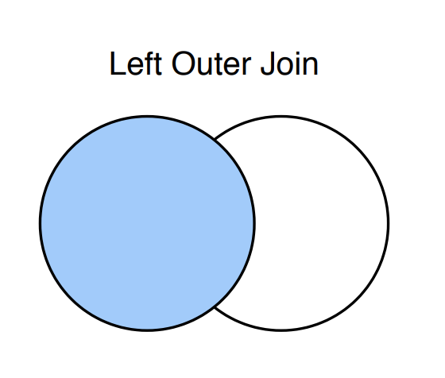
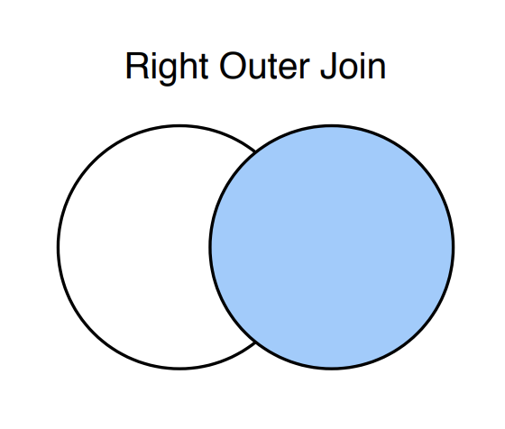
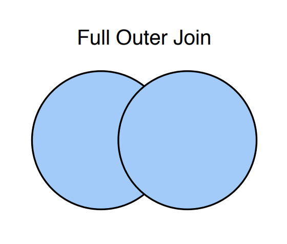

# Join

조인은 다수의 테이블을 연결해서 데이터를 뽑아내는 연산을 의미한다. 기본적으로 Join 은 normalized 된 테이블을 사용하게 된다. Join에는 여러 종류가 있는데, 하나씩 살펴보자.

## Natural Join

Natural 은 두 테이블에서 같은 attribute를 기준으로 테이블을 합쳐서 새로운 테이블을 만드는 것을 의미한다. 그리고 중복되는 attribute 는 합쳐서 하나로 만든다.

students_info

| <U>student_id</U> | student_name | age | sex |
| :---------------: | :----------: | :-: | :-: |
|         1         |     여훈     | 26  |  M  |
|         2         |     윤이     | 24  |  F  |
|         3         |     현기     | 21  |  M  |

students_department

| <U>student_id</U> | Department |
| :---------------: | :--------: |
|         1         |    CSEE    |
|         2         |    CPSW    |
|         3         |    CSEE    |

위와 같은 두 테이블이 있다면, Natural Join을 했을 때, Student_id 를 기준으로 합쳐져서 다음과 같은 테이블이 만들어진다. 두 테이블에서 Student_id 가 각각 존재하지만 Join 이후에는 하나가 된 것을 볼 수 있다.

| <U>student_id</U> | student_name | age | sex | Department |
| :---------------: | :----------: | :-: | :-: | :--------: |
|         1         |     여훈     | 26  |  M  |    CSEE    |
|         2         |     윤이     | 24  |  F  |    CPSW    |
|         3         |     현기     | 21  |  M  |    CSEE    |

SQL 에서 Natural Join 을 할때는 다음과 같은 문법으로 할 수 있다.

```sql
SELECT *
FROM students_info, students_department
WHERE students_info.student_id = student_department.student_id
```

or

```sql
SELECT *
FROM students_info NATURAL JOIN students_department
```

처음 쿼리는 Natural Join을 직접적으로 사용하지는 않았지만, WHERE 문을 통해서 student_id 가 같은 tuple을 뽑기로 했기 때문에 아래 쿼리에서 직접적으로 NATURAL JOIN 을 사용한 것과 동일한 결과가 나온다.

그런데 Natural Join은 사용자가 지정하지 않고 연산과정에서 동일한 attribute name 을 찾아서 join 하기 때문에 attribute 이름만 같고 그 의미가 다른 테이블들이 합쳐지면서 정보가 훼손 될 가능성이 있다.

```sql
SELECT name, title
FROM student, NATURAL JOIN takes NATURAL JOIN course
```

이런 쿼리를 사용했다고 하자, 한번에 세 테이블을 합치게 되는데 문제는 세 테이블이 가진 동일한 attribute의 의미가 달라지는 경우가 생겨버린다.

## Join (Inner Join)

Natural Join의 문제를 해결하기 위해서 Join 연산을 사용할 수 있다. Natural Join은 ON 연산의 사용을 허용한다. Where 처럼 ON 을 통해서 테이블을 합칠 조건을 명시해줄 수 있다.

students_info

| <U>student_id</U> | student_name | age | sex |
| :---------------: | :----------: | :-: | :-: |
|         1         |     여훈     | 26  |  M  |
|         2         |     윤이     | 24  |  F  |
|         3         |     현기     | 21  |  M  |

students_department

| <U>student_id</U> | Department |
| :---------------: | :--------: |
|         1         |    CSEE    |
|         2         |    CPSW    |
|         3         |    CSEE    |

앞서 사용했던 테이블을 Natural Join을 통해서 합칠 때는

```sql
SELECT *
FROM students_info NATURAL JOIN students_department
```

이런 쿼리를 사용했다. 우리는 쿼리를 통해서 어떤 attribute가 같은 이름을 가지는지 명시하지 않았지만, Natural Join이 해당 attribute를 알아서 찾고 합쳐주었다.

Join 을 사용하게 되면

```sql
SELECT *
FROM students_info JOIN students_department
ON tudents_info.student_id = student_department.student_id
```

이렇게 어떤 attribute 를 기준으로 합칠건지 지정해줄 수가 있다. 따라서, 중복되는 컬럼이 여러개 있을 때, 어떤 컬럼을 기준으로 합칠지 사용자가 선택해줄 수 있다.

만약, 두 테이블에 값이 일치하지 않는 tuple들이 있다면 어떻게 될까? 당연하게도 그런 tuple들은 새로 합쳐져서 만들어지는 테이블에서는 제외된다.

## Outer Join

Natural Join 과 Inner Join은 두 테이블에서 일치하는 값이 없는 tuple들을 모두 없애버리게 되는데, 어떤 경우에는 해당 정보들이 필요할지도 모른다.

Outer Join 은 Inner Join 이나 Natural Join 과는 다르게 짝을 찾지 못한 attribute도 결과 테이블에 유지한다. 그리고 Outer Join의 종류에 따라서 짝을 찾지 못한 tuple들 중 어떤 종류의 tuple들만 남길지 선택할 수 있다. 짝을 찾지 못하게 되면 합쳐져서 새로 추가된 attribute에 넣어줄 값이 존재하지 않기 때문에, 해당 attribute의 값을 null로 초기화 해준다.

### Left Outer Join

Left Outer Join은 말 그대로 왼쪽은 모두 포함하는 조인의 형태이다.



students_info

| <U>student_id</U> | student_name | age | sex |
| :---------------: | :----------: | :-: | :-: |
|         1         |     여훈     | 26  |  M  |
|         2         |     윤이     | 24  |  F  |
|         3         |     현기     | 21  |  M  |
|         4         |     국인     | 22  |  M  |

students_department

| <U>student_id</U> | Department |
| :---------------: | :--------: |
|         1         |    CSEE    |
|         2         |    CPSW    |
|         3         |    CSEE    |
|         5         |    SWFL    |

지금 보니까 예시 테이블이 별로 좋은 것 같지는 않다.. 어쩃든 Left Outer Join을 시행해보자. 위 테이블은 보면 이유는 모르겠지만 국인이의 정보가 department 테이블에 없고, id 5번의 정보가 student 테이블에 없다. Inner Join 과 Natural Join 을 사용했다면, 국인이와 id 5번 학생의 정보가 사라졌겠지만, 이번엔 그렇지 않다. Left Outer Join 이기 때문에 왼쪽에 기준으로 테이블을 합쳐보자.

| <U>student_id</U> | student_name | age | sex | Department |
| :---------------: | :----------: | :-: | :-: | :--------: |
|         1         |     여훈     | 26  |  M  |    CSEE    |
|         2         |     윤이     | 24  |  F  |    CPSW    |
|         3         |     현기     | 21  |  M  |    CSEE    |
|         4         |     국인     | 22  |  M  |    null    |

Join 을 때릴(?) 서로 공유되는 attribute 는 student_id 이다. 하지만 왼쪽 테이블에 있는 국인이에 대한 정보가 오른쪽 테이블에는 존재하지 않는다. Left Outer Join 은 이때 왼쪽에만 존재하는 정보를 살리고 합쳤을 때 비어있게 되는 attribute 에 null을 삽입해준다.

따라서 왼쪽 테이블을 기준으로 합쳤을 때 추가되는 Department 에 국인이에 대한 값이 null이 들어가게 되는 것이다.

쿼리문은 다음과 같이 작성하면 된다.

```sql
SELECT *
FROM students_info NATURAL LEFT OUTER JOIN students_department
```

### Right Outer Join

Right Outer Join 은 Left Outer Join 과는 반대로 오른쪽 테이블에 있는 정보를 모두 살리는 것이다.



Left Outer Join 에서 사용한 것과 동일한 테이블은 Right Outer Join으로 합쳐보자

students_info

| <U>student_id</U> | student_name | age | sex |
| :---------------: | :----------: | :-: | :-: |
|         1         |     여훈     | 26  |  M  |
|         2         |     윤이     | 24  |  F  |
|         3         |     현기     | 21  |  M  |
|         4         |     국인     | 22  |  M  |

students_department

| <U>student_id</U> | Department |
| :---------------: | :--------: |
|         1         |    CSEE    |
|         2         |    CPSW    |
|         3         |    CSEE    |
|         5         |    SWFL    |

위 두 테이블을 오른쪽을 기준으로 합치면,

| <U>student_id</U> | Department | student_name | age  | sex  |
| :---------------: | :--------: | :----------: | :--: | :--: |
|         1         |    CSEE    |     여훈     |  26  |  M   |
|         2         |    CPSW    |     윤이     |  24  |  F   |
|         3         |    CSEE    |     현기     |  21  |  M   |
|         5         |    SWFL    |     null     | null | null |

이렇게 국인이의 정보는 포함하지 않지만 오른쪽 테이블에 있던 id 5번의 정보는 포함한 채로 합쳐진다.

쿼리문은 다음과 같이 작성할 수 있다.

```sql
SELECT *
FROM students_info NATURAL RIGHT OUTER JOIN students_department
```

### Full Outer Join

Full Outer Join은 양쪽 테이블의 정보를 모두 유지한채로 테이블을 합치는 방법이다.



위에서 계속 사용했던 아래 테이블을 full outer join 으로 합쳐보자

students_info

| <U>student_id</U> | student_name | age | sex |
| :---------------: | :----------: | :-: | :-: |
|         1         |     여훈     | 26  |  M  |
|         2         |     윤이     | 24  |  F  |
|         3         |     현기     | 21  |  M  |
|         4         |     국인     | 22  |  M  |

students_department

| <U>student_id</U> | Department |
| :---------------: | :--------: |
|         1         |    CSEE    |
|         2         |    CPSW    |
|         3         |    CSEE    |
|         5         |    SWFL    |

두 테이블을 합치면,

| <U>student_id</U> | student_name | age  | sex  | Department |
| :---------------: | :----------: | :--: | :--: | :--------: |
|         1         |     여훈     |  26  |  M   |    CSEE    |
|         2         |     윤이     |  24  |  F   |    CPSW    |
|         3         |     현기     |  21  |  M   |    CSEE    |
|         4         |     국인     |  22  |  M   |    null    |
|         5         |     null     | null | null |    SWFL    |

이렇게 두 양쪽 테이블의 정보를 모두 포함한 테이블이 만들어진다. 비어있는 값은 null 로 초기화된다.

MySQL 에서는 Full Outer Join의 쿼리를 지원하지 않는다. 그래서 우리는 직접 이 쿼리를 만들어서 사용할 수 있는데, 양쪽 정보를 모두 포함시키려면, Left Outer Join 과 Right Outer Join 의 내용을 모두 포함하는 것임으로 UNION 연산을 통해 왼쪽 기준으로 조인한 테이블, 오른쪽 기준으로 조인한 테이블을 합쳐주면 된다.

쿼리문은 다음과 같이 작성할 수 있다.

```sql
SELECT student_id, student_name, age, sex, Department
FROM students_info NATURAL LEFT OUTER JOIN students_Department

UNION

SELECT student_id, student_name, age, sex, Department
FROM students_info NATURAL RIGHT OUTER JOIN students_Department;
```

이렇게 두 쿼리를 합쳐주는 것으로 Full Outer Join을 구현할 수 있다. 하지만 명심해야할 부분은 UNION 같은 집합 연산자를 사용할 때는 두 테이블의 attrbitue의 순서가 동일해야하기 때문에, SELECT 문에서 attribute의 순서를 지정해줘야한다.
