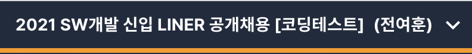

> 이런거 처음해봐서 너무 떨렸다..

## 취업 준비

방학 내내 연구 & 큐빅개발만 하다가 방학이 끝나버렸다. 그리고 개강과 함께 취업준비를 시작했다. 사실 내가 너무 안일하게 생각하고 있었던 것 같다. "그냥 열심히 하다보면 회사에서 일 할 기회가 생기겠지" 라는 마음이었는데, 막상 마지막 학기가 시작되니 그런 것 보다는 `아 나 어떡하지` 라는 생각이 제일 먼저 들었다.

3학년 때 부터 방학을 내내 연구실에서 보내면서 인턴 경험도 없고, 학점이 엄청 좋은 것도 아니고, 코딩실력이 좋은 것도 아니었다. 이런 현실을 깨달았을 때가 올해 3월이었다.

이대로는 안되겠다 싶어서 무작정 공부를 다시 시작했다. 일단 코딩테스트를 통과해야 서류든 면접이든 해볼 수 있겠다 싶어서 약 한달동안 백준을 열심히 풀었다. 작년까지는 꾸준히 풀어왔지만, 오랫동안 이 핑계 저 핑계로 백준을 소홀히 했기 때문에 다시 열심히 해보고자 했다.

지금은 객관적으로 아무 준비도 안된 상태이기 때문에 올해 상반기는 낼 수 있는 자소서는 다 내면서 자소서를 계속 써보고, 코딩테스트도 무조건 다 보면서 내가 어떤게 부족한지 연습해보는 기간으로 잡았다.

이런 마음으로 처음 자소서를 작성해서 내보고 코딩테스트를 치뤄본 것이 바로 오늘,`LINE 공개채용` 코딩테스트였다.

## 내 생애 첫 코테

시험 시간은 1시부터 5시 40분까지였다. 총 두 개의 시험으로 나뉘어져 있고 `알고리즘 테스트` 를 2시간 동안, 약 20분 휴식 후 `단계별 코딩테스트` 를 2시간 동안 풀어야했다. 처음에는 지문이 잘 이해가 안되어서 헤맸는데, 예시와 샘플 테스트케이스 설명을 읽으니 대충 감이 왔다.

`알고리즘 테스트` 영역은 개인적으로 평이한 난이도의 문제, 중간 난이도, 어려운 문제가 섞여있었다. 사실 중간 난이도라고 느꼈던 문제는 풀릴 것 같은데 안풀려서 끙끙대다가 그냥 오답인채로 제출했다. 처음에는 너무 막막했는데, 2시간은 생각보다 긴 시간이었고 총 두 문제를 풀어서 제출 할 수 있었다. 물론 반례들이 있어 오답처리 될 수도 있지만..

`단계별 코딩테스트` 영역은 말 그대로 단계별로 코딩을 해야하는 문제였는데, 처음 설계만 잘 해두면 수월하게 풀 수 있는 문제인 것 같다. 처음 설계 단게에서 조금 해메면서 시간을 많이 소비했는데, 시간만 더 있었다면 끝까지 풀 수 있었을 것 같아서 아쉬운 마음이 든다. 이 영역에서도 두 문제를 풀어서 제출했다.

## 지금 마음을 기록하자

합격 수준까지 도달하지 못했지만, 나는 오늘 매우 만족했다. 작년 운영체제 수업을 들을 때 보았던 코딩테스트에서 태어나서 처음으로 백지를 낸 이후에, `코딩테스트` 라는 단어 자체가 나에겐 부담으로 다가오고 시간 안에 문제를 해결해야 한다는 압박감을 잘 이겨낼 수 없었다. 하지만 오늘은 그래도 내가 원하는대로, 내 페이스대로 할 수 있는 최선을 다했고, 본격적인 코딩테스트 준비를 시작한지 얼마 안된 시점에서 스스로를 칭찬할 만한 결과였다고 생각한다.

오늘 시험을 치루면서 몇가지 깨달은 것이 있다.

1. 문제를 빨리 이해하는 것도 능력이다.

   백준에서는 문제의 설명이 복잡한 경우가 그리 많지 않기 때문에 인풋/아웃풋만 보고도 쉽게 문제를 파악할 수 있었다. 그렇지만 오늘 처럼 여러가지 데이터와 설명이 주어졌을 때, 내가 해야되는 내용을 파앋하는데 너무 오랜 시간이 걸렸던 것 같다.

2. 문제를 많이 풀어보자. 무조건 많이.

   문제를 풀 때, 어떤 알고리즘을 써야될지 고민이 된다. 최근에 백준을 계속해서 풀었기 때문에 문제를 보고 `이 알고리즘을 쓰면 될 수도 있겠다` 라는 생각이 들었던 문제가 있었다. 결국 해결은 못했지만, 문제를 많이 접해보고 해결하는 경험이 많아질 수록, 낯선 문제들도 내가 해결할 수 있는 문제로 변할 것이라고 생각이 들었다.

3. 기초부터 제대로

   알고리즘 문제를 풀다보면, 그래프나 DP 같은 문제에 좀 더 집중하는 경향이 있는 것 같다. 다른 사람은 어떤지 모르겠지만, 3월부터 20일 동안의 나는 그랬다. 그러다 보니 문자열 파싱이나, 정렬 등 가장 기본적인 것들이 부족하다고 많이 느꼈던 시험이었다. 자료구조와 문자열 처리를 확실하게 공부하자.

글만 보면 내가 오늘 코딩테스트에 만점을 받은 것 같다ㅋㅋ 그래도 실제 코딩테스트의 경험은 생각보다 훨씬 더 값졌다. 앞으로 자격이 되는 코딩테스트는 모두 응시해 볼 생각이다. 그 과정이 쉽지는 않겠지만, 취준생의 첫 걸음에 많은 배움을 준 LINE에게 고맙다! 언젠가 저곳에서 일 할 수 있길!
