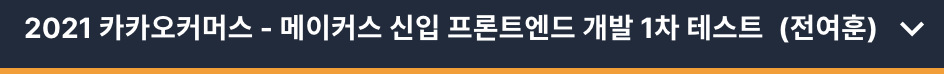

> 두번째 인증샷

## 두 번째 코딩테스트

지난 라인 코딩테스트는 예상했던 대로 불합격 메일을 받았다. 그래도 좋은 경험이었고 이번 상반기에는 일단 되는건 다 해보자라는 마음이었기 때문에 마음이 어렵거나 하지는 않았다. 그리고 오늘은 몇 주 전에 신청했던 카카오 계열사의 코딩테스트를 치뤘다.

라인 코테때 5시간에 가까운 코딩테스트를 겪어서 그런지 2시간 동안 3문제를 푸는 이번 코테는 생각보다 괜찮았고 즐거웠다. 시험 종료를 몇 분 남기지 않고 모든 문제를 풀긴 했지만 효율성이나 히든 케이스에 대한 의심이 있어서 결과는 기다려봐야 알 것 같다.

난이도는 라인보다는 확실히 쉬운 문제들이 출제되었다. 알고리즘은 항상 `c++` 로 했기 때문에 Java 와 Javascript 로만 응시가 가능한 이번 시험이 엄청 편하지는 않았다. 그래도 최근에 챗봇을 개발하면서 배열관련 함수를 많이 접해서 그나마 괜찮았던 것 같다.

## 지금 마음은?

1. 알고리즘 계속 풀자

   최근에 챗봇 개발을 시작하면서 알고리즘을 푸는 횟수가 눈에 띄게 줄었다. 많이 안풀면 감이 계속 떨어진다. 오늘도 그걸 느꼈다.

2. 자바스크립트도 철저히

   웹 개발자를 지향하지만 자바스크립트보다 STL을 더 잘 다루는 것은 아이러니 하다.. 자바스크립트 열심히 하자.
