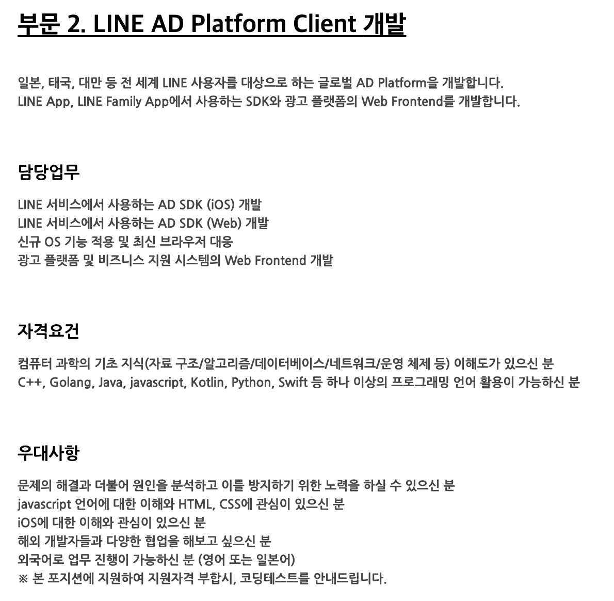
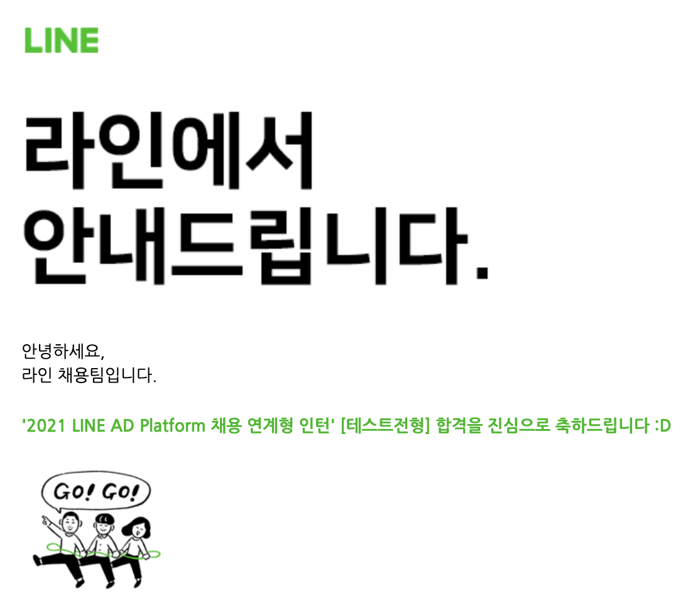
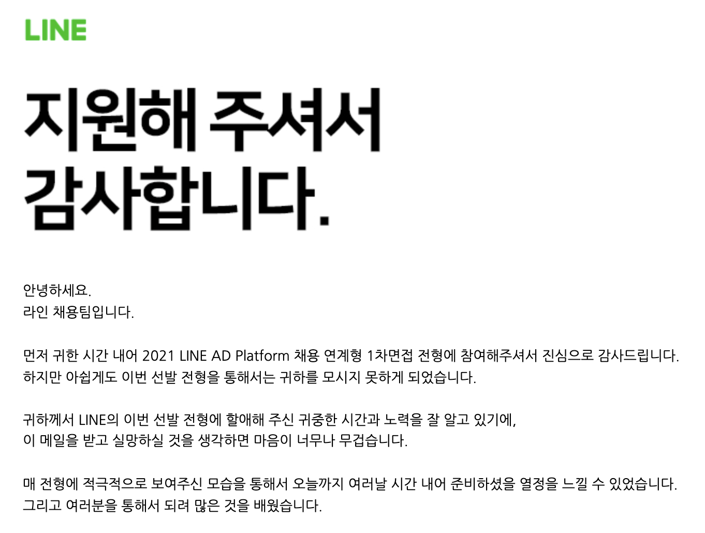

> 뒤늦게 적는 라인플러스 후기.

## 지원하기 🙋

라인플러스 공채 코딩테스트에서 떨어지고 2달 만에 인턴 공고를 보게되었다. 넣을까말까 고민을 많이 했었는데, 아래와 같은 이유로 지원했다.

1.  2달간 코딩테스트 실력이 얼마나 성장했는지 확인하고 싶었다.
2.  웹과 iOS 실무를 모두 보고 경험해볼 수 있다.
3.  채용 연계형이다..!

라인플러스 공채 코딩테스트가 나의 첫 코딩테스트 경험이었고 3월부터 두 달간 코딩테스트 수련을 엄청나게 했기 때문에 내가 얼마나 성장했는지 검증해보고 싶었다. 그리고 평소에 관심은 있었지만 도전하기 무서웠던 iOS와 관련된 일이 어떻게 진행되는지 볼 수 있다는 점, 그리고 2달간의 인턴 후 채용으로 연계될 수 있다는 점 때문에 지원했다.

## 자기소개서 📝

자기소개서 내용은 평이했지만, 채용공고에 해외 개발자들과의 소통이라는 내용이 있기 때문에, 해외에서의 경험과 의사소통 능력을 위주로 어필했다. 이번 상반기에 약 10개의 기업에 지원했고 이쯤되니 자기소개서는 기계처럼 작성할 수 있게되었다..

## 대망의 코딩테스트 🧑🏻‍💻

코딩테스트는 3문제였다. 수련의 성과인지는 아직도 잘 모르겠지만, 3문제를 모두 풀었다. 첫 문제는 자료구조에 대한 이해만 있다면 쉽게 풀 수 있는 문제였고, 두번째 문제는 시간복잡도를 고려해서 좀 더 효율적으로 코드를 작성해야하는 점이 어려웠다. 그리고 마지막 문제는 조금 더 알고리즘적인 지식이 요구되었는데, 이전에 풀어봤던 문제와 비슷한 문제가 나와서 큰 어려움 없이 해결할 수 있었다.

그리고 결과는 합격이었다!

코딩테스트에서 여러번의 탈락을 받았고, 처음으로 코딩테스트를 통과해본 경험이었기 때문에 너무나 행복했다. 면접까지 남은 2주를 완벽하게 준비해야겠다는 생각으로 기술면접 준비에 들어갔다.

## 발등에 🔥 떨어진 면접준비 🏃🏻

코딩테스트에 합격할 것이라고 생각을 안했기 때문에, 면접 준비를 하고있지 않았다. 3월에 카카오 커머스 코딩테스트에서 문제를 다 풀고도 탈락했던 경험이 있었기 때문에, 나도 모르게 히든케이스에서 합격점을 못받을 것이라고 생각했던 것 같다.

뒤늦게 면접을 준비하기 위해 [레파지토리](https://github.com/jeonyeohun/GetReadyForInterview)를 하나 만들었다.

1.  운영체제
2.  네트워크
3.  데이터베이스
4.  자료구조
5.  웹
6.  자바스크립트
7.  알고리즘
8.  프로젝트

을 준비했다. 그리고 최대한 하루에 한 과목씩 정리를 시작했다.

전공 과목은 기본적이고 중요한 개념들을 위주로 공부하고, 프로젝트는 왜 이런 기술들을 썼는지, 어떤 어려움이 있었고 어떻게 해결했는지를 위주로 정리하고 준비했다.

## 땀뻘뻘 면접 💦

면접은 줌을 통한 화상면접으로 진행되었고, 면접이 시작되기 전까지 눈을 감고 1분 자기소개를 끊임 없이 중얼거렸다.

면접이 시작되고 머릿속이 말그대로 새하얗게 변했다. 자기소개를 해달라고 부탁받았는데, 진짜 거짓말안치고 로봇마냥 한글자씩 말했다ㅋㅋㅋㅋ 자기소개를 들은 면접관님은 _"어디 보고 읽으시는거 아니죠?"_ 라고 말씀하셨다..

마음을 가다듬고 다시 면접에 임했고, 운영체제, 네트워크 등의 과목에 대한 질문에는 잘 대답했다. 이때까지는 "오 대박 나 될수도 있겠다"라고 생각했다.

그렇게 1시간동안의 기술 면접이 시작됐다. 인성면접이나 프로젝트에 관련된 질문들이 있을 것이라고 생각했는데, 정말로 기초가 잘 되어있는지에만 관심이 있었다. _여기까지는 아는데 더 자세히는 잘 모르겠습니다._ 라는 말을 엄청나게 많이 했던 것 같다.

그래도 면접관님들이 배려해주시는게 많이 느껴졌고, 내가 잘 아는 부분에 대해서는 더 수직적으로, 내가 잘 모르는 부분에 대해서는 수평적으로 질문하시는게 느껴졌다. 그래서인지 테스트를 받는다는 느낌보다는 내가 어떤 개발자인지, 어떤 지식수준을 가지고 있는지 탐색하는 느낌이었다.

면접이 끝나고 회사에 대해 궁금한게 있으면 질문해달라고 하셔서 글로벌한 사업의 프로덕트를 개발할 때 개발자로서 느끼는 부분에 대해서 질문했다. 사실 채용이랑 관계가 없고, 직무와도 크게 상관없는 질문이었는데 고민하시고 깊이있게 답변을 해주셔서 굉장히 인상깊었다.

그렇게 면접이 끝나고 진이 다 빠져서 몇시간동안 침대에 누워서 면접질문들을 다시 복기했다. 잘 대답한 질문들도 있었고, _아 이건 진짜 공부했어야 했는데_ 싶은 질문들도 있었다.

## 결과 😔

예상했던대로 결과는 불합격이었다. 그래도 내가 잘 모르는 것, 부족한 부분에 대해서 뼈저리게 느낄 수 있는 시간이었고, 너무나 좋은 면접경험 덕분에 나중에 라인에서 꼭 한번 일해보고 싶다는 생각을 하게 되었다. 더 열심히 하자!
