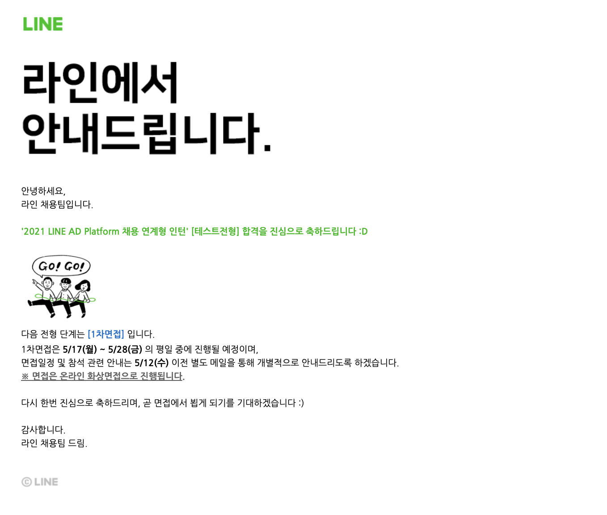

> 붙었다..!

## 코딩테스트

코딩테스트는 쉽지는 않았다. 두 번째 문제에서 효율성을 O(N) 이하의 알고리즘으로 해결해야하는데, 고민을 많이 해봤지만 제대로 O(N) 으로 만들지는 못했다. 다른 문제는 코딩테스트를 준비하면서 스택이나 우선순위 큐와 같은 자료구조들을 공부해왔어서 시간을 조금만 들이면 충분히 풀 수 있었다. 제출을 다 하고도 "이건 되겠다" 라는 확신을 가지지는 못했지만 그래도 만족스럽게 마무리했다.

결과는 합격이다!

## 지금 마음은?

1. 면접 준비 호달달 
   사실 싸피를 준비하려고 CS 공부를 중단하고 인적성을 공부하고 있었는데 발등에 불 떨어졌다.. 열심히 공부하고 준비해봐야겠다.

2. 하면 되는구나! 
   하면 된다. 포기하지 말고 계속 하자!
