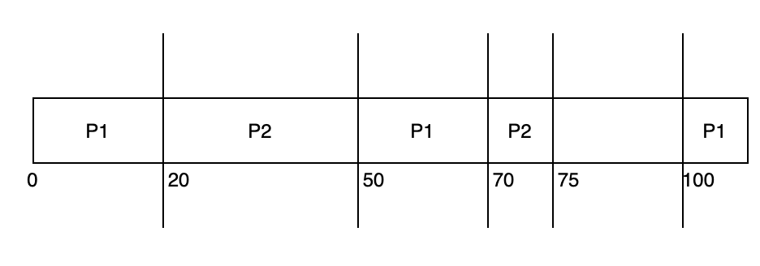

참고도서: _Operating System Concepts (10/E) Abraham Silberschatz, Peter B. Galvin, Greg Gagne_

## Real-Time CPU Scheduling

운영체제가 실시간으로 동작하면서 스케줄링을 수행하는 것을 우리는 두 종류로 구분한다.

1. `Soft Real-Time System` : 우선순위가 높은 프로세스가 먼저 실행되도록 보장하는 시스템
2. `Hard Real-Time System` : 각 태스크가 반드시 정해진 deadline 안으로 작업이 끝나는 것을 보장하는 시스템

## Latency

결국 스케줄링이 필요한 이유는 각 프로세스의 `latency` 를 줄이기 위함인데, `latency`는 어떤 이벤트가 발생하고 그에 맞는 서비스가 수행되기 까지의 시간을 의미한다. 그리고 이 latency는 다시 두 유형으로 나뉘어진다.

1. `Interupt Latency` : 인터럽트가 발생하고 `Interupt Service Routine(ISR)`이 시작되기 까지의 지연시간을 말한다. 이미 이전 수업에서 배웠던 것 처럼 인터럽트가 발생하면 어떤 유형의 인터럽트인지 검사하고 Context Switching 을 수행한 이후에 이미 정해진 ISR을 수헹하게 된다.

2. `Dispatch Latency` : `Dispatcher`가 하나의 프로세스를 block 하고 다른 프로세스를 시작하기 까지의 지연시간을 말한다. 이때 새로운 프로세스가 시작되기전, 커널에서 동작하는 프로세스에 대한 `preemtion`과 높은 우선순위를 가진 프로세스가 요구하는 리소스를 낮은 우선순위 프로세스로부터 방출시키는 작업이 발생하고 이때 걸리는 시간들이 Dispatch Latency가 된다.

## Scheduling Strategy

어떤 프로세스가 스케줄되는 과정을 이해하기 위해서 몇가지 용어들을 알아야한다.

1. `수행시간(t)` : 어떤 프로세스가 CPU에 스케줄링 되었을 때 작업을 수행하는 고정된 시간
2. `마감시간(d)` : 어떤 CPU로부터 서비스를 반드시 받아야하는 마감시간
3. `주기(p)` : CPU를 필요로하는 주기적인 시간
4. `승인제어(Admission Control)` : 스케줄러가 어떤 프로세스가 마감시간 이내에 작업을 마칠 수 없다면 프로세스를 거부하는 알고리즘

### Priority-Based Scheduling

실시간 운영체제는 프로세스를 중요성에 따라 우선순위를 부여하고, Preemtion을 지원함으로 실시간으로 중요한 프로세스가 CPU에 할당될 수 있도록 해야한다. 이런 방법으로 스케줄링을 하는 경우에는 `Soft Real-Time System`의 요구사항을 충족시킬 수 있다. 하지만 각 태스크의 마감시간을 보장하지는 않는다.

##### 번외 토막 상식

책에서 나오는 `태스크` 의 의미가 모호한 것 같아서 구글링을 조금 해봤다. 태스크는 어떤 작업의 단위를 지칭하는 말이다. 어떤 시스템에서는 프로세스가 작업의 단위가 되기도하고, 또 어떤 시스템에서는 스레드가 작업의 단위가 되기도 한다. 따라서 작업을 표현하고자할 때 일반적인 지칭으로 사용하는 것이 태스크이다.

### Rate-Monotonic Scheduling

`Rate-Monotonic` 알고리즘은 프로세스들의 우선순위에 따라 프로세스를 CPU에 스케줄링한다. 이때 우선순위는 각 프로세스가 가지는 주기에 따라서 결정된다. 주기가 짧으면 우선순위가 높아지고, 주기가 길면 우선순위가 낮게 평가된다.

다음과 같은 두 프로세스가 Rate-Monotonic 방법으로 스케줄링된다고 해보자

1. P1 = 수행시간 : 20, 주기 : 50, 마감 : 50 
2. P2 = 수행시간 : 35, 주기 : 100, 마감 : 100

1. 일단 주기가 더 짧은 P1이 스케줄링 되고 고정된 수행시간만큼 작업이 수행된다. P1 의 마감시간은 50이기 때문에 P1은 마감시간을 지켰다.
2. P1의 작업이 끝난 직후에 P2가 스케줄링 된다. P2의 마감시간은 100이기 때문에 그 전에만 작업이 완료되면 된다.
3. P2가 작업을 수행하던 중 P1의 주기인 50에 도달하게 된다. 이 시점에서 P2는 아직 5의 시간이 남았지만 P1에 의해 CPU가 선점된다.
4. 다시 P1이 할당되었고 20동안 작업을 수행하고 돌아간다.
5. P2가 다시 할당되고 P2의 남은 작업 시간인 5를 마저 실행한다.

여기까지 오면 두 프로세스의 1차 주기 내에 모든 작업이 끝나게 되고 두 주기가 완전히 끝나는 100까지 기다리게 된다. 그리고 100에 도달했을 때, 주기가 짧은 P1부터 다시 할당이 시작된다.

#### CPU Usage

Rate-monotonic 알고리즘을 사용한 스케줄링이 매우 효과적으로 보이겠지만, CPU의 자원적 한계 때문에 스케줄링 하고자하는 프로세스의 CPU 이용률에 따라 마감시간을 지키지 못할 수도 있다.

다음은 N개의 프로세스에 대해서 CPU 이용률의 최악의 경우를 구하는 수식이다:

$$
N(2^{1/N} - 1)
$$

단일한 프로세스는 언제나 100%의 이용률을 보여줄 것이기 때문에 크게 의미가 없다. 다수의 프로세스를 사용할 때는 각 프로세스의 CPU 이용률을 구한 뒤, 위 수식에 프로세스의 개수를 대입해 CPU 이용률의 합과 최악의 경우의 이용률을 비교해볼 수 있다.

예를 들어, 위에서 사용한 예시에서 P1의 주기는 50, 수행시간은 20 이었기 때문에 CPU 이용률은 20/50 = 40% 가 된다. 그리고 P2의 주기는 100, 수행시간은 35이기 때문에 CPU 이용률은 35%가 된다. 따라서 두 이용률을 합치면 75%가 되고, 위 수식에 프로세스 2개에 대한 최악의 이용률을 계산해보면 2(2^(1/2)-1)이므로 약 83% 이기 때문에 두 프로세스가 마감시간을 맞추는 것이 보장된다는 것을 확인할 수 있다.

### Earlist-Deadline-First Scheduling

`Earlist-Deadline-First(EDF)` 스케줄링은 마감시간을 기준으로 우선순위를 구분하는 방법이다. 마감시간이 빠르면 우선순위가 높게 부여되고, 짧으면 낮게 부여된다. EDF에서는 프로세스가 실행이 가능한 상태가 되면 자신의 마감시간을 시스템에 알리게되고, 이 마감시간에 맞춰서 시스템 내의 프로세스들의 우선순위가 변경된다.

이 방법은 이론적으로 완벽한 방법이다. 프로세스의 주기를 확인할 필요도 없고 모든 프로세스가 항상 마감시간을 맞출 수 있으며 CPU 이용률을 100%로 활용할 수 있다. 하지만 두 프로세스가 교체되는 과정에서 발생하는 context switching은 항상 pure overhead를 가지고 있기 때문에 실제로 구현이 불가능하다.

### Proportionate Share Scheduling

`Proportional Share` 스케줄링은 모든 응용프로그램들에게 비율을 나누어서 배분해주고 각 응용프로그램은 해당 비율에 맞춰서 프로세스를 할당하게 되는 방법이다. 만약 비율이 100%로 가득 채워져서 사용되고 있을 때는 새로운 프로세스의 할당을 거부하고, 80%가 채워져 있는 상황에서 100%를 넘어서는 30% 이상을 요구했을 때도 할당을 거부하게 된다.
