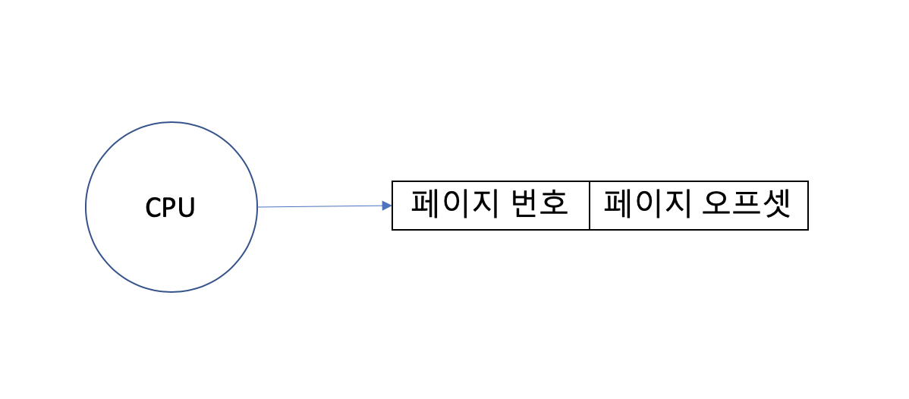
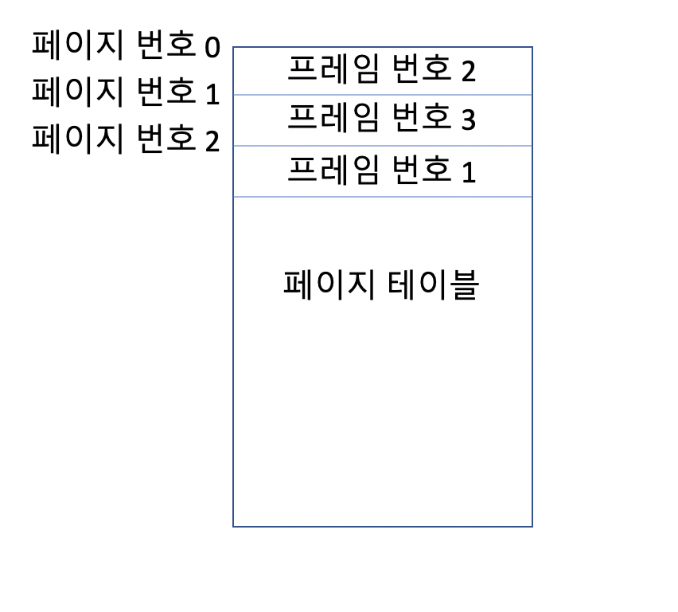
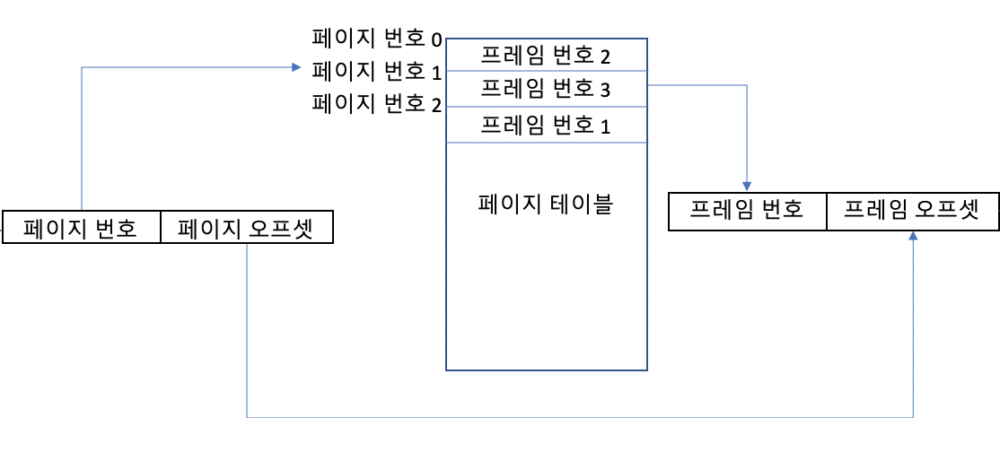
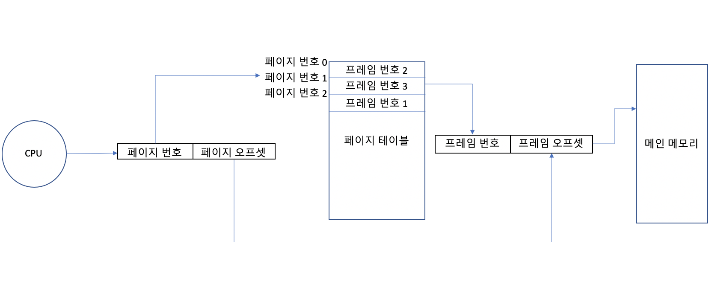

참고도서: _Operating System Concepts (10/E) Abraham Silberschatz, Peter B. Galvin, Greg Gagne_

## 메모리 딘편화

### 외부 단편화 (External Fragmentation)

앞서서 우리가 공부했던 내용에 따르면, 프로세스는 메모리에 올라오면서 메모리의 사용가능한 공간인 `hole`을 찾아 그곳에 적재된다. 그리고 이 hole은 하나의 사용가능한 공간을 의미하는 것이 아니라 프로세스가 적재되고 해제되면서 메모리 곳곳에 만들어진 공간들을 의미한다. 그런데 한가지 문제점이 생긴다. 어떤 프로세스를 메모리에 적재하려고 할 때, 흩어져 있는 각 hole들을 합치면 이 프로세스를 적재할 수 있지만, 각각의 hole은 크기가 작아서 프로세스를 적재할 수 없는 상황이 발생하는 것이다. 이렇게 메모리에 남은 공간은 충분히 여유가 있지만 hole들이 분산되어 있어 프로세스를 적재할 hole이 존재하지 않게 되는 현상을 `외부 단편화`라고 한다. 앞서 배웠던 프로세스의 크기와 가장 가까운 hole을 찾는 기법인 `최적 접합`과 탐색 중 프로세스를 적재할 수 있는 공간을 만나면 곧바로 해당 hole에 프로세스를 적재하는 방법인 `최초 적합`은 이 외부 단편화 문제를 피해갈 수 없다.

실제로 통계적으로 분석했을 때, N개의 블록이 메모리에 존재하면 0.5개의 블록이 메모리 단편화에 의해 사용될 수 없게 되는 현상이 발견된다. 따라서 외부 단편화를 해결하기 위한 방법으로 `압축 기법(Compaction)`이 제안된다. 이 기법은 사용가능한 메모리 공간을 모두 한 곳으로 모으고, 사용중인 공간을 한 곳으로 모아서 hole이 분산되지 않게 하기 위한 방법이다. 프로세스가 메모리 내에서 재배치 되면서 주소가 달라지지만 각 프로세스가 가지는 재배치 레지스터의 값을 바꾸거나 기준 레지스터의 값을 바꾸면 CPU는 여전히 같은 논리 주소를 요청하고 물리 주소는 변경된 주소로 연결될 수 있게된다. 하지만 공간을 모으고 프로세스를 재배치하는 작업은 아무리 좋은 알고리즘 사용해도 큰 비용이 발생할 수 밖에 없다.

### 내부 단편화 (Internal Fragmentation)

일반적으로 프로세스를 메모리에 할당하게되면 메모리 공간은 페이지라는 특정한 크기(일반적으로는 4바이트)로 나누어져서 이 크기를 정수배한 공간을 프로세스에 할당한다. 만약 어떤 프로세스가 요구하는 크기가 15바이트라면, 메모리는 16바이트를 확보해서 프로세스에게 할당하게 된다. 이때 남게되는 1바이트는 프로세스에서도 사용되지 않고, 메모리에서도 사용가능한 공간으로 인식되지 않는 잉여공간이 되어버린다. 페이지가 정수배만큼 할당되기 때문에 잉여공간이 되는 크기가 최대 `페이지 사이즈 - 1` 개가 되어서 큰 손실은 아닐 수 있겠지만 불필요하게 메모리 공간이 낭비되는 현상은 바람직하지 못하다.

## 페이징

외부 단편화와 내부 단편화는 모두 하나의 프로세스가 할당될 때 연속된 메모리 공간을 사용해야하기 때문에 발생하는 문제였다. 그래서 똑똑이 척척박사님들은 발상을 완전히 뒤집어 바꿔버린다...하나의 프로세스를 여러개의 조각으로 잘라서 메모리 곳곳에 나누어 넣는 것이다..! 이 방법을 `페이징(Paging)` 이라고 한다. 이런게 혁신인가..

### 프레임과 페이지

프레임은 메인 메모리를 나누는 블록의 단위를 의미한다. 그리고 페이지는 프로세스가 쪼개지는 블록의 단위를 의미한다. 그리고 이 둘은 항상 같은 크기를 기준으로 나누어져 있게 된다. 따라서 CPU는 각 페이지의 번호를 요청하게 되고 이 번호는 메인 메모리 내의 프레임과 `맵핑`되어 있다. 당연하게도 이 맵핑은 CPU가 자동적으로 해주는 것이 아니다. 맵핑이 되려면 중간에서 CPU가 보내는 페이지 주소를 프레임 주소로 바꿔주는 역할을 하는 장치가 필요하다. 이전에 우리는 이런 장치를 `메모리 관리 장치(MMU)` 라고 했지만 페이징 전략에서는 이 MMU를 `페이지 테이블(Page table)` 이라고 한다.

### 논리 주소(페이지 주소) 가 물리 주소(프레임 주소) 가 되는 과정

앞서 소개한 페이지 테이블은 각 페이지의 시작 주소에 대한 프레임의 시작주소를 가지고 있다. 그래서 CPU가 어떤 페이지 주소를 요청하면 해당 페이지의 시작주소를 프레임의 주소로 바꾸어서 알려주게 된다. 그리고 여기에 offset 이라는 참조위치 값을 이용해서 CPU가 요청하는 주소가 실제로 메모리 어디에 위치해 있는지를 알려주게 된다. 다음 그림을 통해 이 과정을 더 쉽게 이해해보자.

먼저 CPU가 요청하는 주소는 페이지 번호와 페이지 오프셋으로 이루어져 있다.
 

그리고 각 페이지 테이블은 페이지 번호에 대한 프레임 번호를 가지고 있다. 페이지 테이블은 프로세스를 프레임 크기로 나눈 개수 만큼의 프레임 번호가 들어가게 될 것이다. 위 그림을 보면 페이지 번호 0에 해당하는 프레임의 위치는 2임을 알 수 있다.
 

페이지 테이블은 CPU가 요청한 주소의 페이지 번호로 프레임 번호를 얻어내고, 페이지 오프셋은 그대로 프레임 오프셋으로 사용한다. 이렇게 얻어진 두 정보를 합치면 CPU가 요청한 주소가 메모리 내에 어디에 있는지 알 수 있게 된다.

 위 과정을 한 흐름으로 담아보면 이렇다. 

### 페이지 번호와 페이지 오프셋

CPU가 보내는 주소는 페이지 번호와 오프셋으로 이루어져 있는데, 하나의 주소를 보고 어떻게 페이지 번호와 페이지 오프셋을 구분할까? 이것도 다 규칙이 있다. CPU가 보내는 주소의 전체 비트수를 m 이라고 했을 때, 페이지 오프셋 n 의 길이만 알 수 있다면, 페이지 번호는 m-n으로 쉽게 얻어낼 수 있다. 그리고 `페이지 오프셋은 시스템에서 사용하는 페이지의 크기`에 따라 결정된다. 만약 페이지의 크기가 P라면 P는 2^n으로 표현할 수 있고, 이 n이 페이지 오프셋의 길이가 된다.

예를 들어, 페이지 크기가 1KB인 시스템에서는, 1kb 는 1024 바이트이고 이는 210 이기 때문에 CPU가 요청하는 주소의 하위 10비트는 페이지 오프셋에 사용된다. 비슷한 예로 가장 일반적으로 사용되는 페이지 크기인 4KB는 212 로 표현할 수 있고, 이는 페이지 오프셋의 길이가 12비트라는 것을 의미한다.

### Example

논리 주소를 물리 주소로 변환하는 문제를 하나 풀어보자.

- 페이지 크기 : 1KB
- 페이지 테이블 : [1, 2, 5, 4, 8, 3, 7, 6]
- 논리주소 300010 의 물리 주소는?

1. 먼저 페이지 크기를 통해서 페이지 오프셋의 비트 수를 알아내자

- 페이지 크기 1KB는 바이트로 변환하면 1024 바이트이고, 이는 210 을 의미하기 때문에 페이지 오프셋의 비트 수는 `10 비트`가 된다.

2. 논리 주소 3000을 이진수로 변환하자

- 3000을 이진수로 변환하면, `101101001000` 이다.

3. 페이지 번호와 오프셋을 구분하자

- 페이지 오프셋은 마지막 10 비트이다. 따라서, `1101001000` 이다.
- 페이지 번호는 오프셋을 제외한 나머지 비트이므로 `10` 이다.

4. 페이지 테이블에서 프레임 번호를 얻는다

- 페이지 번호가 이진수 `10` 이기 때문에 페이지 테이블의 2번 인덱스에 접근하면 프레임 번호 `5`를 얻게된다.

5. 프레임 번호와 페이지 오프셋을 합친다

- 프레임 번호 `5`를 다시 이진수로 변환하면 `110` 를 얻게 된다.
- 여기에 페이지 오프셋 `1101001000` 을 합친다.

6. 얻어낸 최종 물리 주소는 `1101101001000` 이다.

## 내부 단편화?

페이징을 사용하면 연속된 공간에 프로세스를 한번에 배치하지 않고 여러 공간에 나누어 배치하게 되기 때문에 외부 단편화가 일어날 가능성이 없다. 하지만 내부 단편화는 어떨까? 페이지 크기가 4KB인 시스템에 크기가 90KB인 프로세스가 메모리에 할당된다고 생각해보자. 일단 이 프로세스는 페이지 크기인 4KB 단위로 쪼개어져서 여러 프레임에 각각 할당되게 될 것이다. 그런데 90을 4로 나누게 되면 `90 / 4 = 22` 로 90바이트인 프로세스를 모두 메모리에 올릴 수 없게된다. 그래서 추가적으로 한 페이지를 더 사용하게 되는데 이렇게 되면 마지막 페이지는 2바이트만 사용되고, 나머지 2바이트는 잉여자원이 되어 내부 단편화가 여전히 발생하게 된다.

## 페이지 테이블

페이지 테이블은 한 프로세스에 대한 논리주소-물리주소 맵핑 정보를 기록하고 있다. 따라서 페이지 테이블은 각 프로세스 마다 하나씩 가지게 되는 것이 합당할 것이다. 그래서 페이지 테이블의 포인터가 PCB 안에 다른 레지스터 값들과 함께 저장된다. 그러나 이 때문에 CPU가 프로세스를 교체하게 되면 페이지 테이블 역시 교체되어야 하는 오버헤드가 발생하게 된다.

PCB 안에는 페이지 테이블에 대한 포인터가 들어있으니 이 포인터가 가르키는 실제 페이지 테이블을 어떤 공간에 보관할지가 주된 고민이 된다. 페이지 테이블을 디스크에 저장하기에는 테이블을 불러오는데 너무 오랜 시간이 걸리고 CPU 레지스터에 보관하기에는 테이블의 크기가 제한된다. 이런 이유 때문에 대부분의 시스템들은 페이지 테이블을 메인메모리에 저장하고 `페이지 테이블 기준 레지스터(PTBR)` 을 사용해서 페이지 테이블의 포인터를 저장한다. 프로세스가 교체될 때는 이 레지스터의 값만 변경해서 사용할 페이지 테이블을 교환해주게 된다.

그런데 이런 방법을 사용하면 페이지 테이블에 접근하기 위해 메모리 접근이 한 번 수행되고, 페이지 테이블을 사용하여 변환한 물리 주소에 접근해서 값을 가져올 때 메모리 접근이 한번 더 수행된다. 주소변환을 위해 메모리를 두번 읽게되는 것이다.

## Translation Look-Aside Buffer(TLB)

위 처럼 메모리에 여러번 접근하게 되면서 생기는 지연시간을 방지하기 위한 방법으로 TLB가 사용된다. TLB는 특수한 캐시 레지스터로 크기는 작지만 굉장히 빠른 속도를 보장한다. TLB는 크기의 제한이 있기 때문에 모든 페이지 테이블의 내용을 담지는 못하지만 그 일부 내용을 담을 수 있다. 따라서 CPU가 요청하는 주소를 곧바로 페이지 테이블에 접근해서 찾는 것이 아니라, TLB에서 대응되는 페이지번호를 먼저 찾고 TLB안에 해당 페이지 번호가 존재한다면, 페이지 테이블에 접근하지 않고 곧바로 물리 주소를 얻게된다. 이렇게 수행되는 주소변환은 메모리에 접근하는 횟수가 기존 두 번에서 한 번으로 줄어든다.

TLB의 제한된 크기는 항상 CPU가 요청하는 주소의 페이지 번호가 TLB안에 있는 것을 보장하지 않는다. 그리고 TLB의 내부에 저장된 페이지 번호는 내부적으로 결정된 정책에 의해 주기적으로 교체가 된다. 어떤 정보들, 특히 중요한 커널 코드들은 TLB에 고정된 채로 사용되고 제거되지 않고 항상 TLB안에 상주하게 되기도 한다.

### Hit, Miss, 실질 메모리 접근 시간(Effective Memory Access Time)

CPU가 요청한 주소의 페이지번호가 TLB에 존재해서 페이지 테이블을 거치지 않고 곧바로 물리 주소를 만들어 낼 수 있는 상황이 되면 이를 `TLB Hit` 이라고 하고, TLB에 정보가 존재하지 않아 기존 방식대로 페이지 테이블에 접근해서 물리 주소를 얻어야 하는 상황을 `TLB Miss` 라고 한다.

TLB Miss 상황은 기조 PTBR 만을 사용할 때와 같이 페이지 테이블을 찾기 위해 메모리를 한번 참조하고, 변환된 물리 주소를 사용해서 데이터에 접근할 때 메모리를 다시 한번 참조하게 된다. 반면에 TLB Hit은 페이지 테이블에 접근할 필요가 없기 때문에 한번의 메모리 참조만으로 데이터에 접근할 수 있게 된다.

위 정보를 이용해서 우리는 `실질 메모리 접근 시간(Effective Memory Access Time)`을 계산할 수 있다. 예를 들어 TLB Hit 의 확률이 80% 인 시스템이 있고, 메인 메모리에 접근하는 지연시간이 10ns 리고 했을 때, 실질 메모리 접근 시간은 다음과 같이 계산된다.

$$
effective\,memory\,access\,time = (hit\,ratio \times memory\,access\,time) + (miss\,ratio \times (memory\,access\,time \times 2))
$$

$$
실질\,접근\,시간 = 0.80 \times 10 + 0.20 \times 20 = 8.4
$$

### 보호

CPU로 부터 생성되는 모든 주소는 데이터에 접근하기 위해 페이지 테이블을 거쳐간다. 따라서 우리는 메모리에 있는 데이터에 대한 연산이나 접근에 대한 보호기능을 페이지 테이블에 만들 수 있다. 만약 어떤 프로세스가 자신과 관련된 페이지가 아닌 페이지에 접근하게되면 컴퓨터 시스템은 엉망진창이 될 것이다. 따라서 페이지 테이블에는 1비트짜리 `유/무효 비트` 를 추가해서 CPU에서 요청한 주소의 페이지 번호가 페이지 테이블에서 무효비트를 가지고 있다면 운영체제는 접근을 거부하고 트랩을 발생시킨다.

## 공유 페이지(Shared Page)

만약 어떤 똑같은 코드데이터를 사용하는 프로세스가 다수 실행된다고 해보자. 예를 들어, 사용자가 워드 프로세서를 동시에 여러 창을 열어두었다고 생각해보자. 이때, 같은 응용프로그램을 실행하는 프로세스가 여러개 생성되게 될 것이다. 그렇다면 메모리 내에서 이 프로세스들의 코드영역은 같은 코드를 공유하고 있을 것이다. 왜냐하면 같은 응용프로그램이니까!

컴퓨터와 코딩에 관련된 공부를 하면 중복을 피하는 전략에 대한 연구가 상당히 많다. DRY(Do not Repeat Yourself) 라는 프레이즈까지 있을 정도...이번에도 같은 코드를 사용하는 여러 프로세스들이 각각 코드의 사본을 가지게 하는 것이 아니라 하나의 코드를 공유하게 하는 전략이 제안된다. 페이징이 없었다면 프로세스가 모두 연속적인 메모리 공간에 할당되어야 했기에 불가능한 일이지만, 프로세스가 메모리 내에 여러 프레임에 분산되어 있는 페이징 기법에서는 가능하다.

코드를 공유하는 작업은 단순하게 코드영역에 해당하는 페이지를 하나만 만들고 각 프로세스가 가지는 페이지 테이블이 페이지를 가르키게 하는 것이다. 물론 CPU는 다른 프로세스에 대해 다른 논리 주소를 요청하겠지만 페이지 테이블은 같은 곳을 가르키게 한다.

이렇게 프로세스가 실행된 이후에 절대 코드의 내용이 바뀌지 않아서 다른 프로세스와 공유가 가능한 코드를 `재진입 코드(Reentrant Code)` 라고 한다.
